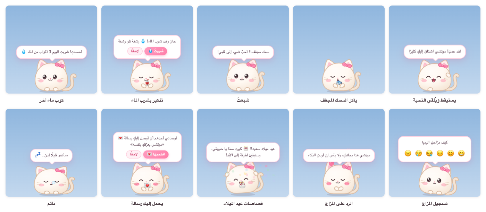

# 糯米桌宠 NuomiPet

[简体中文](README.md) | [繁體中文](README.zh-TW.md) | [English](README.en.md) | [日本語](README.ja.md) | [한국어](README.ko.md) | [Français](README.fr.md) | **العربية**

[](https://github.com/WaIdo/NuomiPet/actions/workflows/check.yml)

<div dir="rtl">

رفيق صغير ناعم يعيش على سطح المكتب، ويعمل على Windows وmacOS. يتجوّل أسفل الشاشة، ويذكّر بشرب الماء والاستراحة والنوم مبكرًا، ويتذكّر مناسباتكما، ويهمس بكلماتك ويوصل رسائلك؛ وإن أغضبتَها، يركع على لوح الغسيل معتذرًا. الواجهة متوفرة بسبع لغات: 简体中文، 繁體中文، English، 日本語، 한국어، Français، العربية.



## التنزيل

نزّل الملف المناسب من صفحة [Releases](https://github.com/WaIdo/NuomiPet/releases/latest):

| الملف | مناسب لـ |
| --- | --- |
| `NuomiPet-1.1.1-win-setup.exe` | Windows 10 / 11 (64 بت)، نسخة التثبيت، ويُنصح بها |
| `NuomiPet-1.1.1-win-portable.exe` | Windows 10 / 11 (64 بت)، بلا تثبيت، تعمل بنقرة مزدوجة |
| `NuomiPet-1.1.1-mac-arm64.dmg` | أجهزة Mac بشريحة Apple (‏M1 وما بعدها)، macOS 13 أو أحدث |
| `NuomiPet-1.1.1-mac-x64.dmg` | أجهزة Mac بشريحة Intel، macOS 13 أو أحدث |

لا تعرف نوع شريحة جهاز Mac؟ اضغط قائمة Apple في أعلى يسار الشاشة ← «حول هذا الـMac» (About This Mac)؛ إن كان حقل «الشريحة» (Chip) يقول Apple M… فاختر arm64، وإن كان يقول Intel فاختر x64.

## التثبيت

**Windows**

1. شغّل `NuomiPet-1.1.1-win-setup.exe` واتبع التعليمات (لا يحتاج صلاحيات المسؤول). أما النسخة المحمولة فتعمل مباشرة بنقرة مزدوجة.
2. حزمة التثبيت غير موقّعة بشهادة توقيع شيفرة مدفوعة، لذا قد تظهر في أول تشغيل رسالة «حمى Windows جهاز الكمبيوتر الخاص بك» (Windows protected your PC): اضغط «مزيد من المعلومات» (More info) ← «تشغيل على أي حال» (Run anyway). وإن اعترضه برنامج مكافحة الفيروسات، فاختر السماح أو الثقة.
3. يظهر الرفيق الصغير في أسفل يمين الشاشة. وفي منطقة الإشعارات أسفل يمين شريط المهام أيقونة قطة وردية صغيرة (قد تكون مخفية تحت `^`)، اضغطها لفتح القائمة.

**macOS**

1. افتح ملف dmg واسحب «糯米桌宠» إلى «التطبيقات» (Applications).
2. التطبيق غير موثَّق من Apple، لذا ستظهر في أول فتح رسالة بأنه لا يمكن التحقق منه. افتح «إعدادات النظام ← الخصوصية والأمن» (System Settings → Privacy & Security)، وابحث في أسفل الصفحة عن «糯米桌宠»، واضغط «فتح على أي حال» (Open Anyway)، ثم أدخل كلمة مرور الجهاز مرة أخرى.
3. ويمكنك أيضًا تنفيذ الأمر التالي مرة واحدة في «الطرفية» (Terminal)، وبعدها يُفتح التطبيق بنقرة مزدوجة مباشرة:

<div dir="ltr">

```bash
xattr -dr com.apple.quarantine /Applications/糯米桌宠.app
```

</div>

يظهر الرفيق الصغير أسفل الشاشة، وفي أعلى يمين شريط القوائم أيقونة رأس قطة صغيرة، اضغطها لفتح القائمة. لا يشغل التطبيق مكانًا في Dock؛ تظهر أيقونته هناك مؤقتًا فقط حين تفتح «العش».

## الميزات

**الرفيق الصغير نفسه**
- 6 حيوانات صغيرة: قطة، أرنوب، دبدوب، جرو، هامستر، كتكوت؛ و15 لونًا (منها 5 درجات خضراء فاتحة: أفوكادو، ماتشا، تفاح أخضر، نعناعي، أخضر البحيرة)؛ و9 إكسسوارات (فيونكة، زهرة، برعم، تاج، قبعة حفلة، مشبك قلب، قبعة فراولة، قبعة سانتا، نظارة دائرية)؛ و4 نقوش (سادة، بطن أبيض، خطوط، بقعة العين)؛ و4 أحجام.
- يتجوّل وحده، ويسرح في أفكاره، ويتثاءب، ويتمطّى، ويدور حول نفسه؛ وعيناه تتبعان الفأرة؛ وإن تُرك الجهاز 5 دقائق ينام (وتظهر فقاعة من أنفه)، ويرحّب بمن يعود.
- التفاعل:
  - تمرير الفأرة ذهابًا وإيابًا فوقه: مسح على رأسه، فتطير القلوب
  - نقرة واحدة: نكزة (والنكز المتكرر يدوّخه)
  - نقرة مزدوجة: فتح اللوحة السريعة (إطعام، دلّلني، لعب، بومودورو، المزاج، العش، تعال خذني)
  - نقر أيمن: القائمة الكاملة
  - الضغط والسحب: رفعه، وعند إفلاته يسقط إلى أسفل الشاشة؛ وإن رُمي يصطدم بالحافة، وإن سقط بقوة يدوخ
- 12 نوعًا من الوجبات الخفيفة، ولكل نوع من الحيوانات طعامه المفضّل؛ وهناك الشبع والمزاج ومستويات المودة (Lv.1 إلى Lv.10).

**التذكيرات والأدوات**
- شرب الماء، والحركة بعد الجلوس الطويل، وراحة العينين، والوجبات في وقتها، والنوم مبكرًا؛ ويمكن حصر التذكيرات في ساعات معيّنة.
- تذكيرات مخصّصة: يوميًا / أيام العمل / عطلة نهاية الأسبوع / مرة واحدة.
- بومودورو: أثناء التركيز يحتضن الرفيق الصغير حاسوبًا صغيرًا ويرافق صاحبته، وبعد الانتهاء يذكّر بالاستراحة.
- قائمة المهام، ومع كل مهمة منجزة يحتفل الرفيق الصغير. وإلى جانب المهام المكتوبة يدويًا، هناك «💞 أشياء صغيرة لنا معًا»: مجموعة أفكار صغيرة للأحبّة (مثل «التقاط صورة تجمعنا» و«مشاهدة الغروب مع WaIdo»)، بضغطة واحدة تُضاف إلى المهام، وإن لم تعجبها يمكن طلب «اقتراحات أخرى».
- الطقس: بعد اختيار المدينة، يخبر بالطقس صباحًا، وإن كان المطر متوقعًا يذكّر بالمظلة.

**ما هو لها**
- المناسبات: عدد أيامكما معًا، وكل مئة يوم وكل ذكرى سنوية، وعيد ميلادها، ومناسبات مخصّصة وعدّ تنازلي. في اليوم نفسه ينثر الرفيق الصغير الزينة احتفالًا، وينبّه قبلها بأيام.
- الرسائل: اكتب رسالة داخل التطبيق وحدّد يوم فتحها (مثل يوم ميلادها). بعد إغلاق الظرف لا يرى أحد النص قبل ذلك اليوم؛ وفي ذلك اليوم يحمل الرفيق الصغير الرسالة إليها.
- همسات: كلماتك يقولها الرفيق الصغير لها من حين لآخر، ويمكن أن تحمل توقيعك: «طلب مني فلان أن أهمس لكِ: …».
- يوميات المزاج: كل مساء يسألها عن مزاجها، وفي العش تقويم شهري للمزاج.
- الأعياد: يهنّئ في رأس السنة الميلادية، وعيد الحب، ويوم المرأة العالمي، وعيد الحب الأبيض، ويوم 520، ويوم الطفل، وعيد تشيشي (عيد الحب الصيني)، ومهرجان منتصف الخريف، وليلة رأس السنة القمرية، ورأس السنة الصينية، ومهرجان الفوانيس، ومهرجان قوارب التنين، وليلة عيد الميلاد، وعيد الميلاد المجيد، وليلة رأس السنة (تواريخ الأعياد القمرية محسوبة حتى 2035). في يوم ميلادها يرتدي قبعة حفلة، وفي عيد الميلاد قبعة سانتا، وفي عيد الحب و520 وتشيشي مشبك القلب.
- حظ اليوم: في قائمة النقر الأيمن اضغط «🔮 حظ اليوم»؛ النجوم كاملة كل يوم (★★★★★)، وما يُستحسن وما يُستحسن تجنّبه يتغيّر يوميًا.
- إرسال الرسائل بالبريد: أرسل من هاتفك أو حاسوبك بريدًا إلى بريد الرفيق الصغير، فيتحوّل إلى رسالة في صندوق رسائلها، ويمكنك تحديد يوم فتحها. طريقة الإعداد في قسم «إرسال الرسائل بالبريد، وطلب أن تأتي لتأخذها» أدناه.
- 🚗 تعال خذني: بضغطة في اللوحة السريعة للرفيق الصغير، يرسل بريدًا (أو إشعارًا إلى هاتفك أو WeChat) يطلب منك أن تأتي لتأخذها بعد العمل.

**إسعادها**

- 11 حركة: ركوع على لوح الغسيل، ورود، قلب، عناق، قبلة، شاي بالحليب، انحناءة، دلع، تدحرج، رقص، مديح، إضافة إلى «عشوائي» الذي يختار واحدة منها.
- الركوع على لوح الغسيل: يركع الرفيق الصغير على لوح الغسيل وعيناه دامعتان، رافعًا لوحة خشبية صغيرة مكتوبًا عليها «آسف»، وبعد قليل يسأل «هل سامحتِني؟»، وتحتها زرّان: «سامحتُك 💗» و«أفّ!».
  - إن ضغطت «أفّ!» يواصل الركوع وتتغيّر اللوحة إلى «سامحيني»؛ وفي المرة الثالثة يقدّم الورود والشاي بالحليب أولًا ثم يركع، وأقصى ما يركع أربع جولات.
  - إن ضغطت «سامحتُك»، أو مسحت على رأسه وهو راكع، يقفز وينثر الزينة ويرقص.
  - إن كتبتَ «التوقيع» في البيانات، فسيقول أحيانًا إنه جاء ليعتذر نيابةً عنك.
- ويُسعدها من تلقاء نفسه أيضًا: إن اختارت في تسجيل المزاج «غاضبة» يركع فورًا معتذرًا؛ وإن اختارت «حزينة» يعانقها أولًا ثم يقدّم الورود؛ وإن اختارت «متعبة» يقدّم كوب شاي بالحليب؛ وإن نكزته مرارًا يركع أحيانًا طالبًا الرحمة؛ وحين تبلغ المودة Lv.3 أو أكثر ويكون مزاجه جيدًا، يرسم قلبًا أو يقدّم الورود أحيانًا من تلقاء نفسه.
- طرق الوصول: نقرة مزدوجة على الرفيق الصغير لفتح اللوحة السريعة ثم «دلّلني»؛ أو «🥺 أُسعدكِ» في قائمة النقر الأيمن؛ أو «🥺 دلّلني» في قائمة منطقة الإشعارات (حركة عشوائية)؛ أو «🥺 دلّلني» في الصفحة الرئيسية للعش.

**العش**

«العش» هو نافذة الإعدادات، ويُفتح من قائمة النقر الأيمن أو اللوحة السريعة أو أيقونة منطقة الإشعارات: الرئيسية (عدد أيامكما معًا، وحال الرفيق الصغير، وماء اليوم وجلسات البومودورو والمهام والمزاج، والطقس)، والمظهر، والتذكيرات، والتركيز، والمهام، والمناسبات، والرسائل، وتقويم المزاج، وهمسات، والإعدادات (بياناتنا، وألوان العش، وفي المقدمة دائمًا، والتشغيل عند بدء الجهاز، والصوت، والتجوّل بحرية، والجاذبية، وعدم الإزعاج، ومدينة الطقس، واستيراد البيانات وتصديرها).


للعش تسعة ألوان: وردي زهر الكرز، برتقالي خوخي، أصفر زبدي، أخضر ماتشا، أخضر تفاحي، أخضر نعناعي، أخضر البحيرة، أزرق سماوي، بنفسجي ليلكي، ويمكن أيضًا اختيار «مثل الرفيق الصغير». يُغيَّر اللون من «العش ← الإعدادات ← ألوان العش»، فتتغير الخلفية والأزرار وفقاعات كلام الرفيق الصغير واللوحة السريعة معًا.

**تعدد اللغات**
- 简体中文، 繁體中文، English، 日本語، 한국어، Français، العربية. في أول تشغيل تُتّبع لغة النظام؛ وواجهة العربية كلها من اليمين إلى اليسار.
- يمكن التبديل في أي وقت من «العش ← الإعدادات ← اللغة» أو من «🌐 اللغة / Language» في قائمة منطقة الإشعارات: تتغير فورًا الواجهة وكلام الرفيق الصغير والقوائم وتهاني الأعياد؛ ويتغير أيضًا اسم الرفيق الصغير ولقبها إن لم يُعدَّلا (糯米 / Mochi / もち / 모찌 / موتشي، 宝贝 / baby / ハニー / 자기 / mon cœur / حبيبتي).
- ما تكتبانه بنفسيكما (الأسماء، والألقاب، والهمسات، والرسائل، والمناسبات) يبقى كما هو ولا يُترجم.

## اكتبا محتواكما الخاص

كل شيء يُضبط داخل التطبيق، دون تعديل ملفات ودون إعادة التحزيم:

- **البيانات**: عند فتح «العش» لأول مرة تظهر نافذة «هيا نتعارف!»؛ املأ اسم الرفيق الصغير، وبماذا يناديها (الافتراضي «حبيبتي»)، وعيد ميلادها (مع اختيار السنة)، ويوم بداية علاقتكما، وتوقيعك، وستُعلَّم الحقول الناقصة. ويمكن التعديل لاحقًا في أي وقت من «العش ← الإعدادات ← بياناتنا». كما أن الرفيق الصغير سيسألها بنفسه بعد لقائهما الأول.
- **المناسبات**: «العش ← المناسبات»، ويمكن إضافة «ذكرى سنوية» و«عدّ تنازلي» و«عدّ الأيام».
- **همسات**: «العش ← همسات»، اكتب كلمات تريد أن ينقلها الرفيق الصغير إليها من حين لآخر.
- **الرسائل**: «العش ← الرسائل ← ✍️ كتابة رسالة»، اكتب العنوان والتوقيع والنص، واختر «فورًا» أو «في يوم محدد» لموعد الفتح. بعد إغلاق الظرف لا يرى أحد النص قبل ذلك اليوم (ولا كاتب الرسالة نفسه)؛ وإن كان فيها خطأ يمكن حذفها وكتابتها من جديد، ويمكن تعديل العنوان ويوم الفتح.
- **الكتابة على حاسوبك**: اكتب الرسائل على حاسوبك، واحفظها في ملف من «الرسائل ← تصدير الرسائل المكتوبة هنا»، ثم استخدم «استيراد رسائل» على حاسوبها. النص في الملف المُصدَّر ليس نصًا مكشوفًا.

### الكتابة مسبقًا قبل التحزيم

إن أردت أن ترى محتواك من أول مرة تفتح فيها التطبيق، فعدّل قبل التحزيم الملف `gift.config.json` في جذر المشروع، ثم حزّم التطبيق بنفسك (انظر «البناء من الشيفرة المصدرية»):

| الحقل | المعنى | مثال |
| --- | --- | --- |
| `petName` | اسم الرفيق الصغير؛ إن تُرك فارغًا فهو «موتشي» (وفي اللغات الأخرى الاسم المقابل) | `"موتشي"` |
| `nickname` | بماذا يناديها الرفيق الصغير؛ إن تُرك فارغًا فهو «حبيبتي» (وفي اللغات الأخرى لقب التحبب المقابل) | `"حبيبتي"` |
| `sender` | توقيعك، ستقول الهمسات: «طلب مني WaIdo أن أهمس لكِ» | `"WaIdo"` |
| `species` / `color` / `accessory` / `markings` / `size` | المظهر الأولي، والقيم في `src/shared/catalog.json` | `"bunny"` / `"sakura"` / `"flower"` / `"none"` / `"m"` |
| `togetherSince` | يوم بداية علاقتكما | `"2026-09-25"` |
| `birthday` | عيد ميلادها | `"2002-06-08"` |
| `anniversaries` | مناسبات أخرى | `[{ "name": "أول موعد", "date": "2023-06-01", "kind": "yearly" }]` |
| `notes` | قائمة الهمسات | `["كوني سعيدة اليوم أيضًا", "..."]` |
| `letters` | الرسائل | انظر أدناه |

قيم `kind` في `anniversaries`: ‏`yearly` تذكير كل سنة، و`countdown` عدّ تنازلي (مرة واحدة)، و`since` عدّ الأيام (مع احتفال عند كل مئة يوم).

مثال على الرسائل (لا يجوز تكرار `id`، وترك `unlock` فارغًا يعني أنها تُقرأ فورًا، واستخدم `\n` في `body` لسطر جديد):

<div dir="ltr">

```json
"letters": [
  {
    "id": "birthday-2027",
    "title": "عيد ميلاد سعيد",
    "unlock": "2027-06-08",
    "from": "WaIdo",
    "body": "السطر الأول\nالسطر الثاني…"
  }
]
```

</div>

توجد افتراضيًا رسالة يعرّف فيها الرفيق الصغير بنفسه (`id: "hello"`)، ويسلّمها لها عند التشغيل الأول.

## إرسال الرسائل بالبريد، وطلب أن تأتي لتأخذها

تحتاج هاتان الميزتان إلى بريد خاص بالرفيق الصغير، ويكفي ضبطه مرة واحدة على حاسوبها.

البريد المدعوم: QQ، ‏Tencent للشركات، NetEase ‏(163، 126، yeah.net، 188، VIP)، NetEase للشركات، Gmail، Outlook / Hotmail / Microsoft 365، iCloud، Yahoo، Sina، Sohu، Alibaba، بريد 139، وأي بريد آخر يدعم IMAP/SMTP يمكن إدخال خوادمه يدويًا. هذا الشرط يخص «بريد الرفيق الصغير» فقط؛ أما بريدك الذي ترسل منه الرسائل، والبريد الذي يستقبل إشعار «تعال خذني»، فيمكن أن يكون من أي مزوّد.

1. أنشئ بريدًا جديدًا للرفيق الصغير (يُنصح ببريد QQ أو 163)، ولا تستخدم البريد الذي تستعملانه عادة.
2. فعّل خدمة IMAP/SMTP في البريد على الويب، واحصل على «رمز التفويض» (وليس كلمة مرور الدخول):
   - بريد QQ: «设置 → 账号 → POP3/IMAP/SMTP/Exchange/CardDAV/CalDAV 服务» (الإعدادات ← الحساب ← خدمة POP3/IMAP/SMTP/…) ← فعّل «IMAP/SMTP 服务» (خدمة IMAP/SMTP)، وبعد التحقق حسب التعليمات يظهر رمز التفويض.
   - بريد NetEase: «设置 → POP3/SMTP/IMAP» (الإعدادات ← POP3/SMTP/IMAP) ← فعّل «IMAP/SMTP 服务» (خدمة IMAP/SMTP)، واحصل على كلمة مرور التفويض حسب التعليمات.
   - Gmail وiCloud: فعّل التحقق بخطوتين أولًا، ثم أنشئ «كلمة مرور التطبيقات».
   - Outlook: لا يستخدم رمز التفويض، بل تسجيل الدخول بحساب Microsoft؛ انظر «استخدام Outlook بريدًا للرفيق الصغير» أدناه.
3. على حاسوبها افتح «العش ← الإعدادات ← البريد»، واختر «مزوّد البريد» (عادةً «تعرّف تلقائي»)، واملأ عنوان بريد الرفيق الصغير، و«رمز التفويض»، و«بريده» (البريد المسموح له بإرسال الرسائل، أي بريدك)، و«إشعار «تعال خذني» يُرسل إلى» (وهو عادةً بريدك أيضًا)، ثم اضغط «حفظ» ثم «اختبار الاتصال».
4. اضغط «إرسال طريقة الاستخدام إليه»، فتصلك رسالة فيها شرح الاستخدام.

**إرسال رسالة**: أرسل من بريدك إلى بريد الرفيق الصغير؛ عنوان البريد يصبح عنوان الرسالة، ونصّه يصبح محتواها. خلال دقائق يسلّمها الرفيق الصغير لها، ويصلك بريد تأكيد.
- لتحديد يوم لا تُفتح قبله: اكتب في بداية العنوان `[2026-12-25]`، أو اكتب في السطر الأول من النص `تاريخ الفتح: 2026-12-25`. وإن كتبت الشهر واليوم فقط (مثل `[12-25]`) فهو أقرب يوم قادم بهذا التاريخ.
- لا تُستلم إلا الرسائل القادمة من العناوين المكتوبة في «بريده»، ولا تدخل رسائل الآخرين صندوق الرسائل. ويمكن أيضًا ضبط «كلمة السر»، فلا تُستلم إلا الرسائل التي تحملها.
- يُستلم النص فقط، ولا تظهر الصور والمرفقات.

**تعال خذني**: تنقر نقرًا مزدوجًا على الرفيق الصغير، وتضغط «🚗 تعال خذني»، وتختار «الآن» أو «بعد نصف ساعة» أو «بعد ساعة»، ويمكنها أن تكتب جملة، فيرسل إليك الرفيق الصغير بريدًا. ولتصلك التنبيهات على الهاتف فورًا:
- ثبّت تطبيق البريد على هاتفك وفعّل إشعارات الرسائل الجديدة؛ ولبريد QQ يمكن أيضًا تفعيل «QQ邮箱提醒» (تنبيهات بريد QQ) داخل WeChat.
- أو املأ «رابط الإشعارات على الهاتف» في الإعدادات: على iPhone يمكن استخدام Bark ‏(`https://api.day.app/YOUR_KEY/{title}/{body}`)، وعلى WeChat يمكن استخدام ServerChan ‏(`https://sctapi.ftqq.com/YOUR_SENDKEY.send?title={title}&desp={body}`) أو PushPlus ‏(`https://www.pushplus.plus/send?token=YOUR_TOKEN&title={title}&content={body}`).

يُحفظ رمز التفويض ورابط الإشعارات على حاسوبها فقط، مشفّرَين بسلسلة المفاتيح في النظام (macOS) أو بحماية البيانات (Windows)، ولا يظهران في النسخ الاحتياطية المُصدَّرة.

### استخدام Outlook بريدًا للرفيق الصغير

لم تعد Microsoft تسمح للتطبيقات الخارجية بتسجيل الدخول إلى Outlook بكلمة المرور، بل بتسجيل الدخول بحساب Microsoft. ويتطلب ذلك «معرّف تطبيق» تسجّله بنفسك لدى Microsoft مجانًا مرة واحدة (ولا يمكن استعارة معرّف برنامج آخر):

1. سجّل الدخول بحساب Microsoft إلى [بوابة Azure](https://portal.azure.com)، وادخل إلى «Microsoft Entra ID > App registrations > New registration» (تسجيلات التطبيقات ← تسجيل جديد). قد تحتاج الحسابات الشخصية أولًا إلى تفعيل حساب Azure مجاني؛ اتبع ما تقوله صفحة Microsoft.
2. اختر أي اسم (مثل NuomiPet)؛ وفي «Supported account types» (أنواع الحسابات المدعومة) اختر «Accounts in any organizational directory and personal Microsoft accounts» (الحسابات في أي دليل تنظيمي وحسابات Microsoft الشخصية)؛ ولا حاجة إلى Redirect URI.
3. في «Authentication > Advanced settings» (المصادقة ← الإعدادات المتقدمة) اضبط «Allow public client flows» (السماح بتدفقات العميل العامة) على «Yes»؛ ولا حاجة إلى إنشاء client secret.
4. في «API permissions» (أذونات API) أضف أذونات Office 365 Exchange Online المفوَّضة `IMAP.AccessAsUser.All` و`SMTP.Send`، إضافة إلى `offline_access` من Microsoft Graph.
5. اكتب «Application (client) ID» (معرّف التطبيق (العميل)) الظاهر في صفحة «Overview» (نظرة عامة) في الحقل `mailMsClientId` من `gift.config.json` (قبل التحزيم)، أو في «العش ← الإعدادات ← البريد».
6. في الإعدادات اختر «Outlook / Hotmail / Microsoft 365»، واضغط «تسجيل الدخول بحساب Microsoft»، وافتح في المتصفح https://microsoft.com/devicelogin ، وأدخل الرمز الظاهر في صفحة الإعدادات، وسجّل الدخول ببريد الرفيق الصغير ووافق. بعدها يتجدد الدخول تلقائيًا؛ وإن تغيّرت كلمة المرور أو أُلغي التفويض، تطلب صفحة الإعدادات تسجيل الدخول مجددًا.

بريد Microsoft 365 الخاص بالشركات أو الجامعات يحتاج عادةً إلى موافقة المسؤول على التفويض، وإلى تفعيل مصادقة IMAP وSMTP لهذا البريد. جزء Outlook اختُبر فقط على خادم محاكٍ محلي، ولم يُجرَّب بعد بحساب Microsoft حقيقي.

## نصائح للاستخدام

- ‏`Ctrl + Alt + P` (وعلى Mac ‏`⌘ + ⌥ + P`): إظهار / إخفاء الرفيق الصغير، وهذا مفيد عند مشاهدة الفيديو بملء الشاشة.
- بعد إخفاء الرفيق الصغير، اضغط أيقونة منطقة الإشعارات واختر «إظهار موتشي» (بحسب اسمه)، أو افتح التطبيق مرة أخرى.
- «استدعاء موتشي» يجعل الرفيق الصغير يسقط من أعلى الشاشة التي فيها الفأرة، وهذا مفيد مع عدة شاشات.
- في قائمة النقر الأيمن يمكن إيقاف «التجوّل بحرية» و«الصوت»، وتفعيل «عدم الإزعاج»: لا يثرثر الرفيق الصغير، ولا يذكّر بالماء أو الجلوس الطويل أو راحة العينين أو الوجبات أو النوم؛ أما التذكيرات المخصّصة والبومودورو والمناسبات والرسائل فتبقى كما هي.
- يُفعَّل «التشغيل عند بدء الجهاز» من صفحة «الإعدادات» في العش أو من قائمة منطقة الإشعارات.

## إلغاء التثبيت والبيانات

- Windows: ابحث عن «糯米桌宠» في «الإعدادات ← التطبيقات» وألغِ تثبيته؛ أما النسخة المحمولة فاحذف ملف exe مباشرة.
- macOS: اختر أولًا «إنهاء» من قائمة رأس القطة في شريط القوائم، ثم اسحب «糯米桌宠» من «التطبيقات» إلى سلة المهملات.

تُحفظ البيانات على هذا الجهاز فقط، ولا يحذفها إلغاء التثبيت؛ فبعد إعادة التثبيت يبقى الرفيق الصغير متذكّرًا لكما:

- Windows: `%APPDATA%\糯米桌宠\mochi-data.json`
- macOS: `~/Library/Application Support/糯米桌宠/mochi-data.json`

من صفحة «الإعدادات» في العش يمكن تصدير النسخ الاحتياطية واستيرادها. ولحذف كل شيء نهائيًا، احذف المجلد أعلاه بعد إلغاء التثبيت.

## الخصوصية

لا يجمع التطبيق أي بيانات ولا يرفعها، ولا توجد إحصاءات ولا إعلانات. لا يتصل بالإنترنت إلا في هذه الحالات:
- الطقس: بعد تفعيله واختيار المدينة، يستعلم عن خطوط الطول والعرض من [Open-Meteo](https://open-meteo.com/) باسم المدينة، ثم يستعلم عن الطقس بها.
- البريد: بعد ضبط بريد الرفيق الصغير، يتصل دوريًا بخادم هذا البريد لاستلام الرسائل، ويرسل بريد تأكيد عند وصول رسالة؛ وحين تضغط «تعال خذني» يرسل بريدًا، وإن كان رابط الإشعارات مكتوبًا يطلب ذلك الرابط مرة واحدة.

إن لم تُضبط هذه الميزات، فلن يتصل التطبيق بالإنترنت.

## البناء من الشيفرة المصدرية

يحتاج إلى Node.js 22 أو أحدث.

<div dir="ltr">

```bash
npm install
```

</div>

تنزيل Electron من داخل الصين بطيء، فيمكن ضبط مرآة قبل التثبيت والتحزيم:

<div dir="ltr">

```bash
export ELECTRON_MIRROR="https://npmmirror.com/mirrors/electron/"
export ELECTRON_BUILDER_BINARIES_MIRROR="https://npmmirror.com/mirrors/electron-builder-binaries/"
```

</div>

إن لم يوجد `node_modules/electron/dist` بعد `npm install` (إصدارات npm الحديثة لا تشغّل سكربتات التثبيت افتراضيًا)، فنزّله يدويًا مرة واحدة:

<div dir="ltr">

```bash
node node_modules/electron/install.js
```

</div>

التشغيل على هذا الجهاز:

<div dir="ltr">

```bash
npm start
```

</div>

التحزيم، والنواتج في مجلد `dist/`. على macOS يمكن تحزيم نسختي Mac وWindows معًا دون Wine:

<div dir="ltr">

```bash
npm run dist:mac
npm run dist:win
```

</div>

لإعادة توليد الأيقونات بعد تعديل شيفرة مظهر الرفيق الصغير: `npm run icons`.

**الاختبارات**

<div dir="ltr">

```bash
npm test                        # اختبارات الوحدات: التواريخ، جدولة التذكيرات، البومودورو، الرسائل، تعدد اللغات
node dev/run-scenarios.js       # تشغيل كل السيناريوهات في dev/scenarios بنوافذ حقيقية، واللقطات في scenario-output/
node dev/i18n-check.js code     # هل بقي في الشيفرة نص صيني لم يُستخرج
node dev/i18n-check.js locales  # هل نصوص كل لغة تطابق الصينية المبسطة واحدًا بواحد، وهل العناصر النائبة متطابقة
```

</div>

مع كل دفع إلى `main`، تشغّل GitHub Actions اختبارات الوحدات وكل السيناريوهات على Windows Server 2022 (خط emoji فيه قديم مثل Windows 10) وWindows Server 2025 وmacOS، وعلى Windows تُحزَّم النسخة وتُثبَّت بصمت وتُشغَّل ويُلغى تثبيتها، ويمكن تنزيل اللقطات من Artifacts في كل تشغيل.

## بنية المشروع

<div dir="ltr">

```
gift.config.json        محتوى مكتوب مسبقًا قبل التحزيم (الأسماء، المناسبات، الهمسات، الرسائل)
src/main/               العملية الرئيسية: النوافذ، السحب وفيزياء السقوط، منطقة الإشعارات والقوائم، جدولة التذكيرات، البومودورو، الطقس، تخزين البيانات
src/preload/            الواجهة المتاحة لعملية العرض (window.mochi)
src/shared/             مشترك بين الطرفين: فهرس الأنواع والألوان والأطعمة، جدول الأعياد، السمات، أدوات التاريخ، تعدد اللغات (i18n.js)
src/shared/locales/     نصوص كل لغة: الواجهة (common/main/pet/home/pages.json)، كلام الرفيق الصغير (phrases.json)، الأسماء والمحتوى الافتراضي (data.json)
src/renderer/shared/    مظهر الرفيق الصغير بصيغة SVG، التعابير والحركات، المؤثرات الصوتية، توافق emoji
src/renderer/pet/       نافذة الرفيق الصغير: السلوك، الفقاعات، المؤثرات، اللوحة السريعة
src/renderer/home/      العش (نافذة الإعدادات)
src/renderer/letter/    نافذة الرسالة
scripts/                توليد الأيقونات، لقطات الصفحات، توليد ألوان السمات
dev/                    صفحات المعاينة، سيناريوهات الاختبار، سكربت تشغيل السيناريوهات، اختبار دخان لحزمة تثبيت Windows
test/                   اختبارات الوحدات
docs/images/            لقطات هذه الصفحة
```

</div>

## ادعم المطوّر

إذا أسعدكما موتشي، يمكنكما دعوة المطوّر إلى كوب شاي بالحليب 🧋 عبر Alipay أو WeChat Pay. الأمر تطوعي تمامًا ولا يغيّر شيئًا في التطبيق، والدعم لا يمنح حق الاستخدام التجاري.

<p>
  
  
</p>

## حقوق النشر والترخيص

Copyright © 2026 WaIdo

تُنشر شيفرة هذا المشروع وموارده (مظهر الرفيق الصغير، والأيقونات، والعبارات، والمؤثرات الصوتية) بموجب [PolyForm Noncommercial License 1.0.0](LICENSE.md). باختصار:

- مسموح: الاستخدام الشخصي، والتعلّم، والتعديل، والإهداء لصديق أو حبيب، ومشاركة النسخة الأصلية أو المعدّلة (لأغراض غير تجارية).
- غير مسموح: الاستخدام لأي غرض تجاري، مثل بيع هذا البرنامج أو نسخة معدّلة منه، أو إدراجه في منتج أو خدمة مدفوعة.
- عند المشاركة يجب إرفاق الترخيص (أو رابطه)، والإبقاء على هذا السطر: `Required Notice: Copyright © 2026 WaIdo (https://github.com/WaIdo/NuomiPet)`.

ما سبق مجرد ملخص، والمرجع هو [LICENSE.md](LICENSE.md). النص الإنجليزي في ملف الترخيص هو النص الملزم، وهذا القسم ملخص فقط. هذا ليس ترخيصًا مفتوح المصدر بتعريف OSI، بل الشيفرة المصدرية متاحة للاطلاع ومقصورة على الاستخدام غير التجاري. للاستخدام التجاري، يُرجى التواصل مع المؤلف أولًا.

**المكوّنات والبيانات الخارجية**

- تتضمن حزمة التثبيت [Electron](https://www.electronjs.org/) (ترخيص MIT) وما فيه من مكوّنات مفتوحة المصدر مثل Chromium وNode.js، وتُوزَّع تراخيصها مع الحزمة: على Windows في `LICENSE.electron.txt` و`LICENSES.chromium.html` داخل مجلد التثبيت، وعلى macOS داخل `糯米桌宠.app/Contents/Resources/`.
- يُستخدم لاستلام البريد وإرساله [ImapFlow](https://github.com/postalsys/imapflow) ‏(MIT) و[Nodemailer](https://nodemailer.com/) ‏(MIT-0) و[mailparser](https://github.com/nodemailer/mailparser) ‏(MIT)، وتُوزَّع مع حزمة التثبيت.
- أداة التحزيم [electron-builder](https://www.electron.build/) ‏(MIT).
- تواريخ الأعياد القمرية بالتقويم الميلادي حُسبت بـ [lunar-javascript](https://github.com/6tail/lunar-javascript) ‏(MIT) وكُتبت في `src/shared/festivals.json`، والتطبيق نفسه لا يتضمن هذه المكتبة.
- بيانات الطقس مقدَّمة من [Open-Meteo](https://open-meteo.com/) بترخيص [CC BY 4.0](https://creativecommons.org/licenses/by/4.0/)؛ والواجهة المجانية لـ Open-Meteo تسمح بالاستخدام غير التجاري فقط.
- تُعرض emoji في الواجهة بخطوط نظام التشغيل (Apple Color Emoji وSegoe UI Emoji وغيرها)، ولا يتضمن المشروع أي ملفات خطوط. لقطات هذه الصفحة مأخوذة على macOS، وحقوق رسوم emoji فيها محفوظة لشركة Apple؛ والأسماء في اللقطات أمثلة فقط.
- مظهر الرفيق الصغير والأيقونات رسوم SVG مرسومة بالشيفرة داخل المشروع، والمؤثرات الصوتية تُولَّد أثناء التشغيل بـ Web Audio، وكلها من إبداع هذا المشروع.

</div>
