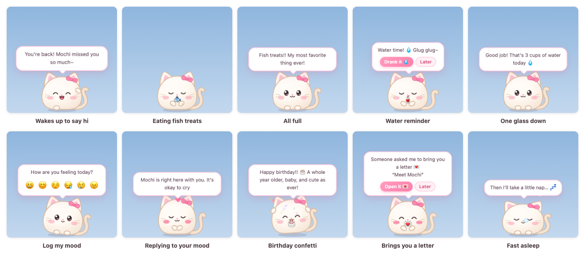
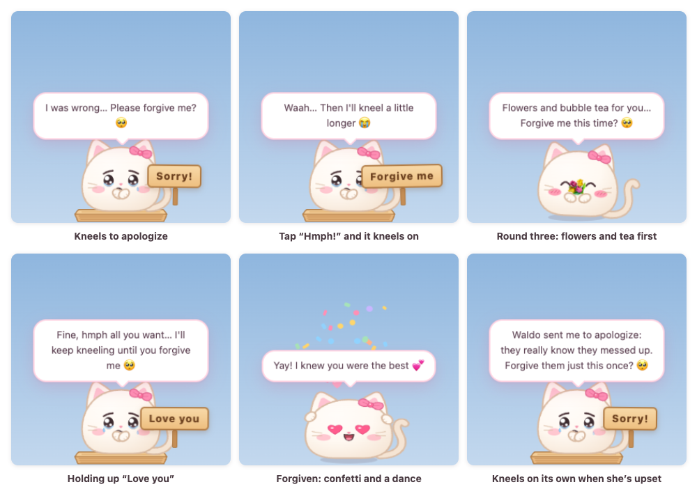
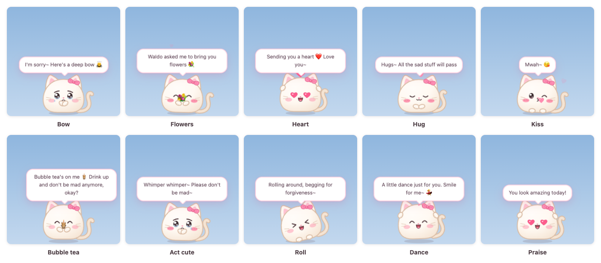
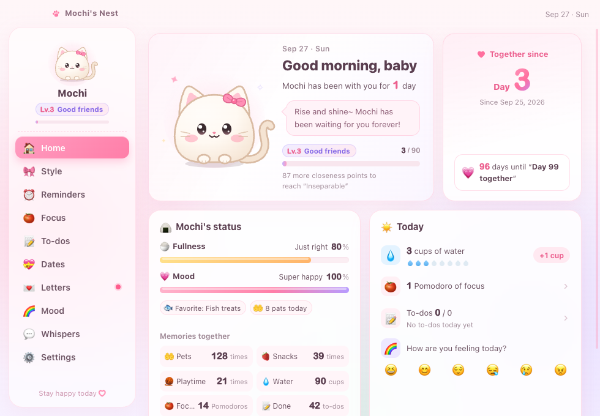
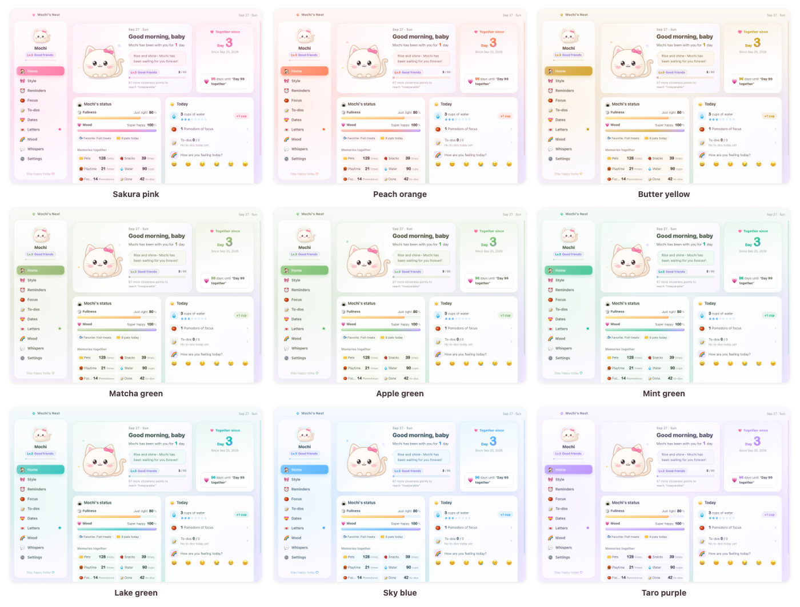

# 糯米桌宠 NuomiPet

[简体中文](README.md) | [繁體中文](README.zh-TW.md) | **English** | [日本語](README.ja.md) | [한국어](README.ko.md) | [Français](README.fr.md) | [العربية](README.ar.md)

[](https://github.com/WaIdo/NuomiPet/actions/workflows/check.yml)

A little ball of fluff that lives on your desktop, on Windows and macOS. It walks along the bottom of the screen, reminds her to drink water, take breaks and go to bed early, remembers your special dates, passes on your whispers and delivers your letters. And if you make her mad, it kneels on a washboard to say sorry. The interface comes in seven languages: 简体中文, 繁體中文, English, 日本語, 한국어, Français and العربية.



## Download

Download the right file from the [Releases](https://github.com/WaIdo/NuomiPet/releases/latest) page:

| File | For |
| --- | --- |
| `NuomiPet-1.1.1-win-setup.exe` | Windows 10 / 11 (64-bit), installer, recommended |
| `NuomiPet-1.1.1-win-portable.exe` | Windows 10 / 11 (64-bit), portable, just double-click to run |
| `NuomiPet-1.1.1-mac-arm64.dmg` | Macs with Apple silicon (M1 and later), macOS 13 or later |
| `NuomiPet-1.1.1-mac-x64.dmg` | Macs with an Intel chip, macOS 13 or later |

Not sure which chip your Mac has? Click the Apple menu at the top left of the screen → "About This Mac". If "Chip" says Apple M…, pick arm64; if it says Intel, pick x64.

## Install

**Windows**

1. Run `NuomiPet-1.1.1-win-setup.exe` and follow the steps (no administrator rights needed). The portable version runs with a double-click.
2. The installer isn't signed with a paid code-signing certificate, so the first time you run it you may see "Windows protected your PC": click "More info" → "Run anyway". If your antivirus blocks it, choose to allow or trust it.
3. The pet appears at the bottom right of the screen. In the tray area at the bottom right of the taskbar there's a pink kitty icon (it may be hidden under `^`); click it to open the menu.

**macOS**

1. Open the dmg and drag "糯米桌宠" (NuomiPet) into "Applications".
2. The app isn't notarized by Apple, so the first time you open it you'll see a message that it can't be verified. Open "System Settings → Privacy & Security", find "糯米桌宠" near the bottom of the page, click "Open Anyway", and enter your login password.
3. Or run the command below once in Terminal; after that you can open the app with a double-click:

```bash
xattr -dr com.apple.quarantine /Applications/糯米桌宠.app
```

The pet appears at the bottom of the screen, and there's a little kitty-head icon at the top right of the menu bar; click it to open the menu. The app doesn't take a spot in the Dock; an icon shows up there only while the Nest is open.

## Features

**The pet**
- 6 little animals: Kitty, Bunny, Teddy, Puppy, Hamster and Chick. 15 colors (including 5 light greens: Avocado, Matcha, Green apple, Mint and Lake green), 9 accessories (Bow, Flower, Sprout, Crown, Party hat, Heart clip, Berry hat, Santa hat, Glasses), 4 markings (Solid, White belly, Stripes, Eye patch) and 4 sizes.
- It walks around on its own, daydreams, yawns, stretches and spins; its eyes follow the mouse. If you're away from the computer for 5 minutes it falls asleep (with a snot bubble), and it greets you when you come back.
- Interactions:
  - Head pats: without pressing any mouse button, move the pointer onto the pet and quickly rub it left and right a few times
    - Moving slowly across it doesn't count, and pressing and dragging picks it up instead
    - Once you've rubbed enough, it closes its eyes, blushes and hearts pop from its head; keep rubbing and they keep coming. When you stop, it responds happily
    - Clicking the big picture of the pet on Nest → Home also counts as a pat
    - Each pat adds a little closeness and mood (at most once every 8 seconds); patting it while it kneels on the washboard means you forgive it
  - Click: a poke (poke it too many times and it gets dizzy)
  - Double-click: opens the quick panel (Feed, Coax, Play, Focus, Mood, Nest, Pickup)
  - Right-click: the full menu
  - Press and drag: pick it up; let go and it drops back to the bottom of the screen. Fling it and it bounces off the walls; land too hard and it gets dizzy
- 12 snacks, and each species has a favorite. It has fullness, mood and a closeness level (Lv.1 to Lv.10).

**Reminders and tools**
- Drink water, stand up and move, eye rest, regular meals and early bedtime. Reminders can be limited to certain hours of the day.
- Custom reminders: every day / weekdays / weekends / once.
- Pomodoro: while you focus, the pet hugs a tiny laptop and keeps you company, then reminds you to take a break.
- A to-do list; the pet celebrates each one you finish. Besides your own to-dos, there's "💞 Little things for two": a row of small ideas for couples (like "Take a photo of us together" or "Watch a sunset with WaIdo"). Click one to add it to your to-dos, or click "Shuffle" for new ones.
- Weather: once a city is set, the pet reports the weather in the morning and reminds her to bring an umbrella when rain is coming.

**The parts for her**
- Dates: how many days you've been together, every 100 days and every anniversary, her birthday, custom anniversaries and countdowns. On the day, the pet throws confetti; a few days before, it gives a heads-up.
- Letters: write a letter in the app and pick the day it can be opened (her birthday, say). Once it's sealed, no one can read it before that day; when the day comes, the pet carries the letter to her.
- Whispers: the pet says the lines you write at random times, and can sign them "WaIdo asked me to whisper this to you: …".
- Mood diary: every evening it asks her how her day was, and the Nest keeps a monthly mood calendar.
- Holidays: New Year's Day, Valentine's Day, Women's Day, White Day, 520 Day, Children's Day, Qixi, Mid-Autumn Festival, Lunar New Year's Eve, Lunar New Year, Lantern Festival, Dragon Boat Festival, Christmas Eve, Christmas and New Year's Eve all come with greetings (lunar holidays are calculated through 2035). On her birthday the pet wears a party hat, at Christmas a Santa hat, and on Valentine's Day, 520 Day and Qixi a heart clip.
- Today's fortune: click "🔮 Today's fortune" in the right-click menu. It's always five full stars (★★★★★), and what it's good for and what to avoid change every day.
- Send letters by email: email the pet's address from your phone or computer and it becomes a letter in her Letters box, and you can choose the day it opens. See "Send letters by email, get asked for a pickup" below for setup.
- 🚗 Pickup: she clicks it once in the pet's quick panel, and the pet emails you (and can also push a notification to your phone or WeChat) to come pick her up after work.

**Cheering her up**



- 11 actions: Kneel, Flowers, Heart, Hug, Kiss, Tea, Bow, Cute, Roll, Dance and Praise, plus "Random" to pick one for you.
- Kneel on the washboard: the pet kneels on a washboard, teary-eyed, holding up a little wooden sign that says "Sorry!". After a while it asks "Am I forgiven?", with two buttons below: "You're forgiven 💗" and "Hmph!".
  - Click "Hmph!" and it keeps kneeling, and the sign changes to "Forgive me". On the third round it brings flowers and bubble tea before kneeling again, for up to four rounds.
  - Click "You're forgiven", or pat its head while it's kneeling, and it jumps up, throws confetti and dances.
  - If you've filled in "Whisper signature", it sometimes says it's apologizing on your behalf.
- It also cheers her up on its own: log the mood "Angry" and it kneels right away to apologize; "Sad" gets a hug and then flowers; "Tired" gets a bubble tea. Poke it again and again and it sometimes kneels and begs for mercy. At closeness Lv.3 or higher, when it's in a good mood, it now and then sends a heart or flowers on its own.
- Where to find it: double-click the pet and click "Coax" in the quick panel; "🥺 Cheer you up" in the right-click menu; "🥺 Cheer me up" in the tray menu (a random one); "🥺 Cheer me up" on the Nest's Home page.



**The Nest**

The Nest is the settings window. You can open it from the right-click menu, the quick panel or the tray icon. It has: Home (days together, the pet's status, today's water / Pomodoros / to-dos / mood, weather), Style, Reminders, Focus, To-dos, Dates, Letters, Mood (calendar), Whispers and Settings (About us, Nest colors, always on top, open at login, sound, walking, gravity, Do Not Disturb, weather city, data import and export).



The Nest comes in nine colors: Sakura pink, Peach orange, Butter yellow, Matcha green, Apple green, Mint green, Lake green, Sky blue and Taro purple, or you can choose "Match the pet". Change it in "Nest → Settings → Nest colors"; the background, buttons, the pet's speech bubbles and the quick panel all change together.



**Languages**
- 简体中文, 繁體中文, English, 日本語, 한국어, Français and العربية. The first time it opens, it follows the system language; the Arabic interface is laid out right to left.
- Switch any time in "Nest → Settings → Language" or "🌐 Language" in the tray menu: the interface, what the pet says, the menus and the holiday greetings change right away. The pet's name and what it calls her also change if you haven't customized them (糯米 / Mochi / もち / 모찌 / موتشي, 宝贝 / baby / ハニー / 자기 / mon cœur / حبيبتي).
- Anything you two wrote yourselves (names, nicknames, whispers, letters, dates) stays as it is and is never translated.

## Add your own content

Everything can be set up inside the app. No files to edit, no rebuilding:

- **Profile**: the first time the Nest opens, it asks "Let's get to know each other~". Fill in the pet's name, what it calls her (default: "baby"), her birthday (including the year), the day you got together, and your name; anything missing is highlighted. You can change these any time in "Nest → Settings → About us". After they first meet, the pet will also ask her itself.
- **Dates**: "Nest → Dates". Add yearly anniversaries, countdowns and day counters.
- **Whispers**: "Nest → Whispers". Write the lines you want the pet to pass on to her at random times.
- **Letters**: "Nest → Letters → Write a letter". Fill in the title, your name and the letter, then choose "Right away" or "On a set day" for when it can be opened. Once it's sealed, no one can read it before that day (not even the writer). If you made a mistake, delete it and write a new one; you can also change the title and the open date.
- **Writing letters on your own computer**: write them on your computer, save them to a file with "Letters → Export letters written here", then use "Import letters" on her computer. The letters in the exported file are not stored as plain text.

### Write it in before building

If you want her to see your content the very first time she opens the app, edit `gift.config.json` in the project root before building, then build it yourself (see "Build from source"):

| Field | Meaning | Example |
| --- | --- | --- |
| `petName` | The pet's name; if empty, it's "糯米" (or the matching name in other languages, such as Mochi) | `"Mochi"` |
| `nickname` | What the pet calls her; if empty, it's "宝贝" (or the matching pet name in other languages, such as baby) | `"baby"` |
| `sender` | Your name; whispers will say "WaIdo asked me to whisper this to you" | `"WaIdo"` |
| `species` / `color` / `accessory` / `markings` / `size` | Starting look; see `src/shared/catalog.json` for the values | `"bunny"` / `"sakura"` / `"flower"` / `"none"` / `"m"` |
| `togetherSince` | The day you got together | `"2026-09-25"` |
| `birthday` | Her birthday | `"2002-06-08"` |
| `anniversaries` | Other dates | `[{ "name": "First date", "date": "2023-06-01", "kind": "yearly" }]` |
| `notes` | List of whispers | `["Stay happy today", "..."]` |
| `letters` | Letters | See below |

`kind` in `anniversaries`: `yearly` reminds every year, `countdown` is a one-time countdown, and `since` counts the days (with a celebration every 100 days).

Letter example (each `id` must be unique; leave `unlock` empty to make it readable right away; use `\n` for line breaks in `body`):

```json
"letters": [
  {
    "id": "birthday-2027",
    "title": "Happy birthday",
    "unlock": "2027-06-08",
    "from": "WaIdo",
    "body": "First line\nSecond line…"
  }
]
```

A letter where the pet introduces itself comes built in (`id: "hello"`) and is handed to her on first launch.

## Send letters by email, get asked for a pickup

Both of these need an email account for the pet, set up once on her computer.

Supported providers: QQ Mail, Tencent Exmail, NetEase Mail (163, 126, yeah.net, 188, VIP), NetEase Business Mail, Gmail, Outlook / Hotmail / Microsoft 365, iCloud, Yahoo, Sina, Sohu, Alibaba Mail and 139 Mail; for any other provider with IMAP/SMTP you can enter the servers by hand. This only applies to the pet's mailbox. The address you send letters from, and the one that gets pickup alerts, can be with any provider.

1. Register a new email account for the pet (QQ Mail or 163 Mail recommended). Don't use an account you two use every day.
2. In the web version of the mailbox, turn on IMAP/SMTP and get an app password (not the login password):
   - QQ Mail: 设置 (Settings) → 账号 (Account) → "POP3/IMAP/SMTP/Exchange/CardDAV/CalDAV 服务" → turn on "IMAP/SMTP 服务" (IMAP/SMTP service). After verifying, the app password is shown.
   - NetEase Mail: 设置 (Settings) → POP3/SMTP/IMAP → turn on "IMAP/SMTP 服务" (IMAP/SMTP service), then follow the steps to get the authorization password.
   - Gmail, iCloud: turn on 2-step verification first, then generate an app-specific password.
   - Outlook: no app password; you sign in with a Microsoft account instead. See "Using Outlook as the pet's mailbox" below.
3. On her computer, open "Nest → Settings → Email", choose the email provider (usually "Detect automatically"), fill in the pet's email address, the app password, "His email" (the address allowed to send letters, i.e. yours) and "Send pickup alerts to" (usually also your address), click "Save", then "Test connection".
4. Click "Send him the how-to", and your mailbox will get an email with instructions.

**Sending a letter**: email the pet's address from your own email. The subject becomes the letter's title and the body becomes the letter. Within a few minutes the pet hands the letter to her, and you get a confirmation email.
- To make it open only on a certain day: put [2026-12-25] at the very start of the subject, or make the first line of the body "Open on: 2026-12-25". With just a month and day (like [12-25]), it's the next one to come.
- Only letters from the addresses in "His email" are accepted; letters from anyone else never reach the Letters box. You can also set a "Secret word", and only letters that include it are accepted.
- Text only; pictures and attachments aren't shown.

**Pickup**: she double-clicks the pet, clicks "🚗 Pickup", picks "Right now", "In 30 min" or "In an hour", can add a note, and the pet emails you. To get the alert on your phone right away:
- Install a mail app on your phone and turn on new-mail notifications; QQ Mail can also send alerts inside WeChat ("QQ邮箱提醒").
- Or fill in "Phone push URL" in the settings: on iPhone you can use Bark (`https://api.day.app/your-key/{title}/{body}`); for WeChat, ServerChan (`https://sctapi.ftqq.com/your-SendKey.send?title={title}&desp={body}`) or PushPlus (`https://www.pushplus.plus/send?token=your-token&title={title}&content={body}`).

The app password and push URL are stored only on her computer, encrypted with the system keychain (macOS) or data protection (Windows), and never appear in exported backups.

### Using Outlook as the pet's mailbox

Microsoft no longer lets third-party apps sign in to Outlook with a password; you have to sign in with a Microsoft account instead. That needs an "application ID", which you register yourself with Microsoft, once and for free (you can't borrow another app's):

1. Sign in to the [Azure portal](https://portal.azure.com) with your Microsoft account and go to "Microsoft Entra ID → App registrations → New registration". Personal accounts may need to set up a free Azure account first; follow the prompts on Microsoft's pages.
2. Any name works (for example NuomiPet). For "Supported account types", choose "Accounts in any organizational directory and personal Microsoft accounts". Leave the redirect URI empty.
3. Under "Authentication → Advanced settings", set "Allow public client flows" to "Yes". You don't need a client secret.
4. Under "API permissions", add the Office 365 Exchange Online delegated permissions `IMAP.AccessAsUser.All` and `SMTP.Send`, plus Microsoft Graph `offline_access`.
5. Put the "Application (client) ID" from the "Overview" page into `mailMsClientId` in `gift.config.json` (before building), or enter it in "Nest → Settings → Email".
6. In the settings, choose "Outlook / Hotmail / Microsoft 365", click "Sign in with Microsoft", open https://microsoft.com/devicelogin in your browser, enter the code shown on the settings page, sign in with the pet's email and approve. After that it renews on its own; if the password changes or access is revoked, the settings page asks you to sign in again.

Work or school Microsoft 365 mailboxes usually also need an administrator to approve access and to turn on IMAP and SMTP authentication for the mailbox. The Outlook part has only been tested against a locally simulated server and hasn't been verified with a real Microsoft account yet.

## Tips

- `Ctrl + Alt + P` (on a Mac, `⌘ + ⌥ + P`): show / hide the pet. Handy when watching videos full screen.
- When the pet is hidden, click the tray icon and choose "Bring Mochi back", or open the app again.
- "Call Mochi over" drops the pet from the top of whichever screen the mouse is on, which is handy with multiple displays.
- In the right-click menu you can turn off "Walk around" and "Sound", and turn on "Do Not Disturb": the pet stops chatting and doesn't remind her about water, sitting too long, eye rest, meals or bedtime. Custom reminders, Pomodoro, dates and letters still come through.
- Turn on "Open at login" on the Nest's Settings page or in the tray menu.

## Uninstall and data

- Windows: find "糯米桌宠" in "Settings → Apps" and uninstall it; for the portable version, just delete the exe.
- macOS: first choose "Quit" from the kitty-head menu in the menu bar, then drag "糯米桌宠" from "Applications" to the Trash.

Data is stored only on this computer and isn't deleted when you uninstall, so after reinstalling, the pet still remembers you two:

- Windows: `%APPDATA%\糯米桌宠\mochi-data.json`
- macOS: `~/Library/Application Support/糯米桌宠/mochi-data.json`

Backups can be exported and imported on the Nest's Settings page. To delete everything, uninstall and then delete the folder above.

## Privacy

The app doesn't collect or upload any data, and has no analytics or ads. It only goes online in these cases:
- Weather: once turned on and a city is set, it looks up the city's coordinates with [Open-Meteo](https://open-meteo.com/), then looks up the weather for those coordinates.
- Email: once the pet's mailbox is set up, it regularly connects to that mailbox's servers to check for letters, and sends a confirmation email when a letter arrives. When she clicks "Pickup", it sends an email, and if a push URL is filled in, it also requests that URL.

If none of these are set up, the app never goes online.

## Build from source

Requires Node.js 22 or later.

```bash
npm install
```

Downloading Electron from mainland China is slow; you can set mirrors before installing and building:

```bash
export ELECTRON_MIRROR="https://npmmirror.com/mirrors/electron/"
export ELECTRON_BUILDER_BINARIES_MIRROR="https://npmmirror.com/mirrors/electron-builder-binaries/"
```

If `node_modules/electron/dist` doesn't exist after `npm install` (newer npm versions skip install scripts by default), download it once by hand:

```bash
node node_modules/electron/install.js
```

Run it locally:

```bash
npm start
```

Build packages; the output goes to `dist/`. On macOS you can build both the Mac and Windows packages, without Wine:

```bash
npm run dist:mac
npm run dist:win
```

To regenerate the icons after changing the pet's drawing code: `npm run icons`.

**Tests**

```bash
npm test                        # Unit tests: dates, reminder scheduling, Pomodoro, letters, languages
node dev/run-scenarios.js       # Runs every scenario under dev/scenarios in real windows; screenshots go to scenario-output/
node dev/i18n-check.js code     # Checks for Chinese text left in the code
node dev/i18n-check.js locales  # Checks that every language matches Simplified Chinese key for key, with the same placeholders
```

On every push to `main`, GitHub Actions runs the unit tests and all scenarios on Windows Server 2022 (whose emoji font is as old as Windows 10's), Windows Server 2025 and macOS, and on Windows it also builds the installer, installs it silently, launches it and uninstalls it. The screenshots can be downloaded from each run's Artifacts.

## Project structure

```
gift.config.json        Content written in before building (names, dates, whispers, letters)
src/main/               Main process: windows, dragging and falling physics, tray and menus, reminder scheduling, Pomodoro, weather, data storage
src/preload/            API available to the renderer (window.mochi)
src/shared/             Shared by both: species/color/food catalog, holiday table, themes, date helpers, languages (i18n.js)
src/shared/locales/     Text for each language: interface (common/main/pet/home/pages.json), pet lines (phrases.json), names and default content (data.json)
src/renderer/shared/    The pet's SVG look, expressions and animations, sound effects, emoji compatibility
src/renderer/pet/       Pet window: behavior, speech bubbles, effects, quick panel
src/renderer/home/      The Nest (settings window)
src/renderer/letter/    Letter window
scripts/                Icon generation, page screenshots, theme color generation
dev/                    Preview pages, test scenarios, scenario runner, Windows installer smoke test
test/                   Unit tests
docs/images/            Screenshots for this page
```

## Support the author

If Mochi makes you two happy too, you can buy the author a bubble tea 🧋 with Alipay or WeChat Pay. It's entirely voluntary and doesn't change anything in the app. A tip does not grant a commercial-use license.

<p>
  
  
</p>

## Copyright and license

Copyright © 2026 WaIdo

The code and assets of this project (the pet's look, icons, lines and sound effects) are released under the [PolyForm Noncommercial License 1.0.0](LICENSE.md). In short:

- You may: use it personally, study it, modify it, give it to a friend or partner, and share the original or modified versions (noncommercially).
- You may not: use it for any commercial purpose, such as selling this software or a modified version, or including it in a paid product or service.
- When sharing, include the license (or a link to it) and keep this line: `Required Notice: Copyright © 2026 WaIdo (https://github.com/WaIdo/NuomiPet)`.

The above is only a summary. The English text of [LICENSE.md](LICENSE.md) is the binding license. This is not an open-source license as defined by the OSI; the source code is public, but use is limited to noncommercial purposes. If you want to use it commercially, please contact the author first.

**Third-party components and data**

- The installer includes [Electron](https://www.electronjs.org/) (MIT License) and the open-source components inside it, such as Chromium and Node.js. Their licenses are distributed with the installer: on Windows, in `LICENSE.electron.txt` and `LICENSES.chromium.html` in the install folder; on macOS, in `糯米桌宠.app/Contents/Resources/`.
- Email is sent and received with [ImapFlow](https://github.com/postalsys/imapflow) (MIT), [Nodemailer](https://nodemailer.com/) (MIT-0) and [mailparser](https://github.com/nodemailer/mailparser) (MIT), distributed with the installer.
- Packaging tool: [electron-builder](https://www.electron.build/) (MIT).
- The Gregorian dates of the lunar holidays were calculated with [lunar-javascript](https://github.com/6tail/lunar-javascript) (MIT) and written into `src/shared/festivals.json`; the app itself doesn't include that library.
- Weather data is provided by [Open-Meteo](https://open-meteo.com/) under [CC BY 4.0](https://creativecommons.org/licenses/by/4.0/); Open-Meteo's free API is for noncommercial use only.
- Emoji in the interface are drawn by the operating system's own fonts (Apple Color Emoji, Segoe UI Emoji and others); the project doesn't include any font files. The screenshots on this page were taken on macOS, and the emoji artwork in them is copyrighted by Apple; all names in the screenshots are examples.
- The pet's look and the icons are SVGs drawn in code within the project, and the sound effects are synthesized at runtime with Web Audio; all are original to this project.
