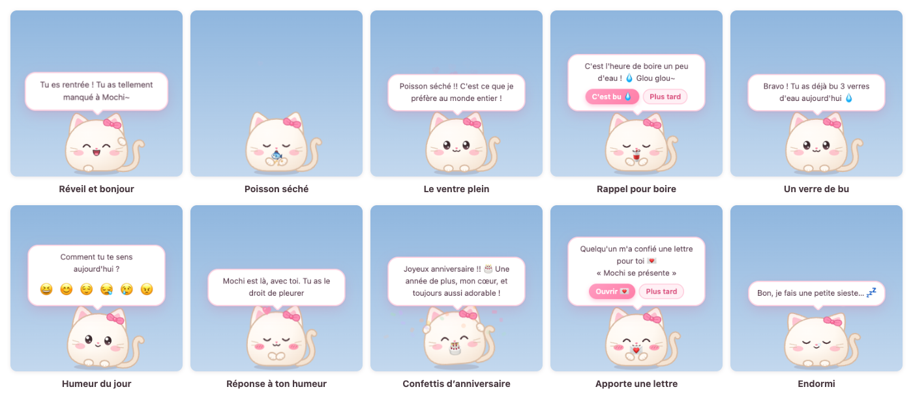

# 糯米桌宠 NuomiPet

[简体中文](README.md) | [繁體中文](README.zh-TW.md) | [English](README.en.md) | [日本語](README.ja.md) | [한국어](README.ko.md) | **Français** | [العربية](README.ar.md)

[](https://github.com/WaIdo/NuomiPet/actions/workflows/check.yml)

Une petite boule toute douce qui vit sur le bureau, sous Windows comme sous macOS. Elle se promène en bas de l'écran, rappelle de boire de l'eau, de faire des pauses et de se coucher tôt, se souvient de vos dates spéciales, transmet vos mots doux et apporte vos lettres ; et si vous l'avez fâchée, elle se met même à genoux sur une planche à laver pour demander pardon. L'interface existe en sept langues : 简体中文, 繁體中文, English, 日本語, 한국어, Français et العربية.



## Téléchargement

Téléchargez le fichier qui vous convient sur la page [Releases](https://github.com/WaIdo/NuomiPet/releases/latest) :

| Fichier | Pour |
| --- | --- |
| `NuomiPet-1.1.0-win-setup.exe` | Windows 10 / 11 (64 bits), version à installer, recommandée |
| `NuomiPet-1.1.0-win-portable.exe` | Windows 10 / 11 (64 bits), version portable, un double-clic suffit |
| `NuomiPet-1.1.0-mac-arm64.dmg` | Mac avec puce Apple (M1 et suivantes), macOS 13 ou plus récent |
| `NuomiPet-1.1.0-mac-x64.dmg` | Mac avec puce Intel, macOS 13 ou plus récent |

Pour savoir quelle puce a votre Mac : menu Pomme en haut à gauche de l'écran → « À propos de ce Mac ». Si la ligne « Puce » indique Apple M…, prenez arm64 ; si elle indique Intel, prenez x64.

## Installation

**Windows**

1. Lancez `NuomiPet-1.1.0-win-setup.exe` et suivez les instructions (aucun droit administrateur nécessaire). La version portable se lance directement d'un double-clic.
2. Le programme n'a pas de certificat de signature de code payant : au premier lancement, le message « Windows a protégé votre ordinateur » peut apparaître. Cliquez sur « Informations complémentaires » → « Exécuter quand même ». Si votre antivirus le bloque, choisissez d'autoriser ou de faire confiance.
3. Le compagnon apparaît en bas à droite de l'écran. Dans la zone de notification, en bas à droite de la barre des tâches, une petite icône de chat rose (parfois cachée sous `^`) ouvre le menu d'un clic.

**macOS**

1. Ouvrez le dmg et faites glisser « 糯米桌宠 » dans « Applications ».
2. L'application n'est pas notariée par Apple : au premier lancement, macOS indique qu'elle ne peut pas être vérifiée. Ouvrez « Réglages Système → Confidentialité et sécurité », trouvez « 糯米桌宠 » en bas de la page, cliquez sur « Ouvrir quand même », puis saisissez encore une fois le mot de passe de votre session.
3. Vous pouvez aussi exécuter une fois la commande suivante dans le « Terminal » ; ensuite, un double-clic suffit :

```bash
xattr -dr com.apple.quarantine /Applications/糯米桌宠.app
```

Le compagnon apparaît en bas de l'écran, et une petite tête de chat dans la barre des menus, en haut à droite, ouvre le menu d'un clic. L'application n'occupe pas le Dock ; son icône n'y apparaît que le temps où le « Nid » est ouvert.

## Fonctionnalités

**Le compagnon lui-même**
- 6 petits animaux : Minou, Lapinou, Nounours, Toutou, Hamster, Poussin ; 15 couleurs (dont 5 verts tendres : Avocat, Matcha, Pomme verte, Menthe, Vert d'eau), 9 accessoires (nœud, fleur, pousse, couronne, chapeau de fête, barrette cœur, bonnet fraise, bonnet de Père Noël, lunettes rondes), 4 motifs (Uni, Ventre blanc, Rayures, Cache-œil) et 4 tailles.
- Il se promène tout seul, rêvasse, bâille, s'étire, fait des tours sur lui-même ; ses yeux suivent la souris ; si vous quittez l'ordinateur 5 minutes, il s'endort (avec une bulle au nez) et vous accueille à votre retour.
- Interactions :
  - Allers-retours de la souris sur lui : une caresse sur la tête, avec des petits cœurs
  - Clic : un petit tapotement (à force, il a le tournis)
  - Double-clic : ouvre le menu rapide (Nourrir, Câlins, Jouer, Focus, Humeur, Nid, Viens !)
  - Clic droit : le menu complet
  - Cliquer-glisser : on le soulève, et il retombe en bas de l'écran quand on le lâche ; lancé trop fort, il se cogne contre le bord de l'écran, et une grosse chute l'étourdit
- 12 friandises, chaque espèce a sa préférée ; satiété, humeur et niveaux de complicité (Lv.1 à Lv.10).

**Rappels et outils**
- Boire de l'eau, bouger un peu, reposer ses yeux, manger à l'heure, se coucher tôt ; les rappels peuvent être limités à une plage horaire.
- Rappels personnalisés : tous les jours / en semaine / le week-end / une seule fois.
- Pomodoro : pendant la concentration, le compagnon tient compagnie avec son petit ordinateur dans les bras, puis rappelle de faire une pause.
- Liste « À faire » : le compagnon fête chaque tâche terminée. En plus de vos propres tâches, il y a « 💞 Petits moments à deux » : une rangée de petites idées pour les amoureux (par exemple « Prendre une photo de nous deux » ou « Regarder un film avec WaIdo ») ; un clic l'ajoute à la liste, et « D'autres idées » en propose de nouvelles.
- Météo : une fois la ville choisie, le compagnon annonce le temps le matin et rappelle de prendre un parapluie quand il va pleuvoir.

**Pour elle**
- Dates spéciales : le nombre de jours ensemble, chaque centaine de jours et chaque anniversaire de couple, son anniversaire à elle, vos propres dates et vos comptes à rebours. Le jour venu, le compagnon fait pleuvoir des confettis ; quelques jours avant, il la prévient.
- Lettres : écrivez une lettre dans l'application et choisissez le jour où elle pourra l'ouvrir (le jour de son anniversaire, par exemple). Une fois scellée, personne ne peut lire le texte avant la date ; le jour venu, le compagnon lui apporte la lettre dans sa gueule.
- Mots doux : les phrases que vous écrivez sont dites par le compagnon de temps en temps, avec votre signature si vous voulez : « WaIdo m'a demandé de te glisser à l'oreille : … ».
- Journal d'humeur : chaque soir, le compagnon lui demande comment s'est passée sa journée ; le Nid garde un calendrier mois par mois.
- Fêtes : Jour de l'An, Saint-Valentin, Journée des femmes, White Day, Fête du 520, Journée des enfants, Qixi (la Saint-Valentin chinoise), Fête de la Mi-Automne, Réveillon du Nouvel An lunaire, Nouvel An chinois, Fête des lanternes, Fête des bateaux-dragons, Réveillon de Noël, Noël et Saint-Sylvestre ont chacune leur message (les dates des fêtes lunaires sont calculées jusqu'en 2035). Le jour de son anniversaire, le compagnon porte un chapeau de fête ; à Noël, un bonnet de Père Noël ; à la Saint-Valentin, à la Fête du 520 et à Qixi, une barrette cœur.
- Horoscope du jour : dans le menu du clic droit, « Horoscope du jour » donne chaque jour cinq étoiles (★★★★★), avec des « Conseillé » et « Déconseillé » qui changent tous les jours.
- Lettres par e-mail : depuis votre téléphone ou votre ordinateur, envoyez un e-mail à l'adresse du compagnon, et il devient une lettre dans sa boîte aux lettres à elle, avec une date d'ouverture si vous le souhaitez. La configuration est expliquée plus bas, dans « Lettres par e-mail et « Viens me chercher » ».
- 🚗 Viens me chercher : un clic dans le menu rapide du compagnon, et il vous envoie un e-mail (ou une notification sur votre téléphone ou WeChat) pour que vous veniez la chercher à la sortie du travail.

**Pour la consoler**

- 11 gestes : à genoux sur la planche à laver, offrir des fleurs, un cœur avec les doigts, un câlin, un bisou, un bubble tea, une courbette, les yeux doux, des roulades, une danse, des compliments ; et « Au hasard » en choisit un.
- À genoux sur la planche à laver : le compagnon s'agenouille, les larmes aux yeux, en brandissant une petite pancarte « Pardon ! ». Au bout d'un moment, il demande « Tu me pardonnes ? », avec deux boutons en dessous : « Je te pardonne 💗 » et « Hmpf ! ».
  - Avec « Hmpf ! », il reste à genoux et la pancarte devient « Pardonne-moi » ; au troisième tour, il offre d'abord des fleurs et un bubble tea avant de se remettre à genoux, et cela jusqu'à quatre tours.
  - Avec « Je te pardonne », ou si elle lui caresse la tête pendant qu'il est à genoux, il bondit de joie, lance des confettis et danse.
  - Si vous avez rempli la « Signature des mots doux » dans le profil, il dit parfois qu'il vient s'excuser de votre part.
- Il console aussi de lui-même : si elle choisit « Fâchée » dans son humeur du jour, il se met aussitôt à genoux ; « Triste », il lui fait un câlin puis lui offre des fleurs ; « Fatiguée », il lui apporte un bubble tea ; si on le tapote trop, il s'agenouille parfois pour demander grâce ; à partir de Lv.3, quand il est de bonne humeur, il lui arrive de faire un cœur avec les doigts ou d'offrir des fleurs spontanément.
- Accès : double-cliquez sur le compagnon et choisissez « Câlins » dans le menu rapide ; « Te remonter le moral » dans le menu du clic droit ; « Câlins » dans le menu de la zone de notification (un geste au hasard) ; « 🥺 Câlins » sur l'accueil du Nid.

**Le Nid**

Le « Nid » est la fenêtre des réglages. Il s'ouvre depuis le menu du clic droit, le menu rapide ou l'icône de la zone de notification : Accueil (jours ensemble, état du compagnon, eau / pomodoros / tâches / humeur du jour, météo), Tenue, Rappels, Pomodoro, À faire, Nos dates, Lettres, Humeur (calendrier), Mots doux et Réglages (Notre profil, Couleur du Nid, Toujours au premier plan, Lancer au démarrage, Son, Balade libre, Gravité, Ne pas déranger, ville de la météo, import et export des données).


Le Nid existe en neuf couleurs : Rose sakura, Orange pêche, Jaune beurre, Vert matcha, Vert pomme, Vert menthe, Vert d'eau, Bleu ciel et Lavande ; on peut aussi choisir « Comme le compagnon ». Elle se change dans « Nid → Réglages → Couleur du Nid » : le fond, les boutons, les bulles du compagnon et le menu rapide changent ensemble.

**Langues**
- 简体中文, 繁體中文, English, 日本語, 한국어, Français et العربية. Au premier lancement, l'application suit la langue du système ; en arabe, toute l'interface s'affiche de droite à gauche.
- Changez de langue à tout moment dans « Nid → Réglages → Langue » ou dans le menu « 🌐 Langue / Language » de la zone de notification : l'interface, les paroles du compagnon, les menus et les messages de fête suivent aussitôt ; le nom du compagnon et le surnom qu'il lui donne suivent aussi, tant que vous ne les avez pas modifiés (糯米 / Mochi / もち / 모찌 / موتشي, 宝贝 / baby / ハニー / 자기 / mon cœur / حبيبتي).
- Ce que vous écrivez vous-mêmes (noms, surnoms, mots doux, lettres, dates spéciales) reste tel quel et n'est pas traduit.

## Ajouter vos propres contenus

Tout se règle dans l'application, sans modifier de fichier ni refaire de paquet :

- **Profil** : à la première ouverture du « Nid », une fenêtre « Faisons connaissance » s'affiche. Renseignez le nom du compagnon, le surnom qu'il lui donne (« mon cœur » par défaut), sa date d'anniversaire (avec l'année), le jour où vous vous êtes mis ensemble et votre signature ; les champs manquants sont signalés. Tout se modifie ensuite dans « Nid → Réglages → Notre profil ». Après la première rencontre, le compagnon lui pose aussi la question.
- **Dates spéciales** : « Nid → Nos dates », pour ajouter des dates qui reviennent chaque année, des comptes à rebours ou des compteurs de jours.
- **Mots doux** : « Nid → Mots doux », pour écrire les phrases que le compagnon lui transmettra de temps en temps.
- **Lettres** : « Nid → Lettres → Écrire une lettre ». Écrivez un titre, une signature et le texte, puis choisissez « Tout de suite » ou « À une date précise » pour l'ouverture. Une fois la lettre scellée, personne ne peut lire le texte avant la date (pas même la personne qui l'a écrite) ; en cas d'erreur, supprimez-la et réécrivez-la, ou modifiez son titre et sa date d'ouverture.
- **Écrire sur votre propre ordinateur** : écrivez vos lettres sur votre ordinateur, enregistrez-les dans un fichier avec « Lettres → Exporter les lettres écrites ici », puis utilisez « Importer des lettres » sur son ordinateur à elle. Dans le fichier exporté, le texte n'est pas en clair.

### Préparer le contenu avant de créer le paquet

Pour qu'elle découvre vos contenus dès le premier lancement, modifiez `gift.config.json` à la racine du projet avant de créer vous-même le paquet (voir « Compiler depuis les sources ») :

| Champ | Signification | Exemple |
| --- | --- | --- |
| `petName` | Le nom du compagnon ; vide, c'est « Mochi » en français (chaque langue a son nom par défaut) | `"Mochi"` |
| `nickname` | Le surnom que le compagnon lui donne ; vide, c'est « mon cœur » en français (chaque langue a son petit nom par défaut) | `"mon cœur"` |
| `sender` | Votre signature ; les mots doux commenceront par « WaIdo m'a demandé de te glisser à l'oreille » | `"WaIdo"` |
| `species` / `color` / `accessory` / `markings` / `size` | L'apparence de départ ; valeurs possibles dans `src/shared/catalog.json` | `"bunny"` / `"sakura"` / `"flower"` / `"none"` / `"m"` |
| `togetherSince` | Le jour où vous vous êtes mis ensemble | `"2026-09-25"` |
| `birthday` | Sa date d'anniversaire | `"2002-06-08"` |
| `anniversaries` | Autres dates spéciales | `[{ "name": "Premier rendez-vous", "date": "2023-06-01", "kind": "yearly" }]` |
| `notes` | Liste de mots doux | `["Sois heureuse aujourd'hui aussi", "..."]` |
| `letters` | Lettres | voir ci-dessous |

Le `kind` des `anniversaries` : `yearly` rappel chaque année, `countdown` compte à rebours (une seule fois), `since` compteur de jours (fêté à chaque centaine de jours).

Exemple de lettre (les `id` doivent être uniques, un `unlock` vide signifie que la lettre peut être lue tout de suite, et `\n` fait un retour à la ligne dans `body`) :

```json
"letters": [
  {
    "id": "birthday-2027",
    "title": "Joyeux anniversaire",
    "unlock": "2027-06-08",
    "from": "WaIdo",
    "body": "Première ligne\nDeuxième ligne…"
  }
]
```

Une lettre de présentation du compagnon est incluse par défaut (`id: "hello"`) ; il la lui apporte au premier lancement.

## Lettres par e-mail et « Viens me chercher »

Ces deux fonctions demandent de préparer une adresse e-mail pour le compagnon ; il suffit de la configurer une fois sur son ordinateur à elle.

Messageries prises en charge : QQ Mail, Tencent Exmail, NetEase Mail (163, 126, yeah.net, 188, VIP), NetEase Mail Entreprise, Gmail, Outlook / Hotmail / Microsoft 365, iCloud, Yahoo, Sina, Sohu, Alibaba Mail et 139 Mail ; pour les autres messageries compatibles IMAP/SMTP, les serveurs se saisissent à la main. Cette liste ne concerne que « l'adresse e-mail du compagnon » : l'adresse d'où vous envoyez vos lettres et celle qui reçoit les alertes « Viens me chercher » peuvent être chez n'importe quel fournisseur.

1. Créez une nouvelle adresse e-mail pour le compagnon (QQ Mail ou 163 recommandés) ; n'utilisez pas une adresse que vous utilisez déjà tous les deux.
2. Dans la version web de la messagerie, activez le service IMAP/SMTP et récupérez le « code d'autorisation » (ce n'est pas le mot de passe de connexion) :
   - QQ Mail : 「设置 → 账号 → POP3/IMAP/SMTP/Exchange/CardDAV/CalDAV 服务」 (Paramètres → Compte → services POP3/IMAP/SMTP/Exchange/CardDAV/CalDAV) → activez 「IMAP/SMTP 服务」 (service IMAP/SMTP) ; après la vérification demandée, le code d'autorisation s'affiche.
   - NetEase Mail : 「设置 → POP3/SMTP/IMAP」 (Paramètres → POP3/SMTP/IMAP) → activez 「IMAP/SMTP 服务」 (service IMAP/SMTP) et suivez les instructions pour obtenir le mot de passe d'autorisation.
   - Gmail, iCloud : activez d'abord la validation en deux étapes, puis générez un « mot de passe d'application ».
   - Outlook : pas de code d'autorisation, la connexion se fait avec un compte Microsoft ; voir « Utiliser Outlook comme adresse du compagnon » ci-dessous.
3. Sur son ordinateur à elle, ouvrez « Nid → Réglages → E-mail », choisissez le fournisseur (en général « Détection automatique »), remplissez l'adresse e-mail du compagnon, le code d'autorisation, « Son adresse e-mail » (la vôtre, celle qui a le droit d'envoyer des lettres) et le champ **Alerte « Viens me chercher » envoyée à** (en général votre adresse aussi), cliquez sur « Enregistrer », puis sur « Tester la connexion ».
4. Cliquez sur « Lui envoyer le mode d'emploi » : vous recevrez un e-mail qui explique tout.

**Envoyer une lettre** : envoyez un e-mail depuis votre adresse à celle du compagnon ; l'objet devient le titre de la lettre, et le texte du message son contenu. En quelques minutes, le compagnon lui apporte la lettre, et vous recevez un e-mail de confirmation.
- Pour qu'elle ne puisse l'ouvrir qu'à partir d'un jour précis : commencez l'objet par [2026-12-25], ou écrivez « Ouverture : 2026-12-25 » en première ligne du message. Avec seulement le mois et le jour (par exemple [12-25]), c'est la prochaine date correspondante.
- Seules les lettres envoyées depuis les adresses de « Son adresse e-mail » sont acceptées ; les autres n'arrivent pas dans la boîte aux lettres. Vous pouvez aussi définir un « Code secret » : seules les lettres qui le contiennent sont acceptées.
- Seul le texte est pris en compte ; les images et les pièces jointes ne s'affichent pas.

**Viens me chercher** : elle double-clique sur le compagnon, choisit « 🚗 Viens ! », puis « Tout de suite », « Dans 30 min » ou « Dans 1 heure », ajoute un mot si elle veut, et le compagnon vous prévient par e-mail. Pour recevoir l'alerte tout de suite sur votre téléphone :
- installez l'application de votre messagerie sur votre téléphone et activez les notifications de nouveaux e-mails ; avec QQ Mail, vous pouvez aussi activer 「QQ邮箱提醒」 (alertes QQ Mail) dans WeChat ;
- ou remplissez l'« Adresse de notification mobile » dans les réglages : sur iPhone, Bark (`https://api.day.app/你的key/{title}/{body}`) ; pour WeChat, ServerChan (`https://sctapi.ftqq.com/你的SendKey.send?title={title}&desp={body}`) ou PushPlus (`https://www.pushplus.plus/send?token=你的token&title={title}&content={body}`). Remplacez 你的key, 你的SendKey et 你的token par votre propre clé ou jeton.

Le code d'autorisation et l'adresse de notification ne sont enregistrés que sur son ordinateur, chiffrés avec le trousseau du système (macOS) ou la protection des données (Windows), et n'apparaissent jamais dans les sauvegardes exportées.

### Utiliser Outlook comme adresse du compagnon

Microsoft n'autorise plus les applications tierces à se connecter à Outlook avec un mot de passe : il faut se connecter avec un compte Microsoft. Cette connexion demande un « ID d'application », que vous devez inscrire vous-même une fois, gratuitement, chez Microsoft (impossible d'emprunter celui d'un autre logiciel) :

1. Connectez-vous au [portail Azure](https://portal.azure.com) avec un compte Microsoft et ouvrez « Microsoft Entra ID → Inscriptions d'applications → Nouvelle inscription ». Avec un compte personnel, il faudra peut-être d'abord ouvrir un compte Azure gratuit : suivez les indications des pages Microsoft.
2. Donnez-lui le nom que vous voulez (NuomiPet, par exemple) ; pour les « Types de comptes pris en charge », choisissez « Comptes dans un annuaire d'organisation et comptes Microsoft personnels » ; l'URI de redirection n'est pas nécessaire.
3. Dans « Authentification → Paramètres avancés », réglez « Autoriser les flux de clients publics » sur « Oui » ; pas besoin de créer de secret client.
4. Dans « Autorisations d'API », ajoutez les autorisations déléguées d'Office 365 Exchange Online `IMAP.AccessAsUser.All` et `SMTP.Send`, ainsi que `offline_access` de Microsoft Graph.
5. Copiez l'« ID d'application (client) » affiché sur la page « Vue d'ensemble » dans le champ `mailMsClientId` de `gift.config.json` (avant de créer le paquet), ou dans « Nid → Réglages → E-mail ».
6. Dans les réglages, choisissez « Outlook / Hotmail / Microsoft 365 », cliquez sur « Se connecter avec Microsoft », ouvrez https://microsoft.com/devicelogin dans le navigateur, saisissez le code affiché dans les réglages, connectez-vous avec l'adresse du compagnon et acceptez. La connexion est ensuite renouvelée automatiquement ; si le mot de passe change ou si l'autorisation est retirée, les réglages demandent de se reconnecter.

Une adresse Microsoft 365 d'entreprise ou d'école demande en général en plus l'accord d'un administrateur, ainsi que l'activation de l'authentification IMAP et SMTP pour cette adresse. La partie Outlook n'a été testée que sur un serveur simulé en local, pas encore avec un vrai compte Microsoft.

## Astuces

- `Ctrl + Alt + P` (`⌘ + ⌥ + P` sur Mac) : afficher / cacher le compagnon, pratique pour regarder une vidéo en plein écran.
- Quand le compagnon est caché, cliquez sur l'icône de la zone de notification et choisissez « Faire revenir Mochi », ou relancez l'application.
- « Appeler Mochi » fait tomber le compagnon du haut de l'écran où se trouve la souris, bien pratique avec plusieurs écrans.
- Dans le menu du clic droit, vous pouvez désactiver « Balade libre » et « Son », ou activer « Ne pas déranger » : le compagnon ne bavarde plus et ne rappelle plus de boire, de bouger, de reposer ses yeux, de manger ou de dormir ; les rappels personnalisés, le pomodoro, les dates spéciales et les lettres continuent normalement.
- « Lancer au démarrage » s'active dans les « Réglages » du Nid ou dans le menu de la zone de notification.

(Dans ces menus, « Mochi » est remplacé par le nom de votre compagnon.)

## Désinstallation et données

- Windows : dans « Paramètres → Applications », trouvez « 糯米桌宠 » et désinstallez-le ; pour la version portable, supprimez simplement l'exe.
- macOS : choisissez d'abord « Quitter » dans le menu de la petite tête de chat de la barre des menus, puis faites glisser « 糯米桌宠 » du dossier « Applications » vers la corbeille.

Les données restent sur l'ordinateur et ne sont pas effacées à la désinstallation : après une réinstallation, le compagnon se souvient encore de vous deux.

- Windows : `%APPDATA%\糯米桌宠\mochi-data.json`
- macOS : `~/Library/Application Support/糯米桌宠/mochi-data.json`

La page « Réglages » du Nid permet d'exporter et d'importer une sauvegarde. Pour tout effacer définitivement, supprimez ce dossier après la désinstallation.

## Confidentialité

L'application ne collecte et n'envoie aucune donnée, sans statistiques ni publicité. Elle ne se connecte à Internet que dans ces cas :
- Météo : une fois activée et la ville choisie, le nom de la ville est envoyé à [Open-Meteo](https://open-meteo.com/) pour obtenir ses coordonnées, puis les coordonnées servent à obtenir la météo.
- E-mail : une fois l'adresse du compagnon configurée, l'application se connecte régulièrement au serveur de cette messagerie pour relever les lettres, et répond par un e-mail de confirmation quand une lettre arrive ; quand elle clique sur « Viens me chercher », un e-mail part, et si une adresse de notification est renseignée, cette adresse est appelée une fois.

Si aucune de ces fonctions n'est configurée, l'application ne se connecte jamais à Internet.

## Compiler depuis les sources

Node.js 22 ou plus récent est nécessaire.

```bash
npm install
```

En Chine continentale, le téléchargement d'Electron est très lent ; vous pouvez d'abord définir un miroir avant d'installer et de créer les paquets :

```bash
export ELECTRON_MIRROR="https://npmmirror.com/mirrors/electron/"
export ELECTRON_BUILDER_BINARIES_MIRROR="https://npmmirror.com/mirrors/electron-builder-binaries/"
```

Si `node_modules/electron/dist` n'existe pas après `npm install` (les versions récentes de npm n'exécutent plus les scripts d'installation par défaut), téléchargez-le une fois à la main :

```bash
node node_modules/electron/install.js
```

Lancer en local :

```bash
npm start
```

Créer les paquets (dans le dossier `dist/`). Sur macOS, on peut créer à la fois les paquets Mac et Windows, sans Wine :

```bash
npm run dist:mac
npm run dist:win
```

Pour régénérer les icônes après avoir modifié le code de l'apparence du compagnon : `npm run icons`.

**Tests**

```bash
npm test                        # tests unitaires : dates, planification des rappels, pomodoro, lettres, langues
node dev/run-scenarios.js       # joue tous les scénarios de dev/scenarios dans de vraies fenêtres, captures dans scenario-output/
node dev/i18n-check.js code     # reste-t-il du chinois non extrait dans le code ?
node dev/i18n-check.js locales  # chaque langue correspond-elle clé par clé au chinois simplifié, avec les mêmes paramètres ?
```

À chaque push sur `main`, GitHub Actions exécute les tests unitaires et tous les scénarios sous Windows Server 2022 (dont la police emoji est aussi ancienne que celle de Windows 10), Windows Server 2025 et macOS, puis, sous Windows, crée le paquet, l'installe en mode silencieux, le lance et le désinstalle ; les captures d'écran sont téléchargeables dans les Artifacts de chaque exécution.

## Structure du projet

```
gift.config.json        contenus préparés avant la création du paquet (noms, dates spéciales, mots doux, lettres)
src/main/               processus principal : fenêtres, physique du glisser et de la chute, zone de notification et menus, planification des rappels, pomodoro, météo, stockage des données
src/preload/            interface disponible pour le processus de rendu (window.mochi)
src/shared/             code commun : catalogue des espèces / couleurs / aliments, table des fêtes, thèmes, outils de dates, langues (i18n.js)
src/shared/locales/     les textes de chaque langue : interface (common/main/pet/home/pages.json), paroles du compagnon (phrases.json), noms et contenus par défaut (data.json)
src/renderer/shared/    apparence SVG du compagnon, expressions et animations, effets sonores, compatibilité emoji
src/renderer/pet/       fenêtre du compagnon : comportement, bulles, effets, menu rapide
src/renderer/home/      le Nid (fenêtre des réglages)
src/renderer/letter/    fenêtre des lettres
scripts/                génération des icônes, captures des pages, génération des couleurs des thèmes
dev/                    pages d'aperçu, scénarios de test, script qui joue les scénarios, test rapide de l'installateur Windows
test/                   tests unitaires
docs/images/            captures d'écran de cette page
```

## Soutenir l'auteur

Si Mochi vous rend heureux tous les deux, vous pouvez offrir un bubble tea à l'auteur 🧋 (Alipay ou WeChat Pay). C'est entièrement libre et ne change rien au fonctionnement de l'application ; un don ne donne pas le droit d'en faire un usage commercial.

<p>
  
  
</p>

## Droits d'auteur et licence

Copyright © 2026 WaIdo

Le code et les ressources de ce projet (apparence du compagnon, icônes, textes, effets sonores) sont publiés sous la [PolyForm Noncommercial License 1.0.0](LICENSE.md). En bref :

- Autorisé : l'utiliser à titre personnel, l'étudier, le modifier, l'offrir à un ami ou à la personne que vous aimez, partager la version d'origine ou une version modifiée (sans but commercial).
- Interdit : toute utilisation commerciale, par exemple vendre ce logiciel ou une version modifiée, ou l'intégrer à un produit ou un service payant.
- En le partageant, joignez la licence (ou son lien) et conservez cette ligne : `Required Notice: Copyright © 2026 WaIdo (https://github.com/WaIdo/NuomiPet)`.

Cette section n'est qu'un résumé : seul le texte anglais du fichier [LICENSE.md](LICENSE.md) fait foi. Il ne s'agit pas d'une licence open source au sens de l'OSI, mais d'un code source public, limité à un usage non commercial. Pour toute utilisation commerciale, contactez d'abord l'auteur.

**Composants et données tiers**

- Le paquet d'installation contient [Electron](https://www.electronjs.org/) (licence MIT) et les composants open source qu'il inclut, comme Chromium et Node.js ; leurs licences sont distribuées avec le paquet : sous Windows, `LICENSE.electron.txt` et `LICENSES.chromium.html` dans le dossier d'installation ; sous macOS, dans `糯米桌宠.app/Contents/Resources/`.
- L'envoi et la réception des e-mails utilisent [ImapFlow](https://github.com/postalsys/imapflow) (MIT), [Nodemailer](https://nodemailer.com/) (MIT-0) et [mailparser](https://github.com/nodemailer/mailparser) (MIT), distribués avec le paquet.
- Outil de création des paquets : [electron-builder](https://www.electron.build/) (MIT).
- Les dates du calendrier grégorien des fêtes lunaires ont été calculées avec [lunar-javascript](https://github.com/6tail/lunar-javascript) (MIT) puis écrites dans `src/shared/festivals.json` ; l'application elle-même n'inclut pas cette bibliothèque.
- Les données météo sont fournies par [Open-Meteo](https://open-meteo.com/) sous licence [CC BY 4.0](https://creativecommons.org/licenses/by/4.0/) ; l'API gratuite d'Open-Meteo est réservée à un usage non commercial.
- Les emoji de l'interface sont affichés par les polices du système d'exploitation (Apple Color Emoji, Segoe UI Emoji, etc.) ; le projet ne contient aucun fichier de police. Les captures de cette page ont été prises sous macOS, et les dessins des emoji qu'on y voit appartiennent à Apple ; les noms visibles sur les captures sont des exemples.
- L'apparence du compagnon et les icônes sont des SVG dessinés en code dans le projet, et les effets sonores sont synthétisés à l'exécution avec Web Audio : tout cela est une création originale de ce projet.
