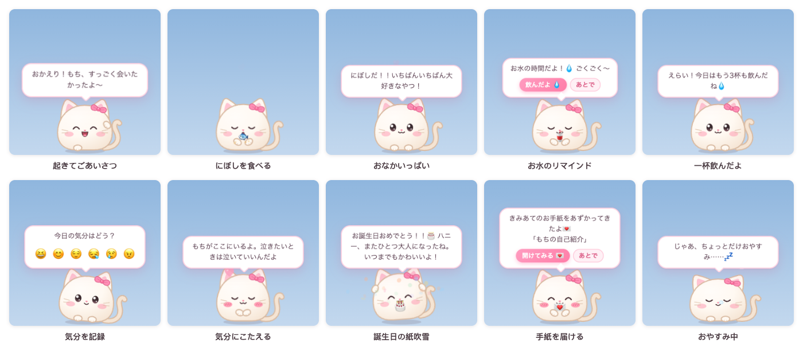
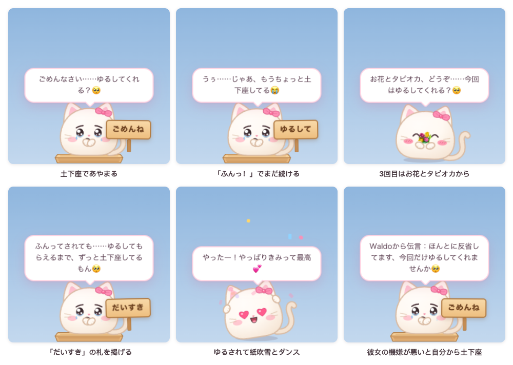
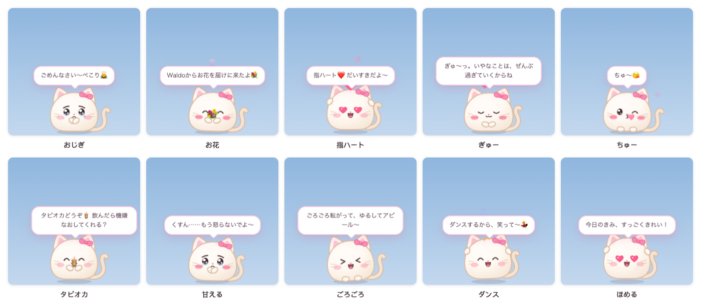
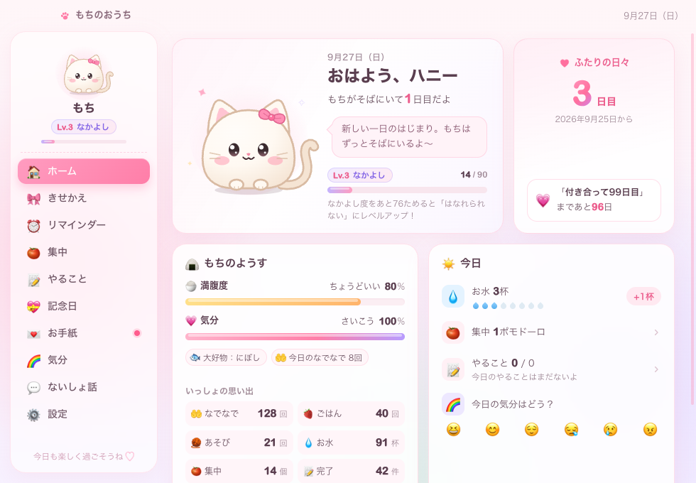
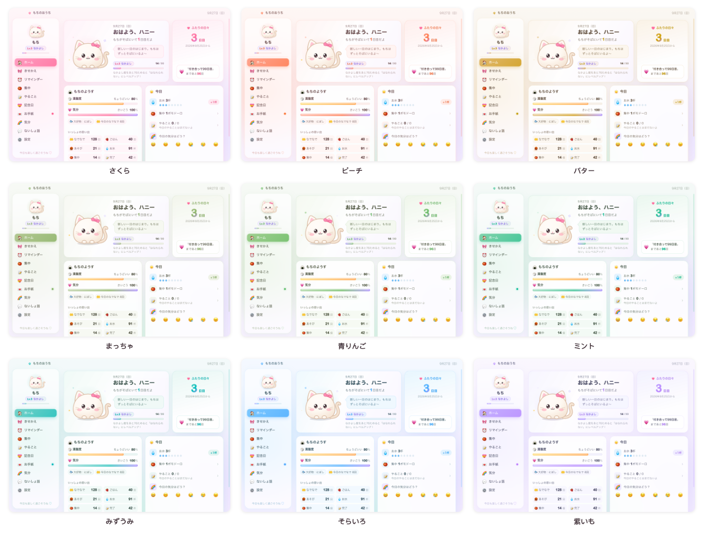

# 糯米桌宠 NuomiPet

[简体中文](README.md) | [繁體中文](README.zh-TW.md) | [English](README.en.md) | **日本語** | [한국어](README.ko.md) | [Français](README.fr.md) | [العربية](README.ar.md)

[](https://github.com/WaIdo/NuomiPet/actions/workflows/check.yml)

デスクトップに住む、まんまるの小さなペットです。Windows と macOS で動きます。画面の下を歩きまわり、お水・休憩・早寝をリマインドし、ふたりの記念日を覚えていて、あなたの代わりにないしょ話を伝えたりお手紙を届けたりします。彼女を怒らせてしまったときは、洗濯板の上で土下座してあやまってくれます。画面は简体中文、繁體中文、English、日本語、한국어、Français、العربية の 7 言語に対応しています。



## ダウンロード

[Releases](https://github.com/WaIdo/NuomiPet/releases/latest) ページから、環境に合ったファイルをダウンロードしてください。

| ファイル | 対象 |
| --- | --- |
| `NuomiPet-1.1.1-win-setup.exe` | Windows 10 / 11（64 ビット）、インストール版（おすすめ） |
| `NuomiPet-1.1.1-win-portable.exe` | Windows 10 / 11（64 ビット）、インストール不要、ダブルクリックですぐ使えます |
| `NuomiPet-1.1.1-mac-arm64.dmg` | Apple シリコンの Mac（M1 以降）、macOS 13 以降 |
| `NuomiPet-1.1.1-mac-x64.dmg` | Intel の Mac、macOS 13 以降 |

Mac のチップがわからないとき：画面左上の Apple メニュー →「この Mac について」を開き、「チップ」の欄が Apple M… なら arm64、Intel なら x64 を選んでください。

## インストール

**Windows**

1. `NuomiPet-1.1.1-win-setup.exe` を実行し、案内にしたがってインストールします（管理者権限は不要です）。インストール不要版はそのままダブルクリックで起動します。
2. コード署名証明書を購入していないため、初回起動時に「Windows によって PC が保護されました」と表示されることがあります。「詳細情報」→「実行」をクリックしてください。ウイルス対策ソフトにブロックされた場合は、許可または信頼を選んでください。
3. ペットが画面の右下にあらわれます。タスクバー右下のタスクトレイにピンクのねこのアイコンがあり（`^` の中に隠れていることもあります）、クリックするとメニューが開きます。

**macOS**

1. dmg を開き、「糯米桌宠」を「アプリケーション」にドラッグします。
2. Apple の公証を受けていないため、初回は「開発元を検証できません」と表示されます。「システム設定 → プライバシーとセキュリティ」を開き、ページの下のほうにある「糯米桌宠」の「このまま開く」をクリックし、ログインパスワードをもう一度入力してください。
3. 「ターミナル」で次のコマンドを一度実行しておくと、以後はダブルクリックで開けるようになります。

```bash
xattr -dr com.apple.quarantine /Applications/糯米桌宠.app
```

ペットが画面の下にあらわれ、メニューバーの右上にねこの顔のアイコンが出ます。クリックするとメニューが開きます。アプリは Dock に常駐しません。「おうち」を開いているあいだだけ Dock にアイコンが表示されます。

## 機能

**ペット**
- 6 種類の動物：ねこ、うさぎ、くま、いぬ、ハムスター、ひよこ。15 色のカラー（うちアボカド、まっちゃ、青りんご、ミント、みずうみの 5 色は淡いグリーン）、9 種類のアクセサリー（リボン、お花、ふたば、王冠、パーティ帽、ハートピン、いちご帽、サンタ帽、まるメガネ）、4 種類のもよう（無地、白いおなか、しましま、アイパッチ）、4 段階の大きさ。
- ひとりで歩きまわったり、ぼんやり考えごとをしたり、あくびや伸びをしたり、くるくる回ったりします。目はマウスを追いかけます。パソコンから 5 分離れると眠ってしまい（鼻ちょうちんも出ます）、戻ってくるとお出迎えしてくれます。
- ふれあい：
  - マウスでペットの上を左右になぞる：なでなで。ハートが出ます
  - クリック：つんつん（何度もつつくと目を回します）
  - ダブルクリック：クイックパネルを開く（ごはん、なだめる、あそぶ、集中、気分、おうち、お迎え）
  - 右クリック：すべてのメニュー
  - ドラッグ：つまみ上げて、はなすと画面の下まで落ちます。投げると壁にぶつかり、強く落ちると目を回します
- 12 種類のおやつがあり、動物ごとに大好物があります。満腹度、気分、なかよし度のレベル（Lv.1～Lv.10）があります。

**リマインダーと便利機能**
- お水、座りすぎ注意、目の休憩、ごはんの時間、早寝。リマインダーは決まった時間帯だけに出すこともできます。
- カスタムリマインダー：毎日 / 平日 / 週末 / 1回だけ。
- ポモドーロ：集中しているあいだはペットが小さなパソコンを抱えてそばにいて、終わったら休憩をすすめてくれます。
- やることリスト。ひとつ完了するたびにペットがお祝いします。自分で書くほかに「💞 ふたりでしたいこと」もあります。恋人どうしの小さなアイデア（たとえば「ふたりの写真を撮る」「WaIdoと夕日を見に行く」）が並んでいて、クリックするとやることに追加されます。気に入らなければ「ほかのアイデア」で入れ替えられます。
- 天気：都市を設定すると、朝に天気を知らせてくれます。雨が降りそうなら傘を持つようすすめます。

**彼女のための機能**
- 記念日：付き合って何日目か、100 日ごとと毎年の記念日、彼女のお誕生日、カスタム記念日、カウントダウン。当日はペットが紙吹雪でお祝いし、数日前から予告もします。
- お手紙：アプリの中でお手紙を書いて、開けられる日（たとえば彼女のお誕生日）を決められます。封をしたら、その日が来るまでだれも本文を読めません。当日になると、ペットがお手紙をくわえて彼女のところへ届けます。
- ないしょ話：あなたが書いた言葉を、ペットがときどき彼女に伝えます。「WaIdoから伝言をあずかってるよ：……」のように署名を入れられます。
- 気分日記：毎晩、今日の気分を彼女にたずねます。おうちの月カレンダーで記録を見られます。
- 行事：元日、バレンタインデー、国際女性デー、ホワイトデー、520の日、国際子どもの日、七夕（旧暦）、中秋節、大晦日（旧暦）、春節、元宵節、端午節、クリスマスイブ、クリスマス、大晦日にお祝いの言葉を贈ります（旧暦の行事は 2035 年まで計算済み）。彼女のお誕生日にはペットがパーティ帽を、クリスマスにはサンタ帽を、バレンタインデー・520の日・七夕にはハートピンをつけます。
- 今日の運勢：右クリックメニューの「今日の運勢」をクリックすると表示されます。毎日かならず星 5 つ（★★★★★）で、「おすすめ」と「ひかえめに」の内容が日替わりで変わります。
- メールでお手紙を送る：あなたがスマホやパソコンからペットのメールアドレスにメールを送ると、彼女の「お手紙」に 1 通のお手紙として届きます。開けられる日を指定することもできます。設定方法は下の「メールでお手紙を送る・お迎えを頼む」を見てください。
- 🚗 お迎え：彼女がペットのクイックパネルでワンクリックすると、ペットがメールで（スマホや WeChat へのプッシュ通知でも）あなたにお迎えを頼みます。

**ごきげん取り**



- 11 種類の動作：洗濯板で土下座、お花、指ハート、ぎゅー、ちゅー、タピオカ、おじぎ、甘える、ごろごろ、ダンス、ほめる。さらに「おまかせ」でランダムにひとつ選びます。
- 洗濯板で土下座：ペットが洗濯板の上で土下座し、目をうるませながら「ごめんね」の木札をかかげます。しばらくすると「ゆるしてくれた？」とたずね、「ゆるしてあげる 💗」と「ふんっ！」の 2 つのボタンが出ます。
  - 「ふんっ！」を押すと土下座を続け、木札が「ゆるして」に変わります。3 回目はお花とタピオカを差し出してから土下座します。最大 4 回まで続きます。
  - 「ゆるしてあげる」を押すか、土下座しているあいだに頭をなでると、飛び上がって紙吹雪を散らし、ダンスします。
  - プロフィールで「ないしょ話の署名」を入れておくと、あなたの代わりにあやまりに来たと言うことがあります。
- ペットが自分からごきげんを取ることもあります。「気分を記録」で「ぷんぷん」を選ぶとすぐに土下座してあやまり、「かなしい」を選ぶとぎゅーっとしてからお花を渡し、「つかれた」を選ぶとタピオカを差し出します。何度もつつくと土下座して許しを乞うこともあります。なかよし度が Lv.3 以上で気分がいいときは、ときどき自分から指ハートをしたりお花をくれたりします。
- 入口：ペットをダブルクリックしてクイックパネルの「🥺 なだめる」、右クリックメニューの「ごきげん取り」、タスクトレイのメニューの「なだめて」（ランダムにひとつ）、おうちのホームの「🥺 なだめて」。



**おうち**

「おうち」は設定ウインドウで、右クリックメニュー、クイックパネル、タスクトレイのアイコンのどれからでも開けます。ホーム（付き合った日数、ペットのようす、今日のお水・ポモドーロ・やること・気分、天気）、きせかえ、リマインダー、集中、やること、記念日、お手紙、気分カレンダー、ないしょ話、設定（プロフィール、おうちの色、常に手前に表示、ログイン時に起動、サウンド、自由におさんぽ、重力で落下、おやすみモード、天気の都市、データのインポート・エクスポート）があります。



おうちの色は、さくら、ピーチ、バター、まっちゃ、青りんご、ミント、みずうみ、そらいろ、紫いもの 9 色から選べるほか、「ペットと同じ」も選べます。「おうち → 設定 → おうちの色」で変えると、背景、ボタン、ペットの吹き出し、クイックパネルの色がいっしょに変わります。



**多言語**
- 简体中文、繁體中文、English、日本語、한국어、Français、العربية。初回起動時はシステムの言語に合わせます。アラビア語の画面は全体が右から左に表示されます。
- 「おうち → 設定 → 言語」またはタスクトレイのメニューの「🌐 言語 / Language」でいつでも切り替えられます。画面、ペットのセリフ、メニュー、行事のお祝いがすぐに切り替わります。変更していないペットの名前と彼女の呼び方も切り替わります（糯米 / Mochi / もち / 모찌 / موتشي、宝贝 / baby / ハニー / 자기 / mon cœur / حبيبتي）。
- ふたりが自分で書いた内容（名前、ニックネーム、ないしょ話、お手紙、記念日）はそのまま残り、翻訳されません。

## ふたりだけの内容を入れる

すべての内容はアプリの中で設定できます。ファイルを書き換えたり、パッケージを作り直したりする必要はありません。

- **プロフィール**：はじめて「おうち」を開くと「おたがいのこと、教えっこしよ～」が表示されます。ペットの名前、彼女の呼び方（はじめは「ハニー」）、彼女のお誕生日（年も選んでください）、付き合った日、あなたの名前を入力してください。未入力の項目には印がつきます。あとから「おうち → 設定 → プロフィール」でいつでも変更できます。ペットもはじめて会ったあと、自分から彼女にたずねます。
- **記念日**：「おうち → 記念日」で、毎年の記念日、カウントダウン、経過日数を追加できます。
- **ないしょ話**：「おうち → ないしょ話」で、ペットにときどき彼女へ伝えてほしい言葉を書きます。
- **お手紙**：「おうち → お手紙 → お手紙を書く」で、タイトル、差出人、本文を書き、「すぐ」か「日付を決める」を選びます。封をしたお手紙は、その日になるまでだれも本文を読めません（書いた人も読めません）。まちがえたときは削除して書き直せますし、タイトルと開けられる日は変更できます。
- **自分のパソコンでお手紙を書く**：あなたのパソコンで書いてから「お手紙 → ここで書いたお手紙をエクスポート」でファイルに保存し、彼女のパソコンで「お手紙をインポート」します。エクスポートしたファイルの中の本文は平文ではありません。

### パッケージを作る前に書いておく

彼女がはじめて開いたときからあなたの書いた内容が見えるようにしたい場合は、パッケージを作る前にプロジェクトのルートにある `gift.config.json` を編集し、自分でパッケージを作ってください（「ソースからビルド」を参照）。

| 項目 | 意味 | 例 |
| --- | --- | --- |
| `petName` | ペットの名前。空のときは「もち」（ほかの言語ではその言語の名前） | `"もち"` |
| `nickname` | ペットが彼女を呼ぶ名前。空のときは「ハニー」（ほかの言語ではその言語の愛称） | `"ハニー"` |
| `sender` | あなたの署名。ないしょ話で「WaIdoから伝言をあずかってるよ」と言います | `"WaIdo"` |
| `species` / `color` / `accessory` / `markings` / `size` | はじめの見た目。指定できる値は `src/shared/catalog.json` を参照 | `"bunny"` / `"sakura"` / `"flower"` / `"none"` / `"m"` |
| `togetherSince` | 付き合った日 | `"2026-09-25"` |
| `birthday` | 彼女のお誕生日 | `"2002-06-08"` |
| `anniversaries` | ほかの記念日 | `[{ "name": "はじめてのデート", "date": "2023-06-01", "kind": "yearly" }]` |
| `notes` | ないしょ話のリスト | `["今日も楽しくね", "..."]` |
| `letters` | お手紙 | 下を参照 |

`anniversaries` の `kind`：`yearly` は毎年お知らせ、`countdown` はカウントダウン（1 回だけ）、`since` は経過日数（100 日ごとにお祝い）。

お手紙の例（`id` は重複させないこと、`unlock` が空ならすぐに読めます、`body` の改行は `\n`）：

```json
"letters": [
  {
    "id": "birthday-2027",
    "title": "お誕生日おめでとう",
    "unlock": "2027-06-08",
    "from": "WaIdo",
    "body": "1行目\n2行目……"
  }
]
```

ペットの自己紹介のお手紙（`id: "hello"`）が最初から入っていて、はじめて起動したときに彼女に届けられます。

## メールでお手紙を送る・お迎えを頼む

この 2 つの機能を使うには、先にペット用のメールアドレスを用意して、彼女のパソコンで一度だけ設定します。

対応しているメール：QQメール、Tencent企業メール、NetEaseメール（163、126、yeah.net、188、VIP）、NetEase企業メール、Gmail、Outlook / Hotmail / Microsoft 365、iCloud、Yahoo、Sina、Sohu、Aliメール、139メール。IMAP/SMTP に対応したほかのメールも、サーバーを手動で入力すれば使えます。これは「ペットのメールアドレス」についての条件です。あなたがお手紙を送るのに使うアドレスや「お迎え」の通知を受け取るアドレスは、どのサービスでもかまいません。

1. ペット用に新しいメールアドレスを作ります（QQメールか 163 メールがおすすめ）。ふだん使っているアドレスは使わないでください。
2. Web 版のメールで IMAP/SMTP サービスを有効にし、アプリパスワード（中国のメールサービスでは「授权码」。ログインパスワードではありません）を取得します。
   - QQメール：「设置 → 账号」（設定 → アカウント）→「POP3/IMAP/SMTP/Exchange/CardDAV/CalDAV服务」→「IMAP/SMTP服务」を有効にし、案内にしたがって認証すると授权码が表示されます。
   - NetEaseメール：「设置 → POP3/SMTP/IMAP」（設定 → POP3/SMTP/IMAP）→「IMAP/SMTP服务」を有効にし、案内にしたがって授权密码を取得します。
   - Gmail、iCloud：先に 2 段階認証をオンにしてから、「アプリ パスワード」（iCloud では「App用パスワード」）を発行します。
   - Outlook：アプリパスワードは使わず、Microsoft アカウントでログインして許可します。下の「Outlook をペットのメールアドレスにする」を見てください。
3. 彼女のパソコンで「おうち → 設定 → メール」を開き、メールサービスを選び（ふつうは「自動判別」）、ペットのメールアドレス、アプリパスワード、「彼のメールアドレス」（お手紙を送れるアドレス。あなたのアドレス）、「お迎え通知の送り先」（ふつうはこれもあなたのアドレス）を入力して「保存する」をクリックし、続けて「接続テスト」をクリックします。
4. 「使い方を彼に送る」をクリックすると、あなたのアドレスに使い方の説明メールが届きます。

**お手紙を送る**：あなたのアドレスからペットのアドレスにメールを送ります。件名がお手紙のタイトル、本文がお手紙の中身になります。数分以内にペットが彼女にお手紙を届け、あなたにも確認メールが届きます。
- 決まった日まで開けられないようにするには、件名の先頭に【2026-12-25】と書くか、本文の 1 行目に「開封日：2026-12-25」と書きます。月日だけ（たとえば【12-25】）なら、いちばん近いその日になります。
- 「彼のメールアドレス」に登録したアドレスから届いたお手紙だけを受け取ります。ほかの人から届いたメールは「お手紙」に入りません。さらに合言葉を決めておくと、合言葉入りのお手紙だけを受け取ります。
- 受け取るのは文字だけです。画像や添付ファイルは表示されません。

**お迎え**：彼女がペットをダブルクリックし、「🚗 お迎え」を押して「今すぐ」「30分後」「1時間後」を選び、ひとことを添えることもできます。するとペットがあなたにメールで知らせます。スマホですぐに通知を受け取りたい場合は：
- スマホにメールアプリを入れて、新着メールの通知をオンにします。QQメールなら WeChat で「QQ邮箱提醒」を有効にすることもできます。
- または設定の「スマホのプッシュ通知URL」を入力します。iPhone なら Bark（`https://api.day.app/あなたのkey/{title}/{body}`）、WeChat なら Server酱（`https://sctapi.ftqq.com/あなたのSendKey.send?title={title}&desp={body}`）または PushPlus（`https://www.pushplus.plus/send?token=あなたのtoken&title={title}&content={body}`）が使えます。

アプリパスワードとプッシュ通知のURLは彼女のパソコンにだけ保存され、システムのキーチェーン（macOS）またはデータ保護機能（Windows）で暗号化されます。エクスポートしたバックアップには含まれません。

### Outlook をペットのメールアドレスにする

Microsoft はサードパーティのアプリがパスワードで Outlook にログインすることを認めていないため、Microsoft アカウントでログインして許可する必要があります。許可には「アプリID」が必要で、あなた自身が Microsoft で一度だけ無料で登録します（ほかのソフトの ID は使えません）。

1. Microsoft アカウントで [Azure ポータル](https://portal.azure.com) にログインし、「Microsoft Entra ID → アプリの登録 → 新規登録」を開きます。個人アカウントの場合は、先に無料の Azure アカウントを作る必要があるかもしれません。Microsoft のページの案内にしたがってください。
2. 名前は自由に付けてかまいません（たとえば NuomiPet）。「サポートされているアカウントの種類」では、組織ディレクトリのアカウントと「個人の Microsoft アカウント」の両方を含む選択肢を選びます。リダイレクト URI は入力しません。
3. 「認証 → 詳細設定」で「パブリック クライアント フローを許可する」を「はい」にします。クライアント シークレットは作りません。
4. 「API のアクセス許可」で、Office 365 Exchange Online の委任されたアクセス許可 `IMAP.AccessAsUser.All` と `SMTP.Send`、Microsoft Graph の `offline_access` を追加します。
5. 「概要」ページの「アプリケーション (クライアント) ID」を、`gift.config.json` の `mailMsClientId` に書くか（パッケージを作る前）、「おうち → 設定 → メール」で入力します。
6. 設定で「Outlook / Hotmail / Microsoft 365」を選んで「Microsoftアカウントでログイン」をクリックし、ブラウザで https://microsoft.com/devicelogin を開いて、設定ページに表示されたコードを入力し、ペットのメールアドレスでログインして承諾します。以後は自動で更新されます。パスワードを変えたり許可を取り消したりしたときは、設定ページに再ログインの案内が出ます。

会社や学校の Microsoft 365 のメールでは、ふつうは管理者の同意も必要で、そのメールアドレスで IMAP と SMTP 認証を有効にしてもらう必要があります。Outlook の部分はローカルで模擬したサーバーでしかテストしておらず、実際の Microsoft アカウントではまだ確認していません。

## 使い方のコツ

- `Ctrl + Alt + P`（Mac では `⌘ + ⌥ + P`）：ペットを表示 / 隠す。全画面で動画を見るときに便利です。
- ペットを隠したあとは、タスクトレイのアイコンから「もちを呼び出す」を選ぶか、アプリをもう一度開いてください。
- 「もちをこっちに呼ぶ」を選ぶと、マウスのある画面の上からペットが落ちてきます。ディスプレイが複数あるときに便利です。
- 右クリックメニューで「自由におさんぽ」「サウンド」をオフにしたり、「おやすみモード」をオンにしたりできます。おやすみモード中はペットがおしゃべりせず、お水・座りすぎ・目の休憩・ごはん・睡眠のリマインダーも出しません。カスタムリマインダー、ポモドーロ、記念日、お手紙はいつもどおりです。
- 「ログイン時に起動」は、おうちの「設定」ページかタスクトレイのメニューでオンにできます。

## アンインストールとデータ

- Windows：「設定 → アプリ」で「糯米桌宠」を探してアンインストールします。インストール不要版は exe を削除するだけです。
- macOS：先にメニューバーのねこの顔のメニューで「終了」を選び、「アプリケーション」の「糯米桌宠」をゴミ箱に入れます。

データはこのパソコンにだけ保存されます。アンインストールしても削除されないので、入れ直してもペットはふたりのことを覚えています。

- Windows：`%APPDATA%\糯米桌宠\mochi-data.json`
- macOS：`~/Library/Application Support/糯米桌宠/mochi-data.json`

おうちの「設定」ページでバックアップをエクスポート・インポートできます。完全に削除したいときは、アンインストールしてから上のフォルダを削除してください。

## プライバシー

アプリはどんなデータも収集・送信せず、アクセス解析や広告もありません。インターネットに接続するのは次の場合だけです。
- 天気：オンにして都市を設定すると、都市名で [Open-Meteo](https://open-meteo.com/) に緯度・経度を問い合わせ、その緯度・経度で天気を取得します。
- メール：ペットのメールアドレスを設定すると、そのメールのサーバーに定期的に接続してお手紙を受信し、受け取ったときに確認メールを返します。彼女が「お迎え」を押したときにメールを 1 通送り、プッシュ通知のURLを入力していればそのURLにも 1 回リクエストします。

これらの機能を設定しなければ、アプリはインターネットに接続しません。

## ソースからビルド

Node.js 22 以降が必要です。

```bash
npm install
```

中国国内では Electron のダウンロードがとても遅いので、先にミラーを設定してからインストール・パッケージ作成をしてください。

```bash
export ELECTRON_MIRROR="https://npmmirror.com/mirrors/electron/"
export ELECTRON_BUILDER_BINARIES_MIRROR="https://npmmirror.com/mirrors/electron-builder-binaries/"
```

`npm install` のあとに `node_modules/electron/dist` がない場合（新しい npm はデフォルトでインストールスクリプトを実行しません）、一度手動でダウンロードしてください。

```bash
node node_modules/electron/install.js
```

ローカルで実行：

```bash
npm start
```

パッケージを作ると、成果物は `dist/` に出力されます。macOS では Mac 用と Windows 用の両方を作れます（Wine は不要です）。

```bash
npm run dist:mac
npm run dist:win
```

ペットの見た目のコードを変えたあとにアイコンを作り直すには：`npm run icons`。

**テスト**

```bash
npm test                        # 単体テスト：日付、リマインダーのスケジュール、ポモドーロ、お手紙、多言語
node dev/run-scenarios.js       # dev/scenarios のすべてのシナリオを実際のウインドウで実行し、スクリーンショットを scenario-output/ に保存
node dev/i18n-check.js code     # コードに抽出されていない中国語が残っていないか
node dev/i18n-check.js locales  # 各言語の文字列が简体中文と 1 対 1 で対応し、プレースホルダーが一致しているか
```

`main` に push するたびに、GitHub Actions が Windows Server 2022（emoji フォントが Windows 10 と同じくらい古い）、Windows Server 2025、macOS で単体テストとすべてのシナリオを実行し、Windows ではパッケージ作成、サイレントインストール、起動、アンインストールまでひととおり行います。スクリーンショットは各実行の Artifacts からダウンロードできます。

## プロジェクト構成

```
gift.config.json        パッケージを作る前に書いておく内容（名前、記念日、ないしょ話、お手紙）
src/main/               メインプロセス：ウインドウ、ドラッグと落下の物理、タスクトレイとメニュー、リマインダーのスケジュール、ポモドーロ、天気、データの保存
src/preload/            レンダラープロセスから使えるインターフェース（window.mochi）
src/shared/             両方で共通：動物/カラー/食べ物のカタログ、行事の表、テーマ、日付ユーティリティ、多言語（i18n.js）
src/shared/locales/     各言語の文字列：画面（common/main/pet/home/pages.json）、ペットのセリフ（phrases.json）、名前とデフォルトの内容（data.json）
src/renderer/shared/    ペットの SVG の見た目、表情とアニメーション、効果音、emoji の互換対応
src/renderer/pet/       ペットのウインドウ：ふるまい、吹き出し、エフェクト、クイックパネル
src/renderer/home/      おうち（設定ウインドウ）
src/renderer/letter/    お手紙のウインドウ
scripts/                アイコン生成、ページのスクリーンショット、テーマの配色生成
dev/                    プレビューページ、テストシナリオ、シナリオ実行スクリプト、Windows インストーラーのスモークテスト
test/                   単体テスト
docs/images/            このページのスクリーンショット
```

## 作者を応援する

もちがふたりを笑顔にできたら、作者にタピオカを一杯ごちそうしてもらえるとうれしいです 🧋（Alipay または WeChat Pay）。完全に自由意思で、アプリの機能は何も変わりません。投げ銭をしても商用利用が許可されるわけではありません。

<p>
  
  
</p>

## 著作権とライセンス

Copyright © 2026 WaIdo

このプロジェクトのコードと素材（ペットの見た目、アイコン、セリフ、効果音）は [PolyForm Noncommercial License 1.0.0](LICENSE.md) で公開しています。かんたんに言うと：

- できること：個人での利用、学習、改変、友だちや恋人へのプレゼント、オリジナル版や改変版の共有（非商用）。
- できないこと：あらゆる商用目的での利用。たとえば本ソフトウェアや改変版の販売、有料の製品やサービスへの組み込み。
- 共有するときは、ライセンス（またはそのリンク）を添え、次の 1 行を残してください：`Required Notice: Copyright © 2026 WaIdo (https://github.com/WaIdo/NuomiPet)`。

以上は要約にすぎず、[LICENSE.md](LICENSE.md) の内容が優先します。これは OSI の定義するオープンソースライセンスではなく、ソースコードを公開したうえで非商用に限って利用を認めるものです。商用で使いたい場合は、先に作者に連絡してください。法的な効力をもつのは英語の LICENSE ファイル（[LICENSE.md](LICENSE.md)）であり、このセクションはその要約です。

**サードパーティのコンポーネントとデータ**

- インストーラーには [Electron](https://www.electronjs.org/)（MIT ライセンス）と、それに含まれる Chromium、Node.js などのオープンソースコンポーネントが入っています。これらのライセンスはインストーラーといっしょに配布されます。Windows ではインストール先の `LICENSE.electron.txt` と `LICENSES.chromium.html`、macOS では `糯米桌宠.app/Contents/Resources/` の中にあります。
- メールの送受信には [ImapFlow](https://github.com/postalsys/imapflow)（MIT）、[Nodemailer](https://nodemailer.com/)（MIT-0）、[mailparser](https://github.com/nodemailer/mailparser)（MIT）を使っており、インストーラーといっしょに配布されます。
- パッケージ作成ツールは [electron-builder](https://www.electron.build/)（MIT）です。
- 旧暦の行事に対応する新暦の日付は [lunar-javascript](https://github.com/6tail/lunar-javascript)（MIT）で計算してから `src/shared/festivals.json` に書き込んだもので、アプリ自体にこのライブラリは含まれていません。
- 天気データは [Open-Meteo](https://open-meteo.com/) が提供しており、[CC BY 4.0](https://creativecommons.org/licenses/by/4.0/) でライセンスされています。Open-Meteo の無料 API は非商用での利用に限られています。
- 画面の emoji は OS に付属するフォント（Apple Color Emoji、Segoe UI Emoji など）で表示しており、このプロジェクトにフォントファイルは含まれていません。このページのスクリーンショットは macOS で撮影したもので、画像中の emoji の図柄の著作権は Apple に帰属します。スクリーンショット内の名前はすべて例です。
- ペットの見た目とアイコンはプロジェクト内のコードで描いた SVG で、効果音は実行時に Web Audio で合成しています。どちらも本プロジェクトのオリジナルです。
