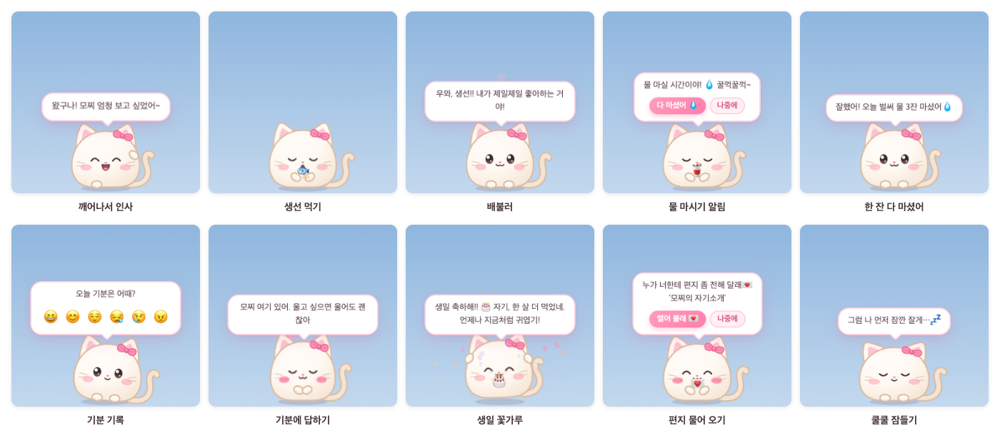

# 糯米桌宠 NuomiPet

[简体中文](README.md) | [繁體中文](README.zh-TW.md) | [English](README.en.md) | [日本語](README.ja.md) | **한국어** | [Français](README.fr.md) | [العربية](README.ar.md)

[](https://github.com/WaIdo/NuomiPet/actions/workflows/check.yml)

바탕화면에 사는 말랑말랑한 작은 펫입니다. Windows와 macOS에서 모두 쓸 수 있습니다. 화면 아래쪽을 걸어 다니며 물 마시기, 휴식, 일찍 자기를 알려 주고, 두 사람의 기념일을 기억하고, 대신 속삭임을 전하거나 편지를 건네줍니다. 여자친구를 화나게 했다면 빨래판 위에 무릎 꿇고 사과도 합니다. 화면은 简体中文, 繁體中文, English, 日本語, 한국어, Français, العربية 7개 언어를 지원합니다.



## 다운로드

[Releases](https://github.com/WaIdo/NuomiPet/releases/latest) 페이지에서 알맞은 파일을 받으세요.

| 파일 | 대상 |
| --- | --- |
| `NuomiPet-1.1.1-win-setup.exe` | Windows 10 / 11(64비트), 설치 버전, 추천 |
| `NuomiPet-1.1.1-win-portable.exe` | Windows 10 / 11(64비트), 설치 없이 더블클릭으로 실행 |
| `NuomiPet-1.1.1-mac-arm64.dmg` | Apple 칩 Mac(M1 이후), macOS 13 이상 |
| `NuomiPet-1.1.1-mac-x64.dmg` | Intel 칩 Mac, macOS 13 이상 |

Mac의 칩 종류를 모르겠다면: 화면 왼쪽 위 Apple 메뉴 → ‘이 Mac에 관하여’를 열어 ‘칩’ 항목이 Apple M…이면 arm64, Intel이면 x64를 고르세요.

## 설치

**Windows**

1. `NuomiPet-1.1.1-win-setup.exe`를 실행하고 안내에 따라 설치합니다(관리자 권한은 필요 없습니다). 설치 없는 버전은 더블클릭으로 바로 실행합니다.
2. 설치 파일에 코드 서명 인증서가 없어서, 처음 실행할 때 ‘Windows의 PC 보호’ 창이 뜰 수 있습니다. ‘추가 정보’ → ‘실행’을 누르세요. 백신 프로그램이 막으면 허용하거나 신뢰로 설정하세요.
3. 펫이 화면 오른쪽 아래에 나타납니다. 작업 표시줄 오른쪽 트레이에 분홍색 고양이 아이콘이 있고(`^` 안에 숨어 있을 수 있습니다), 누르면 메뉴가 열립니다.

**macOS**

1. dmg를 열고 ‘糯米桌宠’을 ‘응용 프로그램’으로 끌어다 놓습니다.
2. Apple 공증을 받지 않은 앱이라 처음 열 때 확인할 수 없다는 경고가 나옵니다. ‘시스템 설정 → 개인정보 보호 및 보안’을 열고, 페이지 아래쪽에서 ‘糯米桌宠’을 찾아 ‘그래도 열기’를 누른 뒤 로그인 암호를 한 번 더 입력하세요.
3. 또는 ‘터미널’에서 아래 명령을 한 번 실행하면 그다음부터는 더블클릭으로 열 수 있습니다.

```bash
xattr -dr com.apple.quarantine /Applications/糯米桌宠.app
```

펫은 화면 아래쪽에 나타나고, 메뉴 막대 오른쪽 위에 작은 고양이 얼굴 아이콘이 생깁니다. 누르면 메뉴가 열립니다. 앱은 Dock에 자리를 차지하지 않으며, ‘보금자리’를 열 때만 Dock에 잠시 아이콘이 나타납니다.

## 기능

**펫**
- 동물 6종: 고양이, 토끼, 곰돌이, 강아지, 햄스터, 병아리. 색 15가지(그중 아보카도, 말차, 청사과, 민트, 호수 그린 5가지는 연한 초록), 액세서리 9가지(리본, 꽃송이, 새싹, 왕관, 파티 모자, 하트 핀, 딸기 모자, 산타 모자, 둥근 안경), 무늬 4가지(단색, 하얀 배, 줄무늬, 안대 무늬), 크기 4단계.
- 혼자서 걸어 다니고, 멍하니 생각에 잠기고, 하품하고, 기지개를 켜고, 빙글 돕니다. 눈은 마우스를 따라 움직입니다. 컴퓨터를 5분 동안 떠나 있으면 잠들고(콧방울도 불어요), 돌아오면 반겨 줍니다.
- 상호작용:
  - 쓰담쓰담: 마우스 버튼은 누르지 말고, 포인터를 펫 위에 올린 뒤 좌우로 빠르게 몇 번 문질러 주세요
    - 천천히 지나가기만 하면 반응하지 않고, 누른 채로 끌면 쓰다듬는 대신 들어 올립니다
    - 충분히 문지르면 눈을 감고 볼이 빨개지며 머리에서 하트가 나옵니다. 계속 문지르면 하트가 계속 나오고, 멈추면 기뻐하며 반응해요
    - ‘보금자리 → 홈’에서 펫의 큰 그림을 클릭해도 쓰담쓰담이 됩니다
    - 쓰다듬을 때마다 친밀도와 기분이 조금 오릅니다(8초에 한 번까지). 무릎 꿇고 있을 때 쓰다듬으면 용서해 준 것이 됩니다
  - 클릭: 콕 찌르기(계속 찌르면 어지러워해요)
  - 더블클릭: 빠른 메뉴 열기(먹이, 달래기, 놀기, 집중, 기분, 보금자리, 마중)
  - 우클릭: 전체 메뉴
  - 누른 채로 끌기: 들어 올리고, 놓으면 화면 아래로 떨어집니다. 휙 던지면 벽에 부딪히고, 세게 떨어지면 어지러워합니다
- 간식 12가지, 동물마다 제일 좋아하는 음식이 있습니다. 포만감, 기분, 친밀도 레벨(Lv.1~Lv.10)이 있습니다.

**알림과 도구**
- 물 마시기, 스트레칭, 눈 휴식, 제때 밥 먹기, 일찍 자기. 알림은 정한 시간대에만 나오게 할 수 있습니다.
- 사용자 지정 알림: 매일 / 평일 / 주말 / 한 번만.
- 뽀모도로: 집중하는 동안 펫이 작은 노트북을 안고 곁에 있고, 끝나면 쉬라고 알려 줍니다.
- 할 일 목록: 하나 끝낼 때마다 펫이 축하해 줍니다. 직접 쓰는 것 말고도 ‘💞 둘이 함께하는 작은 일’이 있습니다. 연인끼리 해 볼 만한 작은 아이디어(예: ‘둘이 같이 사진 찍기’, ‘WaIdo하고 노을 보러 가기’)가 한 줄로 나오고, 누르면 할 일에 추가되며, 마음에 들지 않으면 ‘다른 거 보기’로 바꿀 수 있습니다.
- 날씨: 도시를 설정하면 아침에 날씨를 알려 주고, 비가 올 것 같으면 우산을 챙기라고 합니다.

**여자친구를 위한 기능**
- 기념일: 함께한 지 며칠째인지, 100일 단위와 주년, 여자친구의 생일, 사용자 지정 기념일과 디데이. 그날이 되면 펫이 꽃가루를 뿌리며 축하하고, 며칠 전부터 미리 알려 줍니다.
- 편지함: 앱에서 편지를 쓰고 열어 볼 날짜(예: 여자친구의 생일)를 정합니다. 봉인하면 그날이 오기 전에는 아무도 본문을 볼 수 없고, 그날이 되면 펫이 편지를 물고 찾아갑니다.
- 속삭임: 적어 둔 말을 펫이 가끔 대신 말해 줍니다. ‘OOO 대신 몰래 전할게: …’처럼 서명을 붙일 수 있습니다.
- 기분 일기: 매일 저녁 오늘 기분이 어땠는지 묻고, 보금자리에서 달력으로 볼 수 있습니다.
- 기념일 인사: 새해 첫날, 밸런타인데이, 여성의 날, 화이트데이, 520 데이, 국제 어린이날, 칠석, 추석, 설날 전날, 설날, 정월 대보름, 단오, 크리스마스이브, 크리스마스, 새해 전야에 인사를 건넵니다(음력 기념일은 2035년까지 계산되어 있습니다). 여자친구의 생일에는 파티 모자를, 크리스마스에는 산타 모자를, 밸런타인데이·520 데이·칠석에는 하트 핀을 씁니다.
- 오늘의 운세: 우클릭 메뉴에서 ‘오늘의 운세’를 누르면 매일 별이 가득(★★★★★)하고, 하면 좋은 일과 피할 일이 매일 바뀝니다.
- 메일로 편지 보내기: 남자친구가 휴대폰이나 컴퓨터에서 펫의 메일 주소로 메일을 보내면, 여자친구의 편지함에 편지 한 통으로 들어갑니다. 열어 볼 날짜도 정할 수 있습니다. 설정 방법은 아래 ‘메일로 편지 보내기, 데리러 와 달라고 하기’를 보세요.
- 🚗 데리러 와 줘: 여자친구가 펫의 빠른 메뉴에서 한 번 누르면, 펫이 메일(휴대폰이나 위챗 푸시도 가능)로 퇴근길에 데리러 와 달라고 남자친구에게 알립니다.

**기분 풀어 주기**


- 동작 11가지: 무릎 꿇기, 꽃 선물, 손하트, 안아 주기, 뽀뽀, 밀크티, 폴더 인사, 애교, 데굴데굴, 춤추기, 칭찬. 그리고 하나를 무작위로 고르는 ‘아무거나’.
- 무릎 꿇기: 펫이 빨래판 위에 무릎을 꿇고 눈물 글썽이며 ‘잘못했어’ 나무 팻말을 듭니다. 잠시 뒤 ‘이제 용서해 줬어?’라고 묻고, 아래에 ‘용서해 줄게 💗’와 ‘흥!’ 버튼이 나옵니다.
  - ‘흥!’을 누르면 계속 무릎을 꿇고, 팻말이 ‘용서해 줘’로 바뀝니다. 세 번째에는 꽃과 밀크티를 먼저 건넨 뒤 다시 꿇고, 최대 네 번까지 꿇습니다.
  - ‘용서해 줄게’를 누르거나 무릎 꿇고 있을 때 머리를 쓰다듬으면, 펄쩍 뛰어올라 꽃가루를 뿌리고 춤을 춥니다.
  - 프로필에 ‘속삭임 서명’을 적어 두면, 가끔 남자친구 대신 사과하러 왔다고 말합니다.
- 스스로 달래기도 합니다: 기분 기록에서 ‘화남’을 고르면 바로 무릎 꿇고 사과하고, ‘슬픔’을 고르면 먼저 안아 준 뒤 꽃을 줍니다. ‘피곤’을 고르면 밀크티를 건넵니다. 계속 찌르면 가끔 무릎 꿇고 봐 달라고 빌고, 친밀도 Lv.3 이상에 기분이 좋을 때는 가끔 먼저 손하트를 보내거나 꽃을 줍니다.
- 여는 곳: 펫을 더블클릭해 빠른 메뉴의 ‘🥺 달래기’, 우클릭 메뉴의 ‘기분 풀어 주기’, 트레이 메뉴의 ‘달래 줘’(무작위 하나), 보금자리 홈의 ‘🥺 달래 줘’.


**보금자리**

‘보금자리’는 설정 창으로, 우클릭 메뉴, 빠른 메뉴, 트레이 아이콘에서 열 수 있습니다. 홈(함께한 날, 펫의 상태, 오늘의 물·뽀모도로·할 일·기분, 날씨), 꾸미기, 알림, 집중, 할 일, 기념일, 편지함, 기분 달력, 속삭임, 설정(우리 프로필, 보금자리 색, 항상 맨 위에 표시, 로그인 시 자동 실행, 소리, 자유롭게 돌아다니기, 중력, 방해 금지, 날씨 도시, 데이터 가져오기·내보내기)이 있습니다.


보금자리 색은 벚꽃 핑크, 피치 오렌지, 버터 옐로, 말차 그린, 청사과 그린, 민트 그린, 호수 그린, 스카이 블루, 타로 퍼플 9가지이고, ‘펫과 같은 색’도 고를 수 있습니다. ‘보금자리 → 설정 → 보금자리 색’에서 바꾸면 배경, 버튼, 펫의 말풍선, 빠른 메뉴가 함께 바뀝니다.


**여러 언어**
- 简体中文, 繁體中文, English, 日本語, 한국어, Français, العربية. 처음 열 때는 시스템 언어를 따르고, 아랍어 화면은 전체가 오른쪽에서 왼쪽으로 배치됩니다.
- ‘보금자리 → 설정 → 언어’나 트레이 메뉴의 ‘🌐 언어 / Language’에서 언제든 바꿀 수 있습니다. 화면, 펫의 대사, 메뉴, 기념일 인사가 바로 바뀌고, 바꾼 적 없는 펫 이름과 여자친구 호칭도 함께 바뀝니다(糯米 / Mochi / もち / 모찌 / موتشي, 宝贝 / baby / ハニー / 자기 / mon cœur / حبيبتي).
- 두 사람이 직접 쓴 내용(이름, 애칭, 속삭임, 편지, 기념일)은 그대로 두고 번역하지 않습니다.

## 두 사람만의 내용 넣기

모든 내용은 앱 안에서 설정할 수 있습니다. 파일을 고치거나 다시 패키징할 필요가 없습니다.

- **프로필**: 처음 ‘보금자리’를 열면 ‘우리 서로 알아 가자~’ 창이 뜹니다. 펫 이름, 여자친구를 부르는 호칭(기본값 ‘자기’), 여자친구의 생일(연도까지), 함께한 날, 남자친구의 서명을 입력하세요. 채우지 않은 항목은 표시됩니다. 나중에 ‘보금자리 → 설정 → 우리 프로필’에서 언제든 고칠 수 있습니다. 펫도 처음 만난 뒤 먼저 물어봅니다.
- **기념일**: ‘보금자리 → 기념일’에서 매년, 디데이, 누적 일수를 추가할 수 있습니다.
- **속삭임**: ‘보금자리 → 속삭임’에 펫이 가끔 대신 전해 줄 말을 적습니다.
- **편지**: ‘보금자리 → 편지함 → 편지 쓰기’에서 제목, 보내는 사람, 본문을 쓰고 ‘바로’ 또는 ‘날짜 지정’을 고릅니다. 봉인하면 그날이 오기 전에는 아무도 본문을 볼 수 없습니다(쓴 사람도 마찬가지). 잘못 썼다면 삭제하고 다시 쓸 수 있고, 제목과 열어 볼 날짜는 고칠 수 있습니다.
- **내 컴퓨터에서 편지 쓰기**: 남자친구의 컴퓨터에서 편지를 쓰고 ‘편지함 → 여기서 쓴 편지 내보내기’로 파일로 저장한 뒤, 여자친구의 컴퓨터에서 ‘편지 가져오기’를 하세요. 내보낸 파일의 본문은 평문이 아닙니다.

### 패키징 전에 미리 적어 두기

여자친구가 처음 열 때부터 준비한 내용이 보이게 하려면, 패키징 전에 프로젝트 루트의 `gift.config.json`을 고친 뒤 직접 패키징하세요(‘소스에서 빌드’ 참고).

| 필드 | 뜻 | 예 |
| --- | --- | --- |
| `petName` | 펫 이름. 비우면 한국어에서는 ‘모찌’(다른 언어는 각 언어의 이름) | `"모찌"` |
| `nickname` | 펫이 여자친구를 부르는 호칭. 비우면 한국어에서는 ‘자기’(다른 언어는 각 언어의 애칭) | `"자기"` |
| `sender` | 남자친구의 서명. 속삭임에서 ‘WaIdo 대신 몰래 전할게’처럼 말합니다 | `"WaIdo"` |
| `species` / `color` / `accessory` / `markings` / `size` | 처음 모습. 값은 `src/shared/catalog.json` 참고 | `"bunny"` / `"sakura"` / `"flower"` / `"none"` / `"m"` |
| `togetherSince` | 함께한 날 | `"2026-09-25"` |
| `birthday` | 여자친구의 생일 | `"2002-06-08"` |
| `anniversaries` | 다른 기념일 | `[{ "name": "첫 데이트", "date": "2023-06-01", "kind": "yearly" }]` |
| `notes` | 속삭임 목록 | `["오늘도 행복하게", "..."]` |
| `letters` | 편지 | 아래 참고 |

`anniversaries`의 `kind`: `yearly`는 매년 알림, `countdown`은 디데이(한 번), `since`는 누적 일수(100일 단위로 축하).

편지 예시(`id`는 겹치면 안 되고, `unlock`을 비우면 바로 열어 볼 수 있으며, `body`에서는 `\n`으로 줄을 바꿉니다):

```json
"letters": [
  {
    "id": "birthday-2027",
    "title": "생일 축하해",
    "unlock": "2027-06-08",
    "from": "WaIdo",
    "body": "첫째 줄\n둘째 줄…"
  }
]
```

펫의 자기소개 편지(`id: "hello"`)가 기본으로 들어 있어, 처음 실행할 때 여자친구에게 건네줍니다.

## 메일로 편지 보내기, 데리러 와 달라고 하기

이 두 기능을 쓰려면 먼저 펫에게 메일 주소를 하나 마련해 주고, 여자친구의 컴퓨터에서 한 번만 설정하면 됩니다.

지원하는 메일: QQ 메일, 텐센트 기업 메일, 넷이즈 메일(163, 126, yeah.net, 188, VIP), 넷이즈 기업 메일, Gmail, Outlook / Hotmail / Microsoft 365, iCloud, Yahoo, 시나, 소후, 알리 메일, 139 메일. 그 밖에 IMAP/SMTP를 지원하는 메일은 서버를 직접 입력할 수 있습니다. 이것은 ‘펫의 메일’에만 해당하는 조건이고, 남자친구가 편지를 보낼 메일이나 ‘데리러 와 줘’ 알림을 받을 메일은 어떤 서비스든 괜찮습니다.

1. 펫용 메일 계정을 새로 만드세요(QQ 메일이나 163 메일 추천). 두 사람이 평소에 쓰는 메일은 쓰지 마세요.
2. 웹 메일에서 IMAP/SMTP 서비스를 켜고 ‘앱 비밀번호’(로그인 비밀번호가 아님)를 받습니다.
   - QQ 메일: 「设置 → 账号 → POP3/IMAP/SMTP/Exchange/CardDAV/CalDAV服务」(설정 → 계정 → POP3/IMAP/SMTP/Exchange/CardDAV/CalDAV 서비스)에서 「IMAP/SMTP服务」(IMAP/SMTP 서비스)를 켜고, 안내에 따라 인증하면 앱 비밀번호(授权码)가 표시됩니다.
   - 넷이즈 메일: 「设置 → POP3/SMTP/IMAP」(설정 → POP3/SMTP/IMAP)에서 「IMAP/SMTP服务」(IMAP/SMTP 서비스)를 켜고, 안내에 따라 앱 비밀번호(授权密码)를 받습니다.
   - Gmail, iCloud: 2단계 인증을 먼저 켠 다음 ‘앱 비밀번호’(iCloud는 ‘앱 암호’)를 만듭니다.
   - Outlook: 앱 비밀번호 대신 Microsoft 계정으로 로그인해 권한을 허용합니다. 아래 ‘Outlook을 펫의 메일로 쓰기’를 보세요.
3. 여자친구의 컴퓨터에서 ‘보금자리 → 설정 → 메일’을 열고 메일 서비스를 고른 뒤(보통 ‘자동 인식’), 펫의 메일 주소, 앱 비밀번호, 편지를 보낼 수 있는 주소(‘남자친구의 메일 주소’), ‘데리러 와 줘’ 알림 받을 곳(보통 이것도 남자친구의 메일)을 입력하고 ‘저장’, 그리고 ‘연결 테스트’를 누르세요.
4. ‘사용법을 남자친구에게 보내기’를 누르면 남자친구의 메일로 사용 안내가 갑니다.

**편지 보내기**: 남자친구의 메일에서 펫의 메일 주소로 메일을 보내면, 메일 제목이 편지 제목, 본문이 편지 내용이 됩니다. 몇 분 안에 펫이 편지를 여자친구에게 건네고, 남자친구에게는 확인 메일이 갑니다.
- 특정한 날에 열어 보게 하려면: 제목 맨 앞에 [2026-12-25]를 쓰거나, 본문 첫 줄에 ‘개봉일: 2026-12-25’라고 씁니다. 월과 일만 쓰면(예: [12-25]) 가장 가까운 그날이 됩니다.
- ‘남자친구의 메일 주소’에 적힌 주소에서 온 편지만 받고, 다른 사람이 보낸 메일은 편지함에 들어가지 않습니다. 암호도 정할 수 있어서, 암호가 들어 있는 편지만 받게 할 수 있습니다.
- 글자만 받습니다. 이미지와 첨부 파일은 표시되지 않습니다.

**데리러 와 줘**: 여자친구가 펫을 더블클릭하고 ‘🚗 마중’를 누른 뒤 ‘지금 바로’, ‘30분 뒤’, ‘1시간 뒤’ 중에서 고르고, 하고 싶은 말도 한마디 적을 수 있습니다. 그러면 펫이 남자친구에게 메일로 알립니다. 휴대폰으로 바로 알림을 받고 싶다면:
- 휴대폰에 메일 앱을 설치하고 새 메일 알림을 켜세요. QQ 메일은 위챗에서 「QQ邮箱提醒」(QQ 메일 알림)를 켤 수도 있습니다.
- 또는 설정의 ‘휴대폰 푸시 URL’을 입력하세요. iPhone은 Bark(`https://api.day.app/내key/{title}/{body}`), 위챗은 ServerChan(`https://sctapi.ftqq.com/내SendKey.send?title={title}&desp={body}`)이나 PushPlus(`https://www.pushplus.plus/send?token=내token&title={title}&content={body}`)를 쓸 수 있습니다.

앱 비밀번호와 푸시 URL은 여자친구의 컴퓨터에만 저장되고, 시스템 키체인(macOS)이나 데이터 보호(Windows)로 암호화되며, 내보낸 백업에는 들어가지 않습니다.

### Outlook을 펫의 메일로 쓰기

Microsoft는 이제 서드파티 앱이 비밀번호로 Outlook에 로그인하는 것을 허용하지 않아서, Microsoft 계정으로 로그인해 권한을 허용해야 합니다. 이때 ‘애플리케이션 ID’가 필요하며, Microsoft에서 무료로 한 번 직접 등록해야 합니다(다른 소프트웨어의 ID를 빌려 쓸 수 없습니다).

1. Microsoft 계정으로 [Azure Portal](https://portal.azure.com)에 로그인해 ‘Microsoft Entra ID → 앱 등록 → 새 등록’으로 들어갑니다. 개인 계정은 무료 Azure 계정을 먼저 만들어야 할 수 있으니 Microsoft 페이지의 안내를 따르세요.
2. 이름은 아무거나 괜찮습니다(예: NuomiPet). ‘지원되는 계정 유형’은 ‘모든 조직 디렉터리의 계정 및 개인 Microsoft 계정’을 고르세요. 리디렉션 URI는 입력하지 않습니다.
3. ‘인증 → 고급 설정’에서 ‘퍼블릭 클라이언트 흐름 허용’을 ‘예’로 바꿉니다. 클라이언트 암호는 만들지 않습니다.
4. ‘API 사용 권한’에서 Office 365 Exchange Online의 위임된 권한 `IMAP.AccessAsUser.All`과 `SMTP.Send`, 그리고 Microsoft Graph의 `offline_access`를 추가합니다.
5. ‘개요’ 페이지의 ‘애플리케이션(클라이언트) ID’를 `gift.config.json`의 `mailMsClientId`에 넣거나(패키징 전), ‘보금자리 → 설정 → 메일’에 입력합니다.
6. 설정에서 ‘Outlook / Hotmail / Microsoft 365’를 고르고 ‘Microsoft 계정으로 로그인’을 누른 뒤, 브라우저에서 https://microsoft.com/devicelogin 을 열고 설정 화면에 표시된 코드를 입력해 펫의 메일 계정으로 로그인하고 허용합니다. 그 뒤로는 자동으로 계속 사용되며, 비밀번호를 바꾸거나 권한을 취소하면 설정 화면에서 다시 로그인하라고 알려 줍니다.

회사나 학교의 Microsoft 365 메일은 보통 관리자의 권한 동의가 필요하고, 그 메일 계정에 IMAP과 SMTP 인증도 켜져 있어야 합니다. Outlook 부분은 로컬에서 흉내 낸 서버로만 테스트했고, 실제 Microsoft 계정으로는 아직 확인하지 않았습니다.

## 사용 팁

- `Ctrl + Alt + P`(Mac에서는 `⌘ + ⌥ + P`): 펫 보이기 / 숨기기. 전체 화면으로 영상을 볼 때 편리합니다.
- 펫을 숨긴 뒤에는 트레이 아이콘에서 ‘(펫 이름) 불러내기’를 누르거나 앱을 한 번 더 여세요.
- ‘(펫 이름) 이리 부르기’를 누르면 마우스가 있는 화면 위쪽에서 펫이 떨어집니다. 모니터가 여러 대일 때 편리합니다.
- 우클릭 메뉴에서 ‘자유롭게 돌아다니기’와 ‘소리’를 끄거나 ‘방해 금지’를 켤 수 있습니다. 방해 금지에서는 펫이 수다를 떨지 않고 물 마시기, 스트레칭, 눈 휴식, 식사, 잠자리 알림도 하지 않습니다. 사용자 지정 알림, 뽀모도로, 기념일, 편지는 그대로입니다.
- 로그인 시 자동 실행은 보금자리의 ‘설정’ 페이지나 트레이 메뉴에서 켭니다.

## 제거와 데이터

- Windows: ‘설정 → 앱’에서 ‘糯米桌宠’을 찾아 제거합니다. 설치 없는 버전은 exe 파일을 지우면 됩니다.
- macOS: 먼저 메뉴 막대의 고양이 얼굴 메뉴에서 ‘종료’를 누른 뒤, ‘응용 프로그램’의 ‘糯米桌宠’을 휴지통으로 옮깁니다.

데이터는 이 컴퓨터에만 저장되고 제거해도 지워지지 않아서, 다시 설치해도 펫이 두 사람을 기억합니다.

- Windows: `%APPDATA%\糯米桌宠\mochi-data.json`
- macOS: `~/Library/Application Support/糯米桌宠/mochi-data.json`

보금자리의 ‘설정’ 페이지에서 백업을 내보내고 가져올 수 있습니다. 완전히 지우려면 제거한 뒤 위 폴더도 삭제하세요.

## 개인정보

앱은 어떤 데이터도 수집하거나 업로드하지 않으며, 통계나 광고도 없습니다. 인터넷에 연결하는 경우는 다음뿐입니다.
- 날씨: 날씨를 켜고 도시를 설정하면 도시 이름으로 [Open-Meteo](https://open-meteo.com/)에 위도와 경도를 묻고, 그 위도와 경도로 날씨를 조회합니다.
- 메일: 펫의 메일을 설정하면 그 메일 서버에 주기적으로 접속해 편지를 받고, 편지를 받으면 확인 메일을 보냅니다. 여자친구가 ‘데리러 와 줘’를 누르면 메일을 한 통 보내고, 푸시 URL을 입력했다면 그 URL도 한 번 요청합니다.

이 기능들을 설정하지 않으면 앱은 인터넷에 연결하지 않습니다.

## 소스에서 빌드

Node.js 22 이상이 필요합니다.

```bash
npm install
```

중국 본토에서는 Electron 다운로드가 느리니, 설치와 패키징 전에 미러를 설정할 수 있습니다.

```bash
export ELECTRON_MIRROR="https://npmmirror.com/mirrors/electron/"
export ELECTRON_BUILDER_BINARIES_MIRROR="https://npmmirror.com/mirrors/electron-builder-binaries/"
```

`npm install` 뒤에 `node_modules/electron/dist`가 없다면(새 버전 npm은 기본적으로 설치 스크립트를 실행하지 않습니다), 직접 한 번 내려받으세요.

```bash
node node_modules/electron/install.js
```

이 컴퓨터에서 실행:

```bash
npm start
```

패키징 결과물은 `dist/` 폴더에 생깁니다. macOS에서는 Wine 없이 Mac용과 Windows용을 모두 만들 수 있습니다.

```bash
npm run dist:mac
npm run dist:win
```

펫 모습 코드를 고친 뒤 아이콘을 다시 만들려면: `npm run icons`.

**테스트**

```bash
npm test                        # 단위 테스트: 날짜, 알림 스케줄, 뽀모도로, 편지, 다국어
node dev/run-scenarios.js       # 실제 창에서 dev/scenarios 아래 모든 시나리오 실행, 스크린샷은 scenario-output/
node dev/i18n-check.js code     # 코드에 추출되지 않은 중국어가 남아 있는지
node dev/i18n-check.js locales  # 각 언어의 문구가 간체 중국어와 하나하나 대응하는지, 자리표시자가 같은지
```

`main`에 푸시할 때마다 GitHub Actions가 Windows Server 2022(emoji 글꼴이 Windows 10만큼 오래됨), Windows Server 2025, macOS에서 단위 테스트와 모든 시나리오를 실행하고, Windows에서는 패키징, 자동 설치, 실행, 제거까지 한 번씩 해 봅니다. 스크린샷은 각 실행의 Artifacts에서 내려받을 수 있습니다.

## 프로젝트 구조

```
gift.config.json        패키징 전에 미리 적어 두는 내용(이름, 기념일, 속삭임, 편지)
src/main/               메인 프로세스: 창, 끌기와 낙하 물리, 트레이와 메뉴, 알림 스케줄, 뽀모도로, 날씨, 데이터 저장
src/preload/            렌더러 프로세스에서 쓰는 인터페이스(window.mochi)
src/shared/             양쪽 공용: 동물/색/음식 목록, 기념일 표, 테마, 날짜 도구, 다국어(i18n.js)
src/shared/locales/     각 언어의 문구: 화면(common/main/pet/home/pages.json), 펫 대사(phrases.json), 이름과 기본 내용(data.json)
src/renderer/shared/    펫의 SVG 모습, 표정과 애니메이션, 효과음, emoji 호환
src/renderer/pet/       펫 창: 행동, 말풍선, 효과, 빠른 메뉴
src/renderer/home/      보금자리(설정 창)
src/renderer/letter/    편지 창
scripts/                아이콘 생성, 페이지 스크린샷, 테마 색 생성
dev/                    미리보기 페이지, 테스트 시나리오, 시나리오 실행 스크립트, Windows 설치 파일 스모크 테스트
test/                   단위 테스트
docs/images/            이 페이지의 스크린샷
```

## 개발자 후원하기

모찌가 두 사람을 즐겁게 해 줬다면, 개발자에게 밀크티 한 잔 사 주세요 🧋 (Alipay 또는 WeChat Pay). 완전히 자유이며 앱 기능에는 아무 영향이 없습니다. 후원하더라도 상업적 이용이 허가되지는 않습니다.

<p>
  
  
</p>

## 저작권과 라이선스

Copyright © 2026 WaIdo

이 프로젝트의 코드와 소재(펫 모습, 아이콘, 대사, 효과음)는 [PolyForm Noncommercial License 1.0.0](LICENSE.md)으로 배포됩니다. 간단히 말하면:

- 할 수 있는 것: 개인적인 사용, 학습, 수정, 친구나 연인에게 선물하기, 원본이나 수정본 공유(비상업적).
- 할 수 없는 것: 이 소프트웨어나 수정본을 판매하거나 유료 제품·서비스에 넣는 등 모든 상업적 목적의 사용.
- 공유할 때는 라이선스(또는 그 링크)를 함께 제공하고, 다음 줄을 남겨 두어야 합니다: `Required Notice: Copyright © 2026 WaIdo (https://github.com/WaIdo/NuomiPet)`.

위 내용은 요약일 뿐이며, [LICENSE.md](LICENSE.md)가 기준입니다. 법적 효력이 있는 것은 영어로 된 LICENSE 파일이고, 이 절은 그 요약에 불과합니다. 이 라이선스는 OSI가 정의한 오픈 소스 라이선스가 아니라, 소스 코드는 공개하되 비상업적 사용으로 제한하는 라이선스입니다. 상업적으로 사용하고 싶다면 먼저 저작자에게 연락하세요.

**서드파티 구성 요소와 데이터**

- 설치 파일에는 [Electron](https://www.electronjs.org/)(MIT 라이선스)과 그 안의 Chromium, Node.js 등 오픈 소스 구성 요소가 들어 있으며, 해당 라이선스는 설치 파일과 함께 배포됩니다. Windows는 설치 폴더의 `LICENSE.electron.txt`와 `LICENSES.chromium.html`, macOS는 `糯米桌宠.app/Contents/Resources/` 안에 있습니다.
- 메일 송수신에는 [ImapFlow](https://github.com/postalsys/imapflow)(MIT), [Nodemailer](https://nodemailer.com/)(MIT-0), [mailparser](https://github.com/nodemailer/mailparser)(MIT)를 쓰며, 설치 파일과 함께 배포됩니다.
- 패키징 도구는 [electron-builder](https://www.electron.build/)(MIT)입니다.
- 음력 기념일에 해당하는 양력 날짜는 [lunar-javascript](https://github.com/6tail/lunar-javascript)(MIT)로 미리 계산해 `src/shared/festivals.json`에 적어 둔 것이며, 앱 자체에는 이 라이브러리가 들어 있지 않습니다.
- 날씨 데이터는 [Open-Meteo](https://open-meteo.com/)가 제공하며 [CC BY 4.0](https://creativecommons.org/licenses/by/4.0/)으로 사용이 허가됩니다. Open-Meteo의 무료 API는 비상업적 사용만 허용합니다.
- 화면의 emoji는 운영 체제에 내장된 글꼴(Apple Color Emoji, Segoe UI Emoji 등)로 표시되며, 이 프로젝트에는 글꼴 파일이 들어 있지 않습니다. 이 페이지의 스크린샷은 macOS에서 찍었으며, 그림 속 emoji 이미지의 저작권은 Apple에 있습니다. 스크린샷에 나오는 이름은 모두 예시입니다.
- 펫 모습과 아이콘은 프로젝트 안에서 코드로 그린 SVG이고, 효과음은 실행 중에 Web Audio로 합성한 것으로, 모두 이 프로젝트의 창작물입니다.
