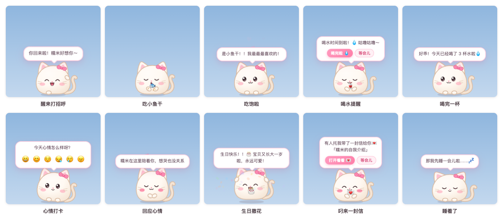
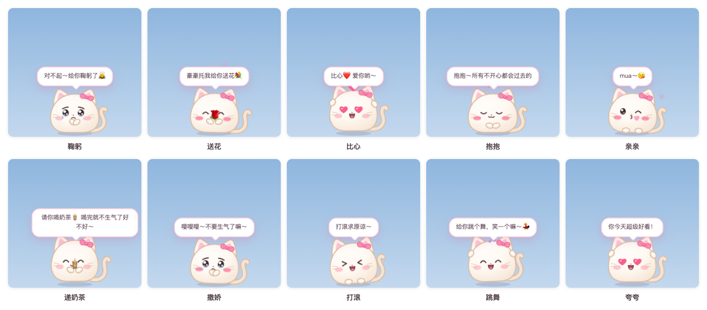
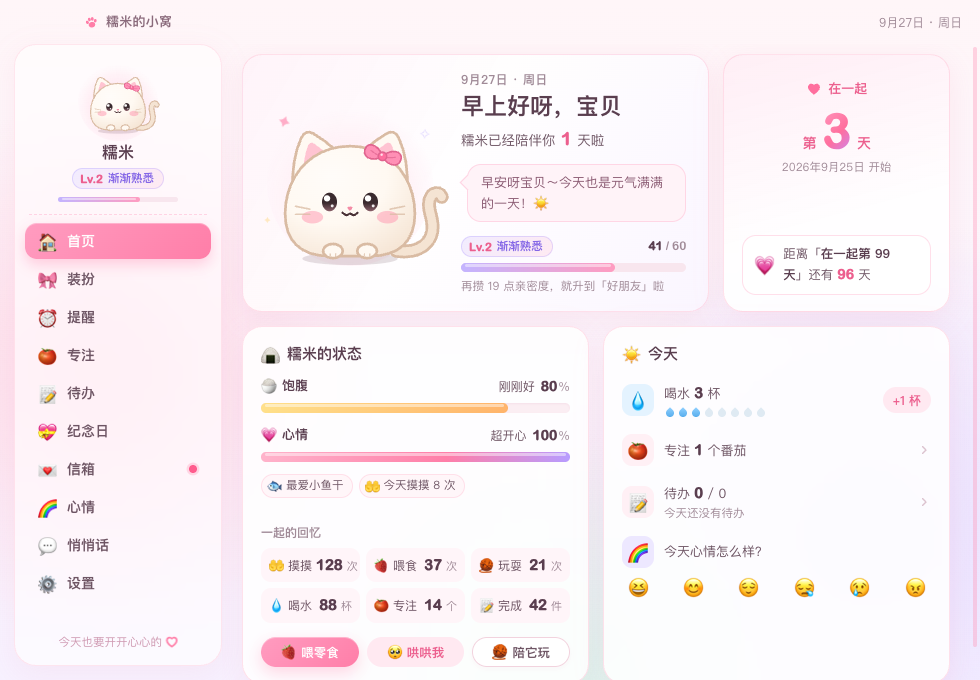

# 糯米桌宠 NuomiPet

**简体中文** | [繁體中文](README.zh-TW.md) | [English](README.en.md) | [日本語](README.ja.md) | [한국어](README.ko.md) | [Français](README.fr.md) | [العربية](README.ar.md)

[](https://github.com/WaIdo/NuomiPet/actions/workflows/check.yml)

一只住在桌面上的小团子，Windows 和 macOS 都能用。它在屏幕底部走来走去，提醒喝水、休息和早睡，记得你们的纪念日，会替你说悄悄话、递信；惹她生气了，还会跪在搓衣板上认错。界面有简体中文、繁體中文、English、日本語、한국어、Français、العربية 七种语言。



## 下载

在 [Releases](https://github.com/WaIdo/NuomiPet/releases/latest) 页面下载对应的文件：

| 文件 | 适用于 |
| --- | --- |
| `NuomiPet-1.1.0-win-setup.exe` | Windows 10 / 11（64 位），安装版，推荐 |
| `NuomiPet-1.1.0-win-portable.exe` | Windows 10 / 11（64 位），免安装，双击就能用 |
| `NuomiPet-1.1.0-mac-arm64.dmg` | Apple 芯片的 Mac（M1 及之后），macOS 13 或更新 |
| `NuomiPet-1.1.0-mac-x64.dmg` | Intel 芯片的 Mac，macOS 13 或更新 |

不知道 Mac 是哪种芯片：点屏幕左上角苹果菜单 →「关于本机」，「芯片」一栏写着 Apple M… 的选 arm64，写着 Intel 的选 x64。

## 安装

**Windows**

1. 运行 `NuomiPet-1.1.0-win-setup.exe`，按提示安装（不需要管理员权限）。免安装版直接双击运行。
2. 安装包没有购买代码签名证书，第一次运行时可能出现「Windows 已保护你的电脑」：点「更多信息」→「仍要运行」。如果杀毒软件拦截，选择允许或信任。
3. 宠物出现在屏幕右下角。任务栏右下角的托盘区有一个粉色小猫图标（可能藏在 `^` 里），点它打开菜单。

**macOS**

1. 打开 dmg，把「糯米桌宠」拖进「应用程序」。
2. 应用没有经过苹果公证，第一次打开会提示无法验证。打开「系统设置 → 隐私与安全性」，在页面下方找到「糯米桌宠」，点「仍要打开」，再输入一次开机密码。
3. 也可以在「终端」里执行一次下面的命令，之后就能直接双击打开：

```bash
xattr -dr com.apple.quarantine /Applications/糯米桌宠.app
```

宠物出现在屏幕底部，菜单栏右上角有一个小猫头图标，点它打开菜单。应用不占程序坞；打开「小窝」时程序坞里会临时出现图标。

## 功能

**宠物本身**
- 6 种小动物：猫猫、兔兔、小熊、狗狗、仓鼠、小鸡；15 种配色（其中牛油果、抹茶、青苹果、薄荷、湖水绿 5 种浅绿），9 种配饰（蝴蝶结、小花、小芽、小皇冠、派对帽、爱心发卡、草莓帽、圣诞帽、圆眼镜），4 种花纹（纯色、白肚皮、小花纹、眼罩斑），4 档大小。
- 会自己走来走去、发呆想事情、打哈欠、伸懒腰、转圈；眼睛跟着鼠标转；离开电脑 5 分钟会睡着（还会冒鼻涕泡），回来时迎接你。
- 互动：
  - 鼠标在它身上来回划：摸摸头，会冒爱心
  - 单击：戳一戳（连续戳会被戳晕）
  - 双击：打开快捷面板（喂食、哄我、玩耍、专注、心情、小窝、来接我）
  - 右键：完整菜单
  - 按住拖动：把它拎起来，松手会掉回屏幕底部；甩出去会撞墙，摔重了会晕
- 12 种零食，每个物种有最爱的食物；有饱腹、心情和亲密度等级（Lv.1～Lv.10）。

**提醒和工具**
- 喝水、久坐起来动动、护眼、按时吃饭、早点睡；提醒可以只在某个时间段内出现。
- 自定义提醒：每天 / 工作日 / 周末 / 仅一次。
- 番茄钟：专注时宠物抱着小电脑陪着，结束后提醒休息。
- 待办清单，完成一件宠物会庆祝。除了自己写，还有「💞 两个人的小事」：一排恋人之间的小点子（比如「拍一张我们俩的合照」「和豪豪一起去看日落」），点一下就加进待办，不喜欢可以换一批。
- 天气：设置城市后，早上播报天气，要下雨会提醒带伞。

**给她的部分**
- 纪念日：在一起第几天、整百天和周年、她的生日、自定义纪念日和倒数日。当天宠物撒花庆祝，提前几天会预告。
- 信箱：在应用里写信，定好拆开的日子（比如她生日那天）。封好后没到日子谁都看不到正文；到了那天宠物会叼着信去找她。
- 悄悄话：你写的话会被宠物不定时说出来，可以署名「xxx让我偷偷告诉你：……」。
- 心情日记：每天晚上问她今天心情怎么样，小窝里有月历记录。
- 节日：元旦、情人节、女神节、白色情人节、520、儿童节、七夕、中秋、除夕、春节、元宵、端午、平安夜、圣诞、跨年都会送祝福（农历节日已算好到 2035 年）。她生日那天宠物戴派对帽，圣诞节戴圣诞帽，情人节、520、七夕戴爱心发卡。
- 今日运势：右键菜单里点「今日运势」，每天都是满星（★★★★★），宜和忌每天换。
- 用邮件寄信：你在手机或电脑上给宠物的邮箱发一封邮件，它会变成她信箱里的一封信，可以定好哪天才能拆开。设置方法见下面的「用邮件寄信、叫你来接」。
- 🚗 来接我：她在宠物的快捷面板里点一下，宠物就发邮件（也可以推送到你的手机或微信）叫你下班来接她。

**哄她开心**


- 11 个动作：跪搓衣板、送花、比心、抱抱、亲亲、递奶茶、鞠躬、撒娇、打滚、跳舞、夸夸，还有「随便哄」随机挑一个。
- 跪搓衣板：宠物跪在搓衣板上，泪汪汪地举着「我错了」的小木牌，过一会儿问「原谅我了吗？」，下面有「原谅你啦 💗」和「哼！」两个按钮。
  - 点「哼！」它会接着跪，牌子换成「原谅我」；第三次先送花、递奶茶再跪，最多跪四轮。
  - 点「原谅你啦」，或者在它跪着的时候摸摸头，它会跳起来撒花、跳舞。
  - 在资料里填了「署名」的话，它有时会说是替你来认错的。
- 它也会自己哄：心情打卡选「生气」会马上跪下认错；选「难过」会先抱抱再送花；选「好累」会递一杯奶茶；连续戳它，有时会跪下求饶；亲密度到 Lv.3 以上、心情好的时候，偶尔会自己比心或送花。
- 入口：双击宠物打开快捷面板点「🥺 哄我」；右键菜单「哄你开心」；托盘菜单「哄哄我」（随机一个）；小窝首页的「🥺 哄哄我」。



**小窝**

「小窝」是设置窗口，从右键菜单、快捷面板或托盘图标都能打开：首页（在一起天数、宠物状态、今日喝水/番茄/待办/心情、天气）、装扮、提醒、专注、待办、纪念日、信箱、心情月历、悄悄话、设置（我们的资料、小窝的颜色、置顶、开机启动、声音、走动、重力、勿扰、天气城市、数据导入导出）。



小窝有樱花粉、蜜桃橘、奶油黄、抹茶绿、青苹果绿、薄荷绿、湖水绿、天空蓝、香芋紫九种颜色，也可以选「跟宠物一样」。在「小窝 → 设置 → 小窝的颜色」里换，背景、按钮、宠物的对话气泡和快捷面板一起变。


**多语言**
- 简体中文、繁體中文、English、日本語、한국어、Français、العربية。第一次打开时跟着系统语言走；阿拉伯文的界面整体从右往左排。
- 在「小窝 → 设置 → 语言」或托盘菜单「🌐 语言」里随时切换：界面、宠物说的话、菜单、节日祝福马上跟着变；没改过的宠物名字和对她的称呼也会跟着变（糯米 / Mochi / もち / 모찌 / موتشي，宝贝 / baby / ハニー / 자기 / mon cœur / حبيبتي）。
- 你们自己写的内容（名字、昵称、悄悄话、信、纪念日）保持原样，不会被翻译。

## 写上你们自己的内容

所有内容都能在应用里设置，不需要改文件，也不需要重新打包：

- **资料**：第一次打开「小窝」时会弹出「我们来认识一下吧」，把宠物的名字、对她的称呼（默认「宝贝」）、她的生日（要选年份）、在一起的日子和你的署名都填上，没填的项会标出来。之后在「小窝 → 设置 → 我们的资料」随时修改。宠物第一次见面后也会主动问她。
- **纪念日**：「小窝 → 纪念日」，可以加每年纪念、倒数日、累计天数。
- **悄悄话**：「小窝 → 悄悄话」，写下想让宠物不定时转告她的话。
- **信**：「小窝 → 信箱 → 写一封信」，写好标题、署名和正文，选「马上」或「到某一天」才能拆开。信封好之后，没到日子谁都看不到正文（写信的人也看不到）；写错了可以删掉重写，也可以改标题和拆开的日子。
- **在自己电脑上写信**：在你的电脑上写好，「信箱 → 导出在这里写的信」存成文件，再到她的电脑上「导入信件」。导出的文件里正文不是明文。

### 打包前预先写好

如果想让她第一次打开时就看到你写的内容，可以在打包前编辑项目根目录下的 `gift.config.json`，再自己打包（见「从源码构建」）：

| 字段 | 含义 | 例子 |
| --- | --- | --- |
| `petName` | 宠物的名字；留空就是「糯米」（其他语言是对应的名字） | `"糯米"` |
| `nickname` | 宠物怎么称呼她；留空就是「宝贝」（其他语言是对应的爱称） | `"宝贝"` |
| `sender` | 你的署名，悄悄话会说「豪豪让我偷偷告诉你」 | `"豪豪"` |
| `species` / `color` / `accessory` / `markings` / `size` | 初始形象，取值见 `src/shared/catalog.json` | `"bunny"` / `"sakura"` / `"flower"` / `"none"` / `"m"` |
| `togetherSince` | 在一起的日子 | `"2026-09-25"` |
| `birthday` | 她的生日 | `"2002-06-08"` |
| `anniversaries` | 其他纪念日 | `[{ "name": "第一次约会", "date": "2023-06-01", "kind": "yearly" }]` |
| `notes` | 悄悄话列表 | `["今天也要开心", "..."]` |
| `letters` | 信件 | 见下 |

`anniversaries` 的 `kind`：`yearly` 每年提醒，`countdown` 倒数日（一次性），`since` 累计天数（整百天时庆祝）。

信件示例（`id` 不能重复，`unlock` 留空表示马上能看，`body` 里用 `\n` 换行）：

```json
"letters": [
  {
    "id": "birthday-2027",
    "title": "生日快乐",
    "unlock": "2027-06-08",
    "from": "豪豪",
    "body": "第一行\n第二行……"
  }
]
```

默认带了一封宠物自我介绍的信（`id: "hello"`），第一次启动时会递给她。

## 用邮件寄信、叫你来接

这两个功能要先给宠物准备一个邮箱，在她的电脑上设置一次就好。

支持的邮箱：QQ 邮箱、腾讯企业邮箱、网易邮箱（163、126、yeah.net、188、VIP）、网易企业邮箱、Gmail、Outlook / Hotmail / Microsoft 365、iCloud、Yahoo、新浪、搜狐、阿里邮箱、139 邮箱，其他支持 IMAP/SMTP 的邮箱可以手动填服务器。这只是对「宠物的邮箱」的要求；你寄信用的邮箱、接收「来接我」通知的邮箱，哪家都可以。

1. 给宠物注册一个新邮箱（推荐 QQ 邮箱或 163 邮箱），不要用你们平时用的邮箱。
2. 在网页版邮箱里开启 IMAP/SMTP 服务，拿到「授权码」（不是登录密码）：
   - QQ 邮箱：设置 → 账号 →「POP3/IMAP/SMTP/Exchange/CardDAV/CalDAV 服务」→ 开启「IMAP/SMTP 服务」，按提示验证后会显示授权码。
   - 网易邮箱：设置 → POP3/SMTP/IMAP → 开启「IMAP/SMTP 服务」，按提示得到授权密码。
   - Gmail、iCloud：先开启两步验证，再生成「应用专用密码」。
   - Outlook：不用授权码，用微软账号登录授权，见下面「用 Outlook 当宠物的邮箱」。
3. 在她的电脑上打开「小窝 → 设置 → 邮件」，选邮箱服务商（一般选「自动识别」），填好宠物的邮箱、授权码、谁可以寄信（你的邮箱）、「来接我」发到哪（一般也是你的邮箱），点「保存」，再点「测试连接」。
4. 点「把用法发给他」，你的邮箱会收到一封使用说明。

**寄信**：用你的邮箱给宠物的邮箱发邮件，主题就是信的标题，正文就是信的内容。几分钟内宠物会把信递给她，你也会收到一封确认邮件。
- 想定在某一天才能拆开：在主题最前面写【2026-12-25】，或者在正文第一行写「拆开日期：2026-12-25」。只写月日（比如【12-25】）就是最近的那一天。
- 只有「谁可以寄信」里的邮箱寄来的信会收下，别人寄来的不会进信箱。还可以设一个暗号，信里带着暗号才收。
- 只收文字，图片和附件不会显示。

**来接我**：她双击宠物，点「🚗 来接我」，选「现在」「半小时后」或「一小时后」，还可以写一句话，宠物就会发邮件告诉你。想在手机上马上收到提醒：
- 在手机上装邮箱 App 并打开新邮件通知；QQ 邮箱还可以在微信里开启「QQ邮箱提醒」。
- 或者在设置里填「推送网址」：iPhone 可以用 Bark（`https://api.day.app/你的key/{title}/{body}`），微信可以用 Server酱（`https://sctapi.ftqq.com/你的SendKey.send?title={title}&desp={body}`）或 PushPlus（`https://www.pushplus.plus/send?token=你的token&title={title}&content={body}`）。

授权码和推送网址只保存在她的电脑上，用系统的钥匙串（macOS）或数据保护（Windows）加密，不会出现在导出的备份里。

### 用 Outlook 当宠物的邮箱

微软已经不允许第三方应用用密码登录 Outlook，要用微软账号登录授权。授权需要一个「应用 ID」，要你自己在微软免费注册一次（不能借用别的软件的）：

1. 用微软账号登录 [Azure 门户](https://portal.azure.com)，进入「Microsoft Entra ID → 应用注册 → 新注册」。个人账号可能要先开通免费的 Azure 账号，以微软页面的提示为准。
2. 名字随便起（比如 NuomiPet）；「支持的帐户类型」选「任何组织目录中的帐户和个人 Microsoft 帐户」；重定向 URI 不用填。
3. 在「身份验证 → 高级设置」里把「允许公共客户端流」设为「是」；不用创建客户端密码。
4. 在「API 权限」里添加 Office 365 Exchange Online 的委托权限 `IMAP.AccessAsUser.All` 和 `SMTP.Send`，以及 Microsoft Graph 的 `offline_access`。
5. 把「概述」页上的「应用程序(客户端) ID」填进 `gift.config.json` 的 `mailMsClientId`（打包前），或者在「小窝 → 设置 → 邮件」里填。
6. 在设置里选「Outlook」，点「用微软账号登录」，在浏览器里打开 https://microsoft.com/devicelogin ，输入设置页上显示的代码，用宠物的邮箱登录并同意。之后会自动续用；改了密码或取消授权时，设置页会提示重新登录。

公司或学校的 Microsoft 365 邮箱通常还要管理员同意授权，并为这个邮箱开启 IMAP 和 SMTP 认证。Outlook 这部分只在本地模拟的服务器上测试过，还没有用真实的微软账号验证。

## 使用小贴士

- `Ctrl + Alt + P`（Mac 上是 `⌘ + ⌥ + P`）：显示 / 隐藏宠物，全屏看视频时很方便。
- 宠物被藏起来后，点托盘图标选「叫它出来」，或者再打开一次应用。
- 「叫它过来」会让宠物从鼠标所在的屏幕上方掉下来，多个显示器时很好用。
- 右键菜单里可以关掉「自由走动」「声音」，打开「勿扰模式」：宠物不再闲聊，也不提醒喝水、久坐、护眼、吃饭、睡觉；自定义提醒、番茄钟、纪念日和信照常。
- 开机自动启动在小窝的「设置」页或托盘菜单里打开。

## 卸载和数据

- Windows：「设置 → 应用」里找到「糯米桌宠」卸载；免安装版直接删掉 exe。
- macOS：先在菜单栏的小猫头菜单里「退出」，再把「应用程序」里的「糯米桌宠」拖到废纸篓。

数据只保存在本机，卸载不会删除，重新安装后宠物还记得你们：

- Windows：`%APPDATA%\糯米桌宠\mochi-data.json`
- macOS：`~/Library/Application Support/糯米桌宠/mochi-data.json`

小窝「设置」页可以导出和导入备份。想彻底删除，卸载后再删掉上面这个文件夹。

## 隐私

应用不收集、不上传任何数据，没有统计和广告。只有这几种情况会联网：
- 天气：打开并设置城市后，用城市名向 [Open-Meteo](https://open-meteo.com/) 查询经纬度，再用经纬度查询天气。
- 邮件：设置了宠物的邮箱以后，定时连接这个邮箱的服务器收信，收到信时回一封确认邮件；她点「来接我」时发一封邮件，填了推送网址的话再请求一次那个网址。

这些功能都不设置的话，应用不会联网。

## 从源码构建

需要 Node.js 22 或更新。

```bash
npm install
```

在国内下载 Electron 很慢，可以先设置镜像再安装和打包：

```bash
export ELECTRON_MIRROR="https://npmmirror.com/mirrors/electron/"
export ELECTRON_BUILDER_BINARIES_MIRROR="https://npmmirror.com/mirrors/electron-builder-binaries/"
```

如果 `npm install` 之后 `node_modules/electron/dist` 不存在（新版 npm 默认不执行安装脚本），手动下载一次：

```bash
node node_modules/electron/install.js
```

在本机运行：

```bash
npm start
```

打包，产物在 `dist/` 目录。在 macOS 上可以同时打出 Mac 和 Windows 的包，不需要 Wine：

```bash
npm run dist:mac
npm run dist:win
```

改了宠物形象的代码后想重新生成图标：`npm run icons`。

**测试**

```bash
npm test                        # 单元测试：日期、提醒调度、番茄钟、信件、多语言
node dev/run-scenarios.js       # 在真实窗口里跑 dev/scenarios 下的所有场景，截图放在 scenario-output/
node dev/i18n-check.js code     # 代码里有没有没提取的中文
node dev/i18n-check.js locales  # 各语言的文字和简体中文是否一一对应、占位符是否一致
```

每次推送到 `main`，GitHub Actions 会在 Windows Server 2022（emoji 字体和 Windows 10 一样旧）、Windows Server 2025 和 macOS 上跑单元测试和所有场景，并在 Windows 上打包、静默安装、启动、卸载一遍，截图可以在每次运行的 Artifacts 里下载。

## 项目结构

```
gift.config.json        打包前预先写好的内容（名字、纪念日、悄悄话、信件）
src/main/               主进程：窗口、拖拽和下落物理、托盘和菜单、提醒调度、番茄钟、天气、数据存储
src/preload/            渲染进程可用的接口（window.mochi）
src/shared/             两边共用：物种/配色/食物目录、节日表、主题、日期工具、多语言（i18n.js）
src/shared/locales/     各语言的文字：界面（common/main/pet/home/pages.json）、宠物台词（phrases.json）、名字和默认内容（data.json）
src/renderer/shared/    宠物的 SVG 形象、表情和动画、音效、emoji 兼容
src/renderer/pet/       桌宠窗口：行为、气泡、特效、快捷面板
src/renderer/home/      小窝（设置窗口）
src/renderer/letter/    信件窗口
scripts/                图标生成、页面截图、主题配色生成
dev/                    预览页、测试场景、场景运行脚本、Windows 安装包冒烟测试
test/                   单元测试
docs/images/            本页截图
```

## 赞赏

如果糯米也让你们开心，可以请作者喝杯奶茶 🧋（支付宝或微信）。完全自愿，不影响任何功能；赞赏不代表获得商业使用的授权。

<p>
  
  
</p>

## 版权与许可

Copyright © 2026 WaIdo

本项目的代码和素材（宠物形象、图标、台词、音效）以 [PolyForm Noncommercial License 1.0.0](LICENSE.md) 发布。简单说：

- 可以：个人使用、学习、修改，送给朋友或恋人，分享原版或改过的版本（非商业）。
- 不可以：用于任何商业目的，比如售卖本软件或改版，或者放进收费的产品和服务里。
- 分享时要附上许可证（或它的链接），并保留这一行：`Required Notice: Copyright © 2026 WaIdo (https://github.com/WaIdo/NuomiPet)`。

以上只是摘要，以 [LICENSE.md](LICENSE.md) 为准。这不是 OSI 定义的开源许可证，而是源代码公开、限非商业使用。想用于商业用途，请先联系作者。

**第三方组件和数据**

- 安装包里带有 [Electron](https://www.electronjs.org/)（MIT 许可证）以及其中的 Chromium、Node.js 等开源组件，它们的许可证随安装包分发：Windows 在安装目录的 `LICENSE.electron.txt` 和 `LICENSES.chromium.html`，macOS 在 `糯米桌宠.app/Contents/Resources/` 里。
- 收发邮件用 [ImapFlow](https://github.com/postalsys/imapflow)（MIT）、[Nodemailer](https://nodemailer.com/)（MIT-0）、[mailparser](https://github.com/nodemailer/mailparser)（MIT），随安装包分发。
- 打包工具 [electron-builder](https://www.electron.build/)（MIT）。
- 农历节日对应的公历日期是用 [lunar-javascript](https://github.com/6tail/lunar-javascript)（MIT）算好后写进 `src/shared/festivals.json` 的，应用本身不包含这个库。
- 天气数据由 [Open-Meteo](https://open-meteo.com/) 提供，以 [CC BY 4.0](https://creativecommons.org/licenses/by/4.0/) 授权；Open-Meteo 的免费接口只允许非商业使用。
- 界面里的 emoji 由操作系统自带的字体显示（Apple Color Emoji、Segoe UI Emoji 等），项目不包含任何字体文件。本页截图在 macOS 上截取，图中的 emoji 图案版权归 Apple 所有；截图里的名字都是示例。
- 宠物形象和图标是项目里用代码画的 SVG，音效是运行时用 Web Audio 合成的，都是本项目原创。
