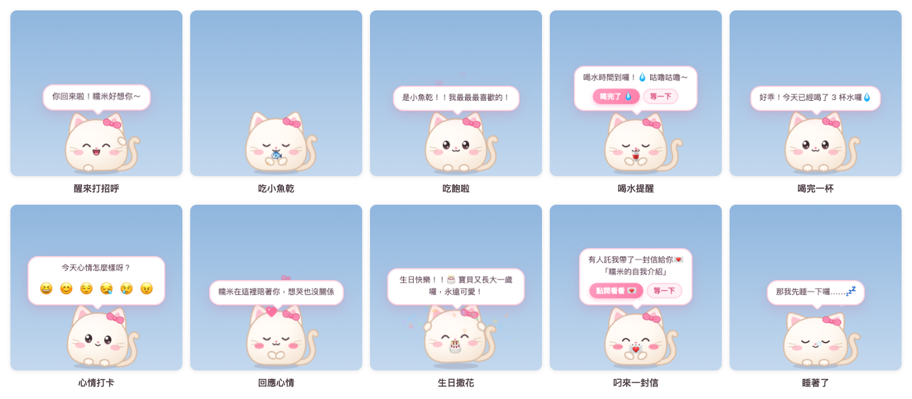
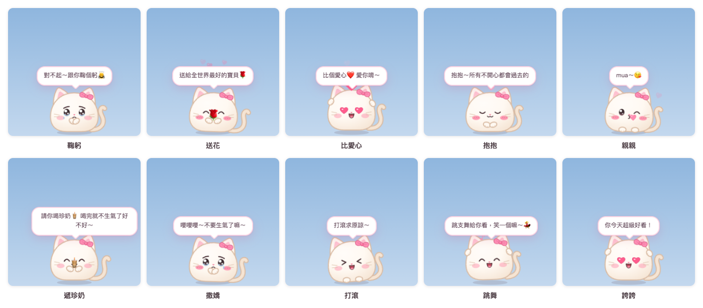
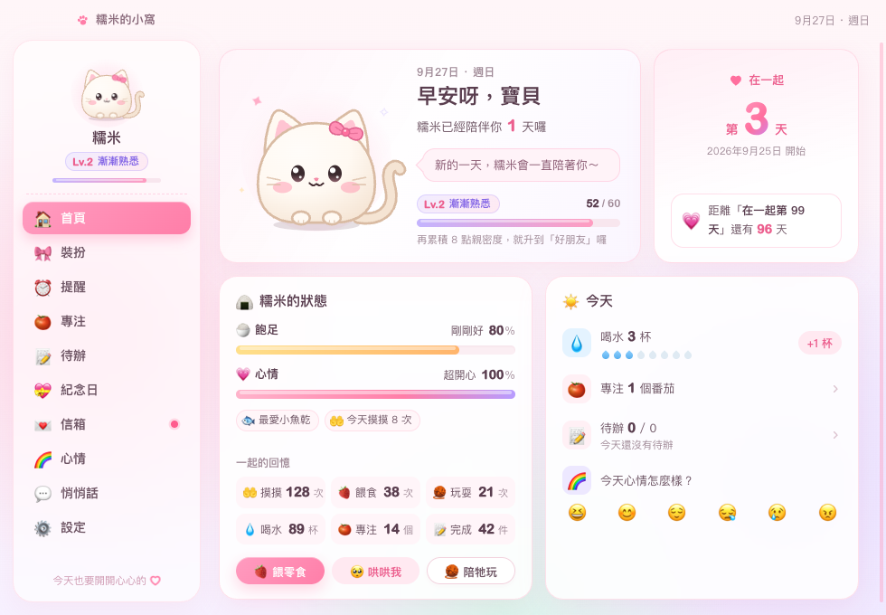

# 糯米桌寵 NuomiPet

[简体中文](README.md) | **繁體中文** | [English](README.en.md) | [日本語](README.ja.md) | [한국어](README.ko.md) | [Français](README.fr.md) | [العربية](README.ar.md)

[](https://github.com/WaIdo/NuomiPet/actions/workflows/check.yml)

一隻住在桌面上的小糰子，Windows 和 macOS 都能用。牠在螢幕底部走來走去，提醒喝水、休息和早點睡，記得你們的紀念日，會替你說悄悄話、送信；惹她生氣了，還會跪在洗衣板上認錯。介面有简体中文、繁體中文、English、日本語、한국어、Français、العربية 七種語言。



## 下載

在 [Releases](https://github.com/WaIdo/NuomiPet/releases/latest) 頁面下載對應的檔案：

| 檔案 | 適用於 |
| --- | --- |
| `NuomiPet-1.1.1-win-setup.exe` | Windows 10 / 11（64 位元），安裝版，推薦 |
| `NuomiPet-1.1.1-win-portable.exe` | Windows 10 / 11（64 位元），免安裝，按兩下就能用 |
| `NuomiPet-1.1.1-mac-arm64.dmg` | Apple 晶片的 Mac（M1 及之後），macOS 13 或更新版本 |
| `NuomiPet-1.1.1-mac-x64.dmg` | Intel 晶片的 Mac，macOS 13 或更新版本 |

不知道 Mac 是哪種晶片：點螢幕左上角的蘋果選單 →「關於這台 Mac」，「晶片」一欄寫著 Apple M… 的選 arm64，寫著 Intel 的選 x64。

## 安裝

**Windows**

1. 執行 `NuomiPet-1.1.1-win-setup.exe`，依提示安裝（不需要系統管理員權限）。免安裝版直接按兩下執行。
2. 安裝檔沒有購買程式碼簽章憑證，第一次執行時可能會出現「Windows 已保護您的電腦」：點「其他資訊」→「仍要執行」。如果防毒軟體攔截，請選擇允許或信任。
3. 寵物會出現在螢幕右下角。工作列右下角的系統匣裡有一個粉紅色小貓圖示（可能藏在 `^` 裡），點它開啟選單。

**macOS**

1. 開啟 dmg，把「糯米桌宠」拖進「應用程式」。（安裝後的應用程式名稱是简体的「糯米桌宠」。）
2. 應用程式沒有經過 Apple 公證，第一次開啟時會提示無法驗證。開啟「系統設定 → 隱私權與安全性」，在頁面下方找到「糯米桌宠」，點「強制打開」，再輸入一次電腦的登入密碼。
3. 也可以在「終端機」裡執行一次下面的指令，之後就能直接按兩下開啟：

```bash
xattr -dr com.apple.quarantine /Applications/糯米桌宠.app
```

寵物會出現在螢幕底部，選單列右上角有一個小貓頭圖示，點它開啟選單。應用程式不佔用 Dock；開啟「小窩」時 Dock 裡會暫時出現圖示。

## 功能

**寵物本身**
- 6 種小動物：貓咪、兔兔、小熊、狗狗、倉鼠、小雞；15 種配色（其中酪梨、抹茶、青蘋果、薄荷、湖水綠 5 種淺綠），9 種配飾（蝴蝶結、小花、小嫩芽、小皇冠、派對帽、愛心髮夾、草莓帽、聖誕帽、圓眼鏡），4 種花紋（純色、白肚皮、小花紋、眼罩斑），4 段大小。
- 會自己走來走去、放空想事情、打呵欠、伸懶腰、轉圈圈；眼睛跟著滑鼠轉；離開電腦 5 分鐘會睡著（還會冒鼻涕泡泡），回來時會迎接你。
- 互動：
  - 摸摸頭：不按滑鼠按鍵，把游標移到牠身上，快速地左右來回滑幾下
    - 慢慢移過去不算；按住滑鼠拖曳是把牠拎起來，也不算
    - 滑夠了牠會閉上眼睛、臉紅，頭上冒出愛心，繼續滑會一直冒；停下來後牠會開心地回應你
    - 在「小窩 → 首頁」點一下寵物的大圖，也算摸摸
    - 每次摸摸會加一點親密度和心情（8 秒內只算一次）；牠跪洗衣板時摸摸牠，就是原諒牠了
  - 點一下：戳一戳（連續戳會被戳暈）
  - 按兩下：開啟快速面板（餵食、哄我、玩耍、專注、心情、小窩、來接我）
  - 按右鍵：完整選單
  - 按住拖曳：把牠拎起來，放手會掉回螢幕底部；甩出去會撞牆，摔太重會暈
- 12 種零食，每個物種都有最愛的食物；有飽足、心情和親密度等級（Lv.1～Lv.10）。

**提醒和工具**
- 喝水、久坐起來動一動、護眼、按時吃飯、早點睡；提醒可以設定只在某個時段內出現。
- 自訂提醒：每天 / 平日 / 週末 / 僅一次。
- 番茄鐘：專注時寵物抱著小電腦陪你，結束後提醒休息。
- 待辦清單，每完成一件寵物都會慶祝。除了自己寫，還有「💞 兩個人的小事」：一排情侶之間的小點子（例如「拍一張我們倆的合照」「跟豪豪一起去看夕陽」），點一下就加進待辦，不喜歡可以「換一批」。
- 天氣：設定城市後，早上會播報天氣，要下雨時會提醒帶傘。

**給她的部分**
- 紀念日：在一起第幾天、每滿一百天和週年、她的生日、自訂紀念日和倒數日。當天寵物會撒花慶祝，提前幾天會預告。
- 信箱：在應用程式裡寫信，定好拆開的日子（例如她生日那天）。封好後還沒到日子，誰都看不到內文；到了那天寵物會叼著信去找她。
- 悄悄話：你寫的話會被寵物不定時說出來，可以署名「xxx要我偷偷跟你說：……」。
- 心情日記：每天晚上問她今天心情怎麼樣，小窩裡有月曆記錄。
- 節日：元旦、情人節、婦女節、白色情人節、520、國際兒童節、七夕、中秋、除夕、春節、元宵、端午、平安夜、聖誕、跨年都會送上祝福（農曆節日已經算好到 2035 年）。她生日那天寵物戴派對帽，聖誕節戴聖誕帽，情人節、520、七夕戴愛心髮夾。
- 今日運勢：在右鍵選單裡點「今日運勢」，每天都是滿星（★★★★★），宜和忌每天換。
- 用郵件寄信：你在手機或電腦上寄一封郵件到寵物的電子信箱，它會變成她信箱裡的一封信，還可以定好哪天才能拆開。設定方法見下面的「用郵件寄信、叫你來接」。
- 🚗 來接我：她在寵物的快速面板裡點一下，寵物就會寄郵件（也可以推播到你的手機或微信）叫你下班來接她。

**哄她開心**


- 11 個動作：跪洗衣板、送花、比愛心、抱抱、親親、遞珍奶、鞠躬、撒嬌、打滾、跳舞、誇誇，還有「隨便哄」隨機挑一個。
- 跪洗衣板：寵物跪在洗衣板上，淚汪汪地舉著「我錯了」的小木牌，過一會兒問「原諒我了嗎？」，下面有「原諒你啦 💗」和「哼！」兩個按鈕。
  - 點「哼！」牠會繼續跪，牌子換成「原諒我」；第三次會先送花、遞珍奶再跪，最多跪四輪。
  - 點「原諒你啦」，或是在牠跪著的時候摸摸頭，牠會跳起來撒花、跳舞。
  - 如果在資料裡填了「悄悄話署名」，牠有時會說是替你來認錯的。
- 牠也會自己哄：心情打卡選「生氣」會馬上跪下認錯；選「難過」會先抱抱再送花；選「好累」會遞一杯珍奶；一直戳牠，有時會跪下求饒；親密度到 Lv.3 以上、心情好的時候，偶爾會自己比愛心或送花。
- 入口：按兩下寵物開啟快速面板，點「🥺 哄我」；右鍵選單「哄你開心」；系統匣選單「哄哄我」（隨機一個）；小窩首頁的「🥺 哄哄我」。



**小窩**

「小窩」是設定視窗，從右鍵選單、快速面板或系統匣圖示都能開啟：首頁（在一起天數、寵物狀態、今天的喝水/番茄/待辦/心情、天氣）、裝扮、提醒、專注、待辦、紀念日、信箱、心情月曆、悄悄話、設定（我們的資料、小窩的顏色、永遠在最上層、開機時自動啟動、聲音、自由走動、重力、勿擾模式、天氣城市、資料匯入匯出）。



小窩有櫻花粉、蜜桃橘、奶油黃、抹茶綠、青蘋果綠、薄荷綠、湖水綠、天空藍、香芋紫九種顏色，也可以選「跟寵物一樣」。在「小窩 → 設定 → 小窩的顏色」裡更換，背景、按鈕、寵物的對話泡泡和快速面板會一起變色。


**多語言**
- 简体中文、繁體中文、English、日本語、한국어、Français、العربية。第一次開啟時會跟著系統語言；阿拉伯文的介面整體由右往左排列。
- 在「小窩 → 設定 → 語言」或系統匣選單「🌐 語言 / Language」裡隨時切換：介面、寵物說的話、選單、節日祝福會馬上跟著變；沒改過的寵物名字和對她的稱呼也會跟著變（糯米 / Mochi / もち / 모찌 / موتشي，寶貝 / baby / ハニー / 자기 / mon cœur / حبيبتي）。
- 你們自己寫的內容（名字、暱稱、悄悄話、信、紀念日）會保持原樣，不會被翻譯。

## 寫上你們自己的內容

所有內容都能在應用程式裡設定，不需要改檔案，也不需要重新打包：

- **資料**：第一次開啟「小窩」時會跳出「我們來認識一下吧～」，把寵物的名字、對她的稱呼（預設「寶貝」）、她的生日（要選年份）、在一起的日子和你的署名都填上，還沒填的項目會標示出來。之後可以在「小窩 → 設定 → 我們的資料」隨時修改。寵物第一次見面後也會主動問她。
- **紀念日**：「小窩 → 紀念日」，可以新增每年紀念、倒數日、累計天數。
- **悄悄話**：「小窩 → 悄悄話」，寫下想讓寵物不定時轉告她的話。
- **信**：「小窩 → 信箱 → 寫一封信」，寫好標題、署名和內文，選「馬上」或「到某一天」才能拆開。信封好之後，還沒到日子誰都看不到內文（寫信的人也看不到）；寫錯了可以刪掉重寫，也可以改標題和拆開的日子。
- **在自己的電腦上寫信**：在你的電腦上寫好，用「信箱 → 匯出在這裡寫的信」存成檔案，再到她的電腦上「匯入信件」。匯出的檔案裡，內文不是明文。

### 打包前預先寫好

如果想讓她第一次開啟時就看到你寫的內容，可以在打包前編輯專案根目錄下的 `gift.config.json`，再自己打包（見「從原始碼建置」）：

| 欄位 | 意思 | 範例 |
| --- | --- | --- |
| `petName` | 寵物的名字；空著就是「糯米」（其他語言是對應的名字） | `"糯米"` |
| `nickname` | 寵物怎麼稱呼她；空著就是「寶貝」（其他語言是對應的暱稱） | `"寶貝"` |
| `sender` | 你的署名，悄悄話會說「豪豪要我偷偷跟你說」 | `"豪豪"` |
| `species` / `color` / `accessory` / `markings` / `size` | 初始造型，可用的值見 `src/shared/catalog.json` | `"bunny"` / `"sakura"` / `"flower"` / `"none"` / `"m"` |
| `togetherSince` | 在一起的日子 | `"2026-09-25"` |
| `birthday` | 她的生日 | `"2002-06-08"` |
| `anniversaries` | 其他紀念日 | `[{ "name": "第一次約會", "date": "2023-06-01", "kind": "yearly" }]` |
| `notes` | 悄悄話清單 | `["今天也要開心", "..."]` |
| `letters` | 信件 | 見下方 |

`anniversaries` 的 `kind`：`yearly` 每年提醒，`countdown` 倒數日（只有一次），`since` 累計天數（每滿一百天會慶祝）。

信件範例（`id` 不能重複，`unlock` 空著表示馬上能看，`body` 裡用 `\n` 換行）：

```json
"letters": [
  {
    "id": "birthday-2027",
    "title": "生日快樂",
    "unlock": "2027-06-08",
    "from": "豪豪",
    "body": "第一行\n第二行……"
  }
]
```

預設附了一封寵物自我介紹的信（`id: "hello"`），第一次啟動時會交給她。

## 用郵件寄信、叫你來接

這兩個功能要先幫寵物準備一個電子信箱，在她的電腦上設定一次就好。

支援的信箱：QQ 郵箱、騰訊企業郵箱、網易郵箱（163、126、yeah.net、188、VIP）、網易企業郵箱、Gmail、Outlook / Hotmail / Microsoft 365、iCloud、Yahoo、新浪、搜狐、阿里郵箱、139 郵箱，其他支援 IMAP/SMTP 的信箱可以手動填寫伺服器。這只是對「寵物的電子信箱」的要求；你寄信用的信箱、接收「來接我」通知的信箱，哪一家都可以。

1. 幫寵物註冊一個新的電子信箱（推薦 QQ 郵箱或 163 郵箱），不要用你們平常用的信箱。
2. 在網頁版信箱裡開啟 IMAP/SMTP 服務，取得「授權碼」（不是登入密碼）：
   - QQ 郵箱：「设置 → 账号」（設定 → 帳號）→「POP3/IMAP/SMTP/Exchange/CardDAV/CalDAV服务」→ 開啟「IMAP/SMTP服务」，依提示驗證後會顯示授權碼。
   - 網易郵箱：「设置 → POP3/SMTP/IMAP」（設定 → POP3/SMTP/IMAP）→ 開啟「IMAP/SMTP服务」，依提示取得授權密碼。
   - Gmail、iCloud：先開啟兩步驟驗證（Apple 是雙重認證），再產生「應用程式密碼」（Apple 叫「App 專用密碼」）。
   - Outlook：不用授權碼，改用微軟帳號登入授權，見下面的「用 Outlook 當寵物的電子信箱」。
3. 在她的電腦上開啟「小窩 → 設定 → 郵件」，選信箱服務商（一般選「自動偵測」），填好寵物的電子信箱、授權碼、誰可以寄信（你的信箱）、「來接我」通知寄到哪裡（一般也是你的信箱），點「儲存」，再點「測試連線」。
4. 點「把用法寄給他」，你的信箱會收到一封使用說明。

**寄信**：用你的信箱寄郵件到寵物的電子信箱，主旨就是信的標題，內文就是信的內容。幾分鐘內寵物就會把信交給她，你也會收到一封確認郵件。
- 想定在某一天才能拆開：在主旨最前面寫【2026-12-25】，或在內文第一行寫「拆開日期：2026-12-25」。只寫月日（例如【12-25】）就是最近的那一天。
- 只有「誰可以寄信」裡的信箱寄來的信才會收下，別人寄來的不會進信箱。還可以設一個暗號，信裡帶著暗號才收。
- 只收文字，圖片和附件不會顯示。

**來接我**：她按兩下寵物，點「🚗 來接我」，選「現在就來」「半小時後」或「一小時後」，還可以寫一句話，寵物就會寄郵件告訴你。想在手機上馬上收到通知：
- 在手機上安裝信箱 App 並開啟新郵件通知；QQ 郵箱還可以在微信裡開啟「QQ邮箱提醒」。
- 或者在設定裡填「手機推播網址」：iPhone 可以用 Bark（`https://api.day.app/你的key/{title}/{body}`），微信可以用 Server酱（`https://sctapi.ftqq.com/你的SendKey.send?title={title}&desp={body}`）或 PushPlus（`https://www.pushplus.plus/send?token=你的token&title={title}&content={body}`）。

授權碼和推播網址只儲存在她的電腦上，用系統的鑰匙圈（macOS）或資料保護（Windows）加密，不會出現在匯出的備份裡。

### 用 Outlook 當寵物的電子信箱

微軟已經不允許第三方應用程式用密碼登入 Outlook，要改用微軟帳號登入授權。授權需要一個「應用程式 ID」，要你自己在微軟免費註冊一次（不能借用別的軟體的）：

1. 用微軟帳號登入 [Azure 入口網站](https://portal.azure.com)，進入「Microsoft Entra ID → 應用程式註冊 → 新增註冊」。個人帳號可能要先開通免費的 Azure 帳戶，請以微軟頁面上的提示為準。
2. 名稱隨便取（例如 NuomiPet）；「支援的帳戶類型」選「任何組織目錄中的帳戶及個人 Microsoft 帳戶」；重新導向 URI 不用填。
3. 在「驗證 → 進階設定」裡把「允許公用用戶端流程」設為「是」；不用建立用戶端密碼。
4. 在「API 權限」裡新增 Office 365 Exchange Online 的委派權限 `IMAP.AccessAsUser.All` 和 `SMTP.Send`，以及 Microsoft Graph 的 `offline_access`。
5. 把「概觀」頁上的「應用程式 (用戶端) 識別碼」填進 `gift.config.json` 的 `mailMsClientId`（打包前），或在「小窩 → 設定 → 郵件」裡填寫。
6. 在設定裡選「Outlook」，點「用微軟帳號登入」，在瀏覽器裡開啟 https://microsoft.com/devicelogin ，輸入設定頁上顯示的代碼，用寵物的電子信箱登入並同意。之後會自動延續登入；改了密碼或取消授權時，設定頁會提示重新登入。

公司或學校的 Microsoft 365 信箱通常還要系統管理員同意授權，並為這個信箱開啟 IMAP 和 SMTP 驗證。Outlook 這部分只在本機模擬的伺服器上測試過，還沒有用真實的微軟帳號驗證。

## 使用小訣竅

- `Ctrl + Alt + P`（Mac 上是 `⌘ + ⌥ + P`）：顯示 / 隱藏寵物，全螢幕看影片時很方便。
- 寵物被藏起來之後，點系統匣圖示選「叫糯米出來」（選單上顯示的是寵物目前的名字），或是再開啟一次應用程式。
- 「叫糯米過來」會讓寵物從滑鼠所在的螢幕上方掉下來，接多台螢幕時很好用。
- 右鍵選單裡可以關掉「自由走動」「聲音」，開啟「勿擾模式」：寵物不再閒聊，也不提醒喝水、久坐、護眼、吃飯、睡覺；自訂提醒、番茄鐘、紀念日和信照常。
- 開機時自動啟動可以在小窩的「設定」頁或系統匣選單裡開啟。

## 解除安裝和資料

- Windows：在「設定 → 應用程式」裡找到「糯米桌宠」解除安裝；免安裝版直接刪掉 exe。
- macOS：先在選單列的小貓頭選單裡點「結束」，再把「應用程式」裡的「糯米桌宠」拖到垃圾桶。

資料只儲存在本機，解除安裝不會刪除，重新安裝後寵物還記得你們：

- Windows：`%APPDATA%\糯米桌宠\mochi-data.json`
- macOS：`~/Library/Application Support/糯米桌宠/mochi-data.json`

小窩的「設定」頁可以匯出和匯入備份。想徹底刪除的話，解除安裝後再刪掉上面這個資料夾。

## 隱私

應用程式不蒐集、不上傳任何資料，沒有統計和廣告。只有以下幾種情況會連網：
- 天氣：開啟並設定城市後，用城市名稱向 [Open-Meteo](https://open-meteo.com/) 查詢經緯度，再用經緯度查詢天氣。
- 郵件：設定了寵物的電子信箱之後，會定時連線到這個信箱的伺服器收信，收到信時回一封確認郵件；她點「來接我」時寄一封郵件，有填推播網址的話再請求一次那個網址。

這些功能都沒設定的話，應用程式不會連網。

## 從原始碼建置

需要 Node.js 22 或更新版本。

```bash
npm install
```

在中國大陸下載 Electron 很慢，可以先設定鏡像站再安裝和打包：

```bash
export ELECTRON_MIRROR="https://npmmirror.com/mirrors/electron/"
export ELECTRON_BUILDER_BINARIES_MIRROR="https://npmmirror.com/mirrors/electron-builder-binaries/"
```

如果 `npm install` 之後 `node_modules/electron/dist` 不存在（新版 npm 預設不執行安裝指令碼），請手動下載一次：

```bash
node node_modules/electron/install.js
```

在本機執行：

```bash
npm start
```

打包，產出的檔案在 `dist/` 目錄。在 macOS 上可以同時打包 Mac 和 Windows 版，不需要 Wine：

```bash
npm run dist:mac
npm run dist:win
```

改了寵物造型的程式碼之後，想重新產生圖示：`npm run icons`。

**測試**

```bash
npm test                        # 單元測試：日期、提醒排程、番茄鐘、信件、多語言
node dev/run-scenarios.js       # 在真實視窗裡跑 dev/scenarios 下的所有情境，截圖放在 scenario-output/
node dev/i18n-check.js code     # 程式碼裡有沒有還沒抽出來的中文
node dev/i18n-check.js locales  # 各語言的文字和簡體中文是否一一對應、預留位置是否一致
```

每次推送到 `main`，GitHub Actions 都會在 Windows Server 2022（emoji 字型和 Windows 10 一樣舊）、Windows Server 2025 和 macOS 上跑單元測試和所有情境，並在 Windows 上打包、靜默安裝、啟動、解除安裝一遍，截圖可以在每次執行的 Artifacts 裡下載。

## 專案結構

```
gift.config.json        打包前預先寫好的內容（名字、紀念日、悄悄話、信件）
src/main/               主程序：視窗、拖曳和掉落物理、系統匣和選單、提醒排程、番茄鐘、天氣、資料儲存
src/preload/            轉譯程序可用的介面（window.mochi）
src/shared/             兩邊共用：物種/配色/食物目錄、節日表、主題、日期工具、多語言（i18n.js）
src/shared/locales/     各語言的文字：介面（common/main/pet/home/pages.json）、寵物台詞（phrases.json）、名字和預設內容（data.json）
src/renderer/shared/    寵物的 SVG 造型、表情和動畫、音效、emoji 相容處理
src/renderer/pet/       桌寵視窗：行為、對話泡泡、特效、快速面板
src/renderer/home/      小窩（設定視窗）
src/renderer/letter/    信件視窗
scripts/                圖示產生、頁面截圖、主題配色產生
dev/                    預覽頁、測試情境、情境執行指令碼、Windows 安裝檔冒煙測試
test/                   單元測試
docs/images/            本頁截圖
```

## 贊賞

如果糯米也讓你們開心，可以請作者喝杯珍奶 🧋（支付寶或微信）。完全自願，不影響任何功能；贊賞不代表取得商業使用的授權。

<p>
  
  
</p>

## 版權與授權

Copyright © 2026 WaIdo

本專案的程式碼和素材（寵物造型、圖示、台詞、音效）以 [PolyForm Noncommercial License 1.0.0](LICENSE.md) 發布。簡單來說：

- 可以：個人使用、學習、修改，送給朋友或戀人，分享原版或修改過的版本（非商業）。
- 不可以：用於任何商業目的，例如販售本軟體或修改版，或放進收費的產品和服務裡。
- 分享時要附上授權條款（或它的連結），並保留這一行：`Required Notice: Copyright © 2026 WaIdo (https://github.com/WaIdo/NuomiPet)`。

以上只是摘要，以 [LICENSE.md](LICENSE.md) 為準：具有約束力的是英文的 LICENSE 檔案，本節只是摘要。這不是 OSI 定義的開源授權，而是公開原始碼、限非商業使用。想用於商業用途，請先聯絡作者。

**第三方元件和資料**

- 安裝檔裡附有 [Electron](https://www.electronjs.org/)（MIT 授權）以及其中的 Chromium、Node.js 等開源元件，它們的授權條款隨安裝檔一起散布：Windows 在安裝目錄的 `LICENSE.electron.txt` 和 `LICENSES.chromium.html`，macOS 在 `糯米桌宠.app/Contents/Resources/` 裡。
- 收發郵件使用 [ImapFlow](https://github.com/postalsys/imapflow)（MIT）、[Nodemailer](https://nodemailer.com/)（MIT-0）、[mailparser](https://github.com/nodemailer/mailparser)（MIT），隨安裝檔一起散布。
- 打包工具 [electron-builder](https://www.electron.build/)（MIT）。
- 農曆節日對應的國曆日期是用 [lunar-javascript](https://github.com/6tail/lunar-javascript)（MIT）算好後寫進 `src/shared/festivals.json` 的，應用程式本身不包含這個函式庫。
- 天氣資料由 [Open-Meteo](https://open-meteo.com/) 提供，以 [CC BY 4.0](https://creativecommons.org/licenses/by/4.0/) 授權；Open-Meteo 的免費 API 只允許非商業使用。
- 介面裡的 emoji 由作業系統內建的字型顯示（Apple Color Emoji、Segoe UI Emoji 等），專案不包含任何字型檔案。本頁截圖是在 macOS 上擷取的，圖中的 emoji 圖案版權歸 Apple 所有；截圖裡的名字都是範例。
- 寵物造型和圖示是專案裡用程式碼畫出來的 SVG，音效是執行時用 Web Audio 合成的，都是本專案原創。
